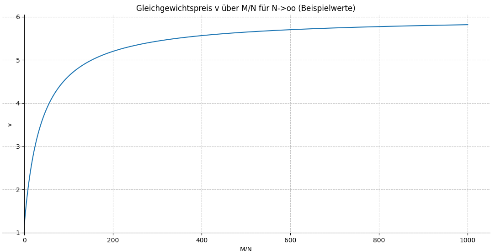
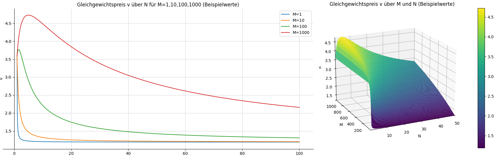
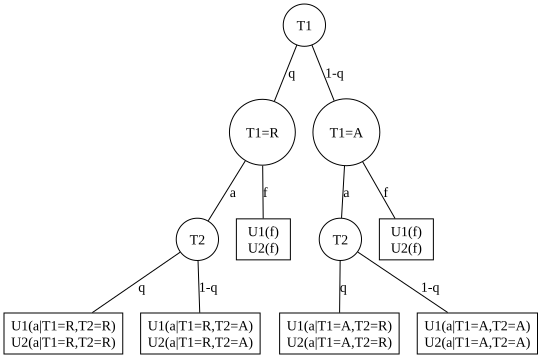
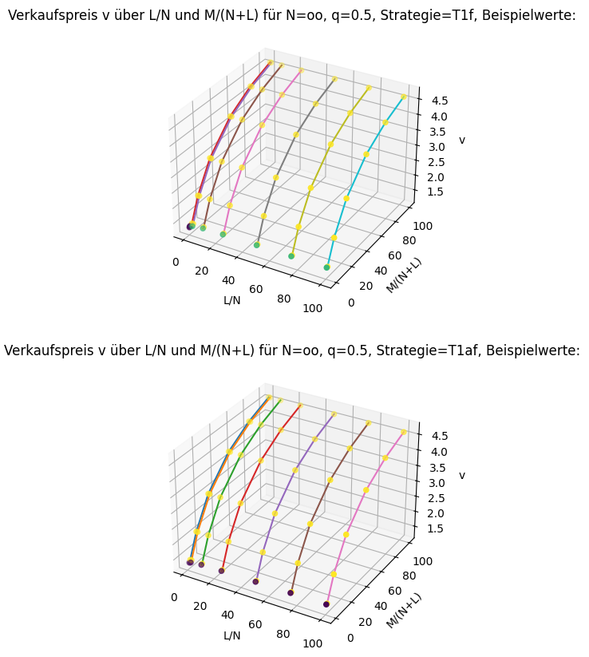

# Hilbert-Tankstellen
<!-- Start table of contents, generated by md_toc_update.py, do not edit -->
## Inhaltsverzeichnis

- [Hilbert-Tankstellen](HilbertTankstellen.md#hilbert-tankstellen)
  - [Szenario](HilbertTankstellen.md#szenario)
  - [Nash-Gleichgewicht ohne Markteintritt](HilbertTankstellen.md#nash-gleichgewicht-ohne-markteintritt)
    - [Einschub: Implizites und totales Differential](HilbertTankstellen.md#einschub-implizites-und-totales-differential)
  - [Gleichgewicht mit Markteintritt](HilbertTankstellen.md#gleichgewicht-mit-markteintritt)
  - [Literatur, Verweise](HilbertTankstellen.md#literatur-verweise)
<!-- End of TOC, generated by md_toc_update.py, do not edit -->

"Alle Zimmer belegt. Zimmer frei." (Tafel am Eingang des Hotels Hilbert) [^1]

## Szenario

Das berühmte [Hotel Hilbert](https://de.wikipedia.org/wiki/Hilberts_Hotel) ist komplett ausgebucht. Alle Hotelgäste sind mit dem eigenen Auto angereist und möchten Ausflüge in die Umgebung unternehmen. Dazu benötigen sie natürlich Benzin. Gleich gegenüber hat sich glücklicherweise die Tankstellenkette Hilbert etabliert, die abzählbar unendlich viele konkurrierende, nicht-kooperative Tankstellen betreibt.

Was passiert, wenn abzählbar unendlich viele Käufer, abzählbar unendlich viele Anbieter, eine unendliche Nachfrage und ein unendliches Angebot zusammentreffen?

Als Beispiel für ein spieltheoretisches Gleichgewicht betrachten wir folgendes Szenario:

Jede Tankstelle $T_n$ kauft Benzin vom Großhändler zum Einkaufspreis $e_n$ ein (z.B. 1 Euro/liter), verkauft eine Menge $m_n$ (z.B. 1 liter/Min) zum Verkaufspreis $v_n$ (z.B. 2 Euro/liter) inkl. Umsatzsteuer $s$ (z.B. 0.19 für 19% Umsatzsteuer) und hat laufende Betriebskosten $b_n$ (z.B. 1 Euro/Min) für Pacht, Gehälter usw. Die Eröffnung einer neuen Tankstelle verursacht einmalige Investitionskosten mit einer laufenden Belastung (Abschreibung) $f_n$ (z.B. 0.5 Euro/Min). Bei den etablierten Tankstellen der Kette sind die Investitionskosten längst abgeschrieben ($f_n=0$). 

Eine Tankstelle $T_n$ ist mit einer Wahrscheinlichkeit $q = P(T_n=R)$ reich ($R$) und verfügt über hohe Rücklagen, oder sie ist mit einer Wahrscheinlichkeit $P(T_n=A) = (1-q)$ arm ($A$) und ohne Rücklagen. Tritt ein neuer Konkurrent ein und eröffnet eine neue Tankstelle, reagiert der Markt entweder aggressiv (Ereignis $a$) mit Konkurrenzkampf und Dumpingpreisen, oder friedlich (Ereignis $f$) mit Aufteilung des Marktes. Reiche Tankstellen können die Kosten $K$ eines Konkurrenzkampf ohne Gewinneinbuße aus ihren Rücklagen bezahlen ($K_n(a|T_n=R)=0$); arme Tankstellen müssen die Kosten $K$ des Konkurrenzkampf als Verlust (Gewinneinbuße $K_n(a|T_n=A) > 0$) verbuchen (z.B. 1 Euro/Min). Eine friedliche Marktaufteilung verursache keine Kosten ($K_n(f|T_n=R)=K_n(f|T_n=A)=0$).

Der Gewinn (Nutzen) $U_n$ der Tankstelle $T_n$ beträgt damit 

$U_n = m_n \cdot (v_n/(1+s) - e_n) - b_n - f_n - K_n$

mit den Parametern:

| Parameter | Bedeutung           |
| --------- | ------------------- |
| $b$       | Betriebskosten      |
| $e$       | Einkaufspreis       |
| $f$       | Investitionskosten  |
| $h$       | Nachfragehebel      |
| $K$       | Aggressionskosten   |
| $r$       | Wettbewerbsreaktion |
| $s$       | Umsatzsteuer        |

Jeder Hotelgast ist gleichzeitig Kunde $K_m$ einer Tankstelle und erwirbt eine Menge $m_m$ Benzin zum jeweiligen Verkaufspreis. Die Gesamtmenge $m$ an verkauftem Benzin sei umgekehrt proportional zum Preis, d.h. steigende Verkaufspreise reduzieren die Verkaufsmenge und umgekehrt [^2]. Der Einfachheit halber nehmen wir einen linearen Zusammenhang an: $m = M \cdot (m_0 - h \cdot (v - v_0))$ mit Hebel $h$ in liter/Euro, Basismenge $m_0$ (z.B. 10 liter), Basismengenpreis $v_0$ (z.B. 2 Euro/liter), Durchschnittspreis $v$ und $M$ Kunden. Hebel, Basismenge und Basismengenpreis ist ein frei konfigurierbarer Arbeitspunkt im Marktszenario, um den sich die Verkaufsmenge abhängig vom Verkaufspreis bewegt; ein kleinerer Hebel verursacht geringere Mengenänderungen bei Preisänderungen als ein größerer Hebel. Bei einem Hebel $h = 0$ bleibt die Nachfrage unabhängig vom Preis konstant; bei einem Hebel $h = (1/2) \cdot m_0 / v_0$ halbiert sich die verkaufte Menge bei doppeltem Preis.  

Dieser lineare Ansatz ist eine vereinfachende Annahme; andere Annahmen führen i.A. zu unterschiedlichen Ergebnissen.

Die Menge $m_n$, die an einer Tankstelle verkauft wird, hängt von der Gesamtnachfrage und vom Preisunterschied zu den Konkurrenten ab. Je billiger das Benzin im Vergleich zum Konkurrenten wird, desto mehr kann die Tankstelle verkaufen; je teurer im Vergleich zur Konkurrenz, desto weniger kann sie verkaufen. Der Einfachheit halber sei der Zusammenhang linear zur Preisdifferenz $v - v_n$ (Differenz Durchschnittspreis $v$ zum Tankstellenpreis $v_n$): $m_n ∝ (m/N) + r \cdot (v - v_n)$. Die Rate $r$ modelliert wie sensibel die Kunden auf lokale Preisunterschiede reagieren. Der Proportionalitätsfaktor $C_{mv} = 1$ ergibt sich aus $\sum m_n = m$ (verkaufte Gesamtmenge = gekaufte Gesamtmenge).

## Nash-Gleichgewicht ohne Markteintritt

Zunächst können wir das Nash-Gleichgewicht bei $M$ Kunden und $N$ Tankstellen ohne Markteintritte berechnen. Jede Tankstelle versucht ihren Gewinn zu maximieren:  
$U_n(v_n) → \max$ ⇔ $∂U_n / ∂v_n = 0$  
Im Nash-Gleichgewicht (Symmetric Nash Equilibrium, SNE) kann keine Tankstelle ihren Gewinn durch einseitige Strategieänderung steigern, d.h. im Nash-Gleichgewicht gilt für **alle** Tankstellen: $∂U_n / ∂v_n = 0$

Für symmetrische Nash-Gleichgewichte (SNE) sind alle Tankstellen identisch, d.h. es gilt $e_n ​= e$, $b_n ​= b$, $r_n ​= r$ für alle Tankstellen $T_n$.

[hilbert_gas_stations_nash.py](../src/hilbert_gas_stations_nash.py) berechnet das Nash-Gleichgewicht bei $M$ Kunden und $N$ Tankstellen ohne Markteintritte:  
$v_{n,sne} = (M N h v_0 + M N m_0 + M e_n h s + M e_n h + N^2 e_n r s + N^2 e_n r - N e_n r s - N e_n r) / (M N h + M h + N^2 r - N r)$

Beispiel:

Als Beispiel nehmen wir an, dass jeder der $M$ Hotelgäste im Ausgangspunkt 10 liter für 2 Euro/liter zu kaufen bereit ist, eine Verdopplung des Verkaufspreises aber die Nachfrage halbiert: $m_0 = 10, v_0 = 2, h = 0.5 \cdot m_0 / v_0 = 5/2$. Wir nehmen ausserdem an, dass alle Tankstellen bereits etabliert sind (und Investionskosten abgeschrieben, $f_n=0$) und es keine Markteintritte gibt (keine neuen Konkurrenten, $K_n=0$). Der Einkaufspreis betrage für alle Tankstellen $e_n = 1$, die Mehrwertsteuer $s = 19/100$ und Rate $r = 100$.

Einige Beispielwerte berechnet mit [hilbert_gas_stations_nash.py](../src/hilbert_gas_stations_nash.py):  
$v_{sne} = 1.19 \cdot (0.12605 \cdot M N + 0.025 \cdot M + N^2 - N) / (0.025 \cdot M N + 0.025 \cdot M + N^2 - N)$  
| Anzahl Kunden $M$ | Anzahl Tankstellen $N$ | Nash-Gleichgewicht: Verkaufspreis |
| ----------------- | ---------------------- | --------------------------------- |
|               1   |                1       |              3.5950               |
|               1   |       1000000000       |              1.1900               |
|      1000000000   |       1000000000       |              1.3073               |
|   1000000000000   |       1000000000       |              5.8150               |

Im Grenzübergang $N → ∞$ nimmt der Gleichgewichtspreis den Wert $v_{n,sne} = e_n \cdot (1 + s)$ an, solange $M$ wesentlich kleiner $N$ bleibt: Dominiert $N^2$ im obigen Ausdruck $v_{n,sne}$, nähert sich $v_{n,sne} = (N^2 e_n r s + N^2 e_n r) / (N^2 r) =  e_n \cdot (1 + s)$. Für $N → ∞$ und $M → ∞$ hängt der Gleichgewichtspreis aber von der Annahme ab, wie sich die Menge der Kunden auf die Menge der Tankstellen verteilt: 
* Bei minimaler Kundendichte (1 Kunde auf viele Tankstellen, hoher Konkurrenzdruck, $N → ∞, M/N → 0$) wird der Preis minimal: $v_{n,sne} = e_n \cdot (1 + s)$, im Beispiel $v_{n,sne} = 1.19$
* Bei Dichte $M/N = 1$ (jede Tankstelle 1 Kunde, $M = N, N → ∞$) steigt der Preis: $v_{n,sne} = (e_n r s + e_n r + h v_0 + m_0) / (h + r)$, im Beispiel $v_{n,sne} = 1.307$
* Bei maximaler Kundendichte (viele Kunden je Tankstelle, hoher Nachfragedruck, $N → ∞, M/N → ∞$) wird der Preis maximal: $v_{n,sne} = (h v_0 + m_0) / h$, im Beispiel $v_{n,sne} = 6$

Bei festem Verhältnis $M/N$ ist der Gleichgewichtspreis für $N → ∞$:  
$v_{n,sne}(M/N, N → ∞) = (h v_0 M/N + m_0 M/N + e_n r s + e_n r)/(h M/N + r)$,  
$v_{n,sne}(M/N, N → ∞) = (30 M/N + 238)/(5 M/N + 200)$ im Beispiel.  

Im Grenzübergang $N → ∞$ und $M/N → 0$ ergibt sich der minimale Gleichgewichtspreis:  
$v_{n,sne}(M/N → 0, N → ∞) = e_n \cdot (1 + s)$,  
$v_{n,sne}(M/N → 0, N → ∞) = 1.19$ im Beispiel.  

Im Grenzübergang $N → ∞$ und $M/N → ∞$ ergibt sich der maximale Gleichgewichtspreis:  
$v_{n,sne}(M/N → ∞, N → ∞) = v_0 + m_0/h$,  
$v_{n,sne}(M/N → ∞, N → ∞) = 6$ im Beispiel.  

Kurz gesagt: Bei Hilbert-Tankstellen im Grenzübergang $N → ∞$ hängt das Nash-Gleichgewicht vom Verhältnis $M/N$ ab: Der Verkaufspreis wird mit $v_{n,sne} = e_n \cdot (1 + s)$ minimal bei $M ≪ N$ und steigt bis zum maximalen Wert $v_{n,sne} = (h v_0 + m_0) / h$ bei $M ≫ N$. Das folgende Diagram zeigt den Gleichgewichtspreis in Abhängigkeit von $M/N$ für $N → ∞$ und $M → ∞$:

Im Fall abzählbar unendlich vieler Anbieter wird der Gleichgewichtspreis nicht von der Anzahl der Konkurrenten bestimmt, sondern von der relativen Dichte $M/N$ der Menge der Hotelgäste und der Menge der Tankstellen.

Um den minimalen Gleichgewichtspreis bei $M/N → 0$ zu erhalten, müssten Hilberts Hotelgäste nur ein infinitesimal kleines Tröpfchen Benzin von jeder Hilbert-Tankstelle kaufen. Auf Dauer kann aber kein Anbieter vom Tröpfchen-Verkauf leben. Eine zusätzliche Randbedingung $U_n(v_n) ≥ 0$ würde sicherstellen, dass der Gleichgewichtspreis so hoch ist, dass kein Anbieter Verluste macht. Aus der Randbedingung $U_n(v_n) ≥ 0$ folgt ein minimal erforderliches $M/N_{min}$. Unterschreitet $M/N$ die kritische Schwelle $M/N_{min}$, schliessen Tankstellen mit Verlust und $M/N$ bleibt groß genug, um die Randbedingung einzuhalten. Im Grenzübergang $M,N → ∞$ bleibt es natürlich trotzdem bei abzählbar unendlich vielen Hilbert-Tankstellen, aber eine Mindestanzahl Kunden pro Tankstelle $M/N ≥ M/N_{min}$ und ein Mindestnutzen $U_n(v_n) ≥ 0$ wird eingehalten. Im Beispiel führt $U_n(v_n) ≥ 0$ zu $M/N ≥ M/N_{min} ≈ 0.9282$ und damit zu einem Gleichgewichtspreis von $v_{n,sne}(M/N=0.9282, N→∞) ≈ 1.2991$.

Ein weiteres interessantes Phänomen zeigt sich bei hoher Kundenanzahl und wenigen Tankstellen: Bei wenigen Anbietern und hoher Kundenzahl kann der Zutritt eines weiteren Anbieters die Preise erhöhen, statt dass die Preise -wie intuitiv zu erwarten wäre- durch mehr Konkurrenten sinken. Bei viel mehr Kunden als Anbietern ist der Konkurrenzdruck gering und wird durch einen zusätzlichen Anbieter kaum größer; der Preis wird praktisch nur durch eine zurückgehende Nachfrage begrenzt. Ein neuer Konkurrent verringert aber die Verkaufsmenge pro Tankstelle und damit auch die Mengenänderung pro Tankstelle durch Preiserhöhung. Spielt der Konkurrenzdruck fast keine Rolle, kann sich ein höherer Preis bei geringerer Menge pro Tankstelle lohnen. Erst wenn $N$ groß genug wird, schlägt der klassische Wettbewerbseffekt durch. Man sieht den Effekt an der Erhöhung des Verkaufspreises z.B. bei $M=1000$ und $N < 6$ im folgenden Diagramm (Gleichgewichtspreis $v$ über Anzahl Tankstellen $N$ bei unterschiedlicher Kundenanzahl $M$):

Dieser Effekt entsteht nur bei schwachem Wettbewerb (kleines $r$) und sehr hoher Nachfrage.

### Einschub: Implizites und totales Differential

Häufiges Problem: Gesucht ist die Lösung für $∂U(x,y)/∂x = 0$ mit einer Nebenbedingung $F(x,y) = 0$. 

Beispiel: Der Gewinn eines Unternehmens hänge vom Stückpreis $x$ sowie der verkauften Menge $y$ ab. Für die verkaufte Menge $y$ und den Stückpreis $x$ gelte wiederum ein Zusammenhang $F(x,y) = 0$. Um den Gewinn zu maximieren, sucht das Unternehmen Lösungen der Gleichung $∂U(x,y)/∂x = 0$ unter der Nebenbedingung $F(x,y) = 0$.

Implizites Differenzieren liefert $dy/dx$:  
$F(x,y) = 0$  
$⇔ (∂F/∂x)dx + (∂F/∂y)dy = 0$  
$⇔ dy/dx = -(∂F/∂x) / (∂F/∂y)$  

Das totale Differential liefert $∂U(x,y)/∂x$:  
$∂U(x,y)/∂x = ∂U/∂x + ∂U/∂y \cdot dy/dx$  
$∂U(x,y)/∂x = ∂U/∂x - ∂U/∂y \cdot (∂F/∂x) / (∂F/∂y)$  

## Gleichgewicht mit Markteintritt

Wir betrachten zunächst den allereinfachsten Fall: M Kunden, eine etablierte Tankstelle und Eintritt eines einzigen neuen Konkurrenten.

Das 2-Konkurrentenspiel ⁠$(N,A,T,q,u)$ ist damit definiert durch:
* Menge der Spieler: $N$ = { $T_1$ (etablierte Tankstelle), $T_2$ (neuer Konkurrent) }
* Menge der Aktionen: $A_1$ = { $a$ (aggressiv), $f$ (friedlich) }
* Menge der Typen: $T_i$ = { $R$ (Reich), $A$ (arm) }
* Wahrscheinlichkeiten: $P(T_i=R) = q$, $P(T_i=A) = 1 - q$
* Nutzenfunktionen $U_n$:  
    $U_n = m_n \cdot (v_n/(1+s) - e_n) - b_n - f_n - K_n$ mit  
    $m_n$ = verkaufte Menge an der n-ten Tankstelle  
    $v_n$ = Verkaufspreis an der n-ten Tankstelle  
    $s$ = Mehrwertsteuersatz  
    $e_n$ = Einkaufspreis der n-ten Tankstelle  
    $b_n$ = laufende Betriebskosten der n-ten Tankstelle  
    $f_n$ = Investition/Abschreibung der n-ten Tankstelle, $f_1 = 0, f_2 > 0$  
    $K_n$ = Kosten eines Konkurrenzkampfes, $K_n(f)=0, K_n(a,T_n=R)=0, K_n(a,T_n=A)> 0$  
* Nebenbedingung: Wie schon beim Nash-Gleichgewicht soll die zusätzliche Nebenbedingung $U_n ≥ 0$ sicherstellen, dass kein Anbieter dauerhaft Verluste macht; Tankstellen mit $U_n < 0$ müssen schließen. Dadurch erhöht sich für alle Tankstellen der Anreiz, aggressiv aufzutreten und zu bluffen:
    * Ist eine Tankstelle reich, die andere arm, wird die reiche Tankstelle versuchen die arme Tankstelle durch Konkurrenzkampf und Dumpingpreise vom Markt zu drängen und sich dadurch höhere Gewinne zu sichern.
    * Aber auch eine etablierte arme Tankstelle kann eine reiche Neukonkurrenz zur Aufgabe zwingen, wenn die Etablierungskosten zu hoch sind, um den Konkurrenzkampf zu überstehen. Eine etablierte und arme Tankstelle kann sich durch bluffen höhere Gewinne sichern.
    * Ein armer Neukonkurrent kann sich am Markt behaupten, wenn die Etablierungskosten gering sind. Ein reicher Neukonkurrent toleriert höhere Etablierungskosten und kann die etablierte Konkurrenz zur Marktteilung oder Aufgabe zwingen.
* Spielbaum:  
    
* Die Nutzenfunktionen $U_n$ hängen von Verkaufspreis $v_n$ und -menge $m_n$ ab. Diese sind durch die Nash-Gleichgewichte in Abhängigkeit von der Anzahl $N$ der Anbieter gegeben. Bei friedlicher Reaktion, oder falls beide Anbieter den Konkurrenzkampf überleben (d.h. $U_1 ≥ 0, U_2 ≥ 0$), also das Nash-Gleichgewicht für $N = 2$. Falls ein Anbieter aufgibt (d.h. $U_1 < 0$ oder $U_2 < 0$), folglich das Nash-Gleichgewicht für $N = 1$.
* In dieser Spielvariante hat nur die etablierte Tankstelle eine Wahl (friedlich oder aggressiv); die Reaktion des neuen Konkurrenten (Betrieb oder Aufgabe) erfolgt implizit durch die Nebenbedingung $U_2 ≥ 0$, nicht durch Entscheidung nach einem Signal. Die Spielvariante ist daher kein klassisches Bayes-Spiel.

Die Berechnung der Gleichgewichte im 2-Konkurrentenspiel erfolgt in [hilbert_gas_stations_two_players.py](../src/hilbert_gas_stations_two_players.py). Für den allgemeinen Fall mit $M$ Kunden, $N$ etablierten Tankstellen, $L$ neuen Konkurrenten und gegebenen Verhältnissen $L/N$ und $M/(N+L)$ berechnet [hilbert_gas_stations_equilibrium.py](../src/hilbert_gas_stations_equilibrium.py) die Gleichgewichte. Einige Beispiele für Gleichgewichte mit den Beispielwerten von oben, 4 Gruppen T1R (reiche etablierte Tankstellen), T1A (arme etablierte Tankstellen), T2R (reiche neue Konkurrenten), T2A (arme neue Konkurrenten), $0 < q < 1$ und den Strategien T1f (etablierte Tankstellen immer friedlich) und T1af (reiche etablierte Tankstellen aggressiv, arme etablierte Tankstellen friedlich):

| N | L | M | L/N | M/(N+L) | Strategie |      Gruppen       |   q Intervall   |          Verkaufspreis          | Verkaufsmenge/Anbieter |
|---|---|---|-----|---------|-----------|--------------------|-----------------|---------------------------------|------------------------|
| ∞ | ∞ | ∞ |   1 |   1/4   |    T1f    | T1R                | 0 < q <= 0.5387 | 1.3073 (min:1.2991, max:5.9996) | 11.7317 (min:10.9087, max:480.9615) |
| ∞ | ∞ | ∞ |   1 |     1   |    T1f    | T1R, T1A, T2R      | 0 < q <= 0.5089 | 1.3452 (min:1.3443, max:1.4190) | 15.5161 (min:15.4272, max:22.9047) |
| ∞ | ∞ | ∞ |   1 |     1   |    T1f    | T1R, T1A           | 0.5089 < q < 1  | 1.4190                          | 22.9048 |
| ∞ | ∞ | ∞ |   1 |     1   |    T1af   | T1R, T1A, T2R      | 0 < q <= 0.5089 | 1.3452 (min:1.3443, max:1.4190) | 15.5161 (min:15.4272, max:22.9047) |
| ∞ | ∞ | ∞ |   1 |   100   |    T1f    | T1R, T1A, T2R, T2A | 0 < q < 1       | 4.6257                          | 343.5714 |
| ∞ | ∞ | ∞ |   1 |   100   |    T1af   | T1R, T1A, T2R, T2A | 0 < q < 1       | 4.6257                          | 343.5714 |
| ∞ | ∞ | ∞ | 100 |     1   |    T1f    | T1R, T1A, T2R      | 0 < q <= 0.752  | 1.4169 (min:1.3443, max:4.6354) | 22.6908 (min:15.4272, max:344.5363) |
| ∞ | ∞ | ∞ | 100 |     1   |    T1f    | T1R, T1A           | 0.752 < q < 1   | 4.6355                          | 344.5461 |
| ∞ | ∞ | ∞ | 100 |     1   |    T1af   | T1R, T1A, T2R      | 0 < q <= 0.752  | 1.4169 (min:1.3443, max:4.6354) | 22.6908 (min:15.4272, max:344.5363) |
| ∞ | ∞ | ∞ | 100 |     2   |    T1f    | T1R, T1A, T2R, T2A | 0 < q < 1       | 1.4190                          | 22.9048 |
| ∞ | ∞ | ∞ | 100 |     2   |    T1af   | T1R, T1A, T2R, T2A | 0 < q < 1       | 1.4190                          | 22.9048 |
| ∞ | ∞ | ∞ | 100 |   100   |    T1f    | T1R, T1A, T2R, T2A | 0 < q < 1       | 4.6257                          | 343.5714 |
| ∞ | ∞ | ∞ | 100 |   100   |    T1af   | T1R, T1A, T2R, T2A | 0 < q < 1       | 4.6257                          | 343.5714 |

Das Tankstellen-Modell in [hilbert_gas_stations_equilibrium.py](../src/hilbert_gas_stations_equilibrium.py) befolgt eine Exit-Strategie: Nur die ökonomisch schlechteste Gruppe (d.h. diejenige Gruppe mit geringstem Nutzen U_g und U_g < 0) scheidet aus, danach werden alle Verkaufspreise, -mengen und Gleichgewichte neu ermittelt. Andere Exit-Strategien können daher andere Gleichgewichte haben.

Damit verhalten sich Hilbert-Tankstellen für $N → ∞$ und Markteintritt im Grunde einfach:
* Die Strategie T1f (etablierte Tankstellen immer friedlich) hat immer ein Gleichgewicht.
* Die Strategie T1af (reiche etablierte Tankstellen aggressiv, arme etablierte Tankstellen friedlich) hat ein Gleichgewicht wenn genügend Kunden pro Tankstelle existieren. Bei zu wenig Kunden müssen neue Konkurrenten aufgrund höherer Investitionskosten aufgeben, so daß sich die etablierten Tankstellen die Aggressionskosten sparen können.
* Bei genügend Kunden pro Tankstelle überleben alle, sonst geben zuerst die armen und dann die reichen Neukonkurrenten auf.
* Sind $N = (N_{active} + L_{active})$ die aktiven (einen Konkurrenzkampf überlebenden) Anbieter, dann legt das Verhältnis $M/N$ die Verkaufspreise und -mengen auf die gleiche Weise fest wie beim Nash-Gleichgewicht ohne Markteintritt, d.h. mit minimalem Verkaufspreis $v = e_n \cdot (1 + s) = 1.19$ für $M/N → 0$, $v = (e_n \cdot r \cdot s + e_n \cdot r + h \cdot v_0 + m_0) / (h + r) = 1.307$ für $M/N = 1$ und $v = v_0 + m_0 / h$ für $M/N → ∞$.
* Ein Markteintritt verändert also die Zahl aktiver Anbieter, danach greift wieder das Nash-Gleichgewicht ohne Markteintritt mit der Marktdichte $M / (N_{active} + L_{active})$.

Das Diagramm zeigt den Verkaufspreis $v$ über $L/N$ und $M/(N+L)$ für $N → ∞$, $q = 0.5$, Beispielwerten und die beiden Strategien T1f und T1af:  

## Literatur, Verweise

[^1]: Aeneas Rooch, "Die Entdeckung der Unendlichkeit", Heyne Verlag 2022
[^2]: Cournot-Bertrand-Hybridmodell
