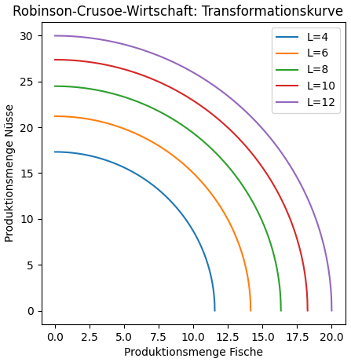
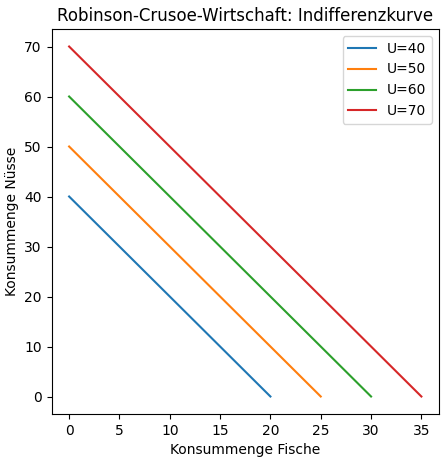
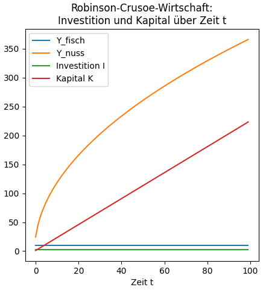
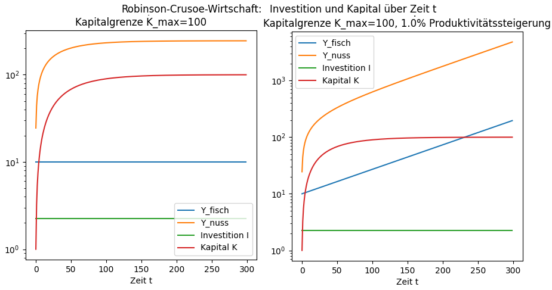
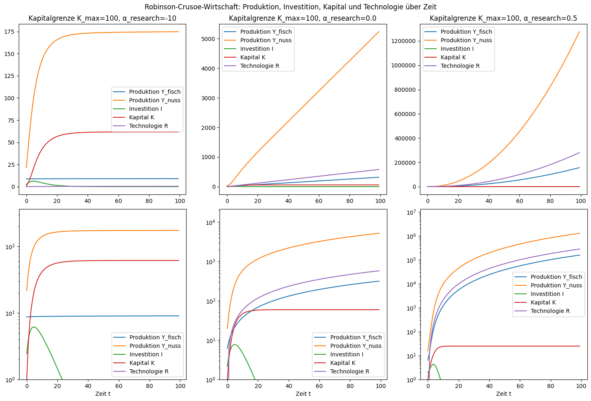
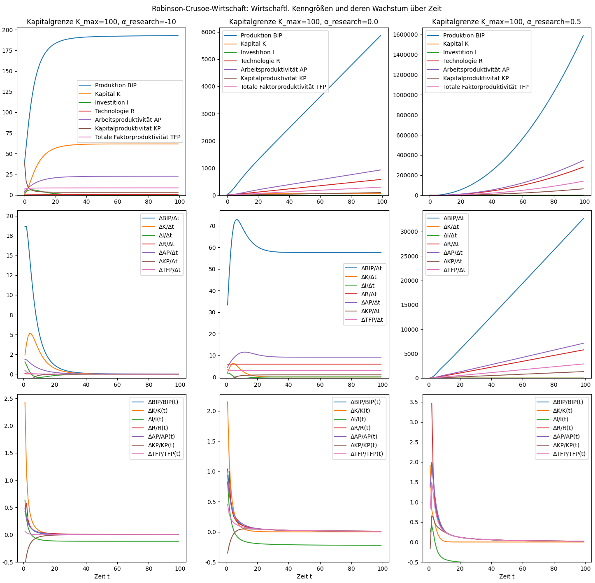

# Mini-WM: Ein minimalistisches Wirtschaftsmodell
<!-- Start table of contents, generated by md_toc_update.py, do not edit -->
## Inhaltsverzeichnis

- [Mini-WM: Ein minimalistisches Wirtschaftsmodell](MiniWM_Teil01_RobinsonCrusoe.md#mini-wm-ein-minimalistisches-wirtschaftsmodell)
  - [Mini-WM Teil 1: Robinson-Crusoe-Wirtschaft](MiniWM_Teil01_RobinsonCrusoe.md#mini-wm-teil-1-robinson-crusoe-wirtschaft)
    - [Ein-Personen-Subsistenzwirtschaft](MiniWM_Teil01_RobinsonCrusoe.md#ein-personen-subsistenzwirtschaft)
      - [Produktionsfunktion](MiniWM_Teil01_RobinsonCrusoe.md#produktionsfunktion)
      - [Transformationskurve](MiniWM_Teil01_RobinsonCrusoe.md#transformationskurve)
      - [Indifferenzkurve](MiniWM_Teil01_RobinsonCrusoe.md#indifferenzkurve)
      - [Maximierung der Nutzenfunktion](MiniWM_Teil01_RobinsonCrusoe.md#maximierung-der-nutzenfunktion)
      - [Gleichgewicht zwischen Produktion und Konsum](MiniWM_Teil01_RobinsonCrusoe.md#gleichgewicht-zwischen-produktion-und-konsum)
        - [Gleichgewicht bei reiner Subsistenz](MiniWM_Teil01_RobinsonCrusoe.md#gleichgewicht-bei-reiner-subsistenz)
        - [Gleichgewicht bei Subsistenz und Genusskonsum](MiniWM_Teil01_RobinsonCrusoe.md#gleichgewicht-bei-subsistenz-und-genusskonsum)
    - [Ein-Personen-Wirtschaft mit Investitionen](MiniWM_Teil01_RobinsonCrusoe.md#ein-personen-wirtschaft-mit-investitionen)
    - [Wirtschaftl. Kennzahlen](MiniWM_Teil01_RobinsonCrusoe.md#wirtschaftl-kennzahlen)
    - [Interessante Punkte in der Robinson-Crusoe-Wirtschaft](MiniWM_Teil01_RobinsonCrusoe.md#interessante-punkte-in-der-robinson-crusoe-wirtschaft)
    - [Links und Anmerkungen](MiniWM_Teil01_RobinsonCrusoe.md#links-und-anmerkungen)
<!-- End of TOC, generated by md_toc_update.py, do not edit -->

Ich habe Wirtschaft nie verstanden. Banken erzeugen Geld aus dem Nichts [^1] [^2], Vermögen und Schulden wachsen als gäbe es ein perpetuum mobile - wie kann das sein? Kann Geld -rein theoretisch- auf Dauer exponentiell wachsen?

Um eine anschauliche Vorstellung zu bekommen, wie "Wirtschaft" prinzipiell funktionieren könnte, habe ich versucht, ein minimales Wirtschaftsmodell zu bauen (Mini-WM): Das einfachst mögliche Modell, das so etwas wie eine "wachsende Wirtschaft" simulieren kann. Ziel ist nicht, ein realistisches Modell einer realen Wirtschaft zu konstruieren, sondern ein ein kausales Modell einer Minimal-Wirtschaft, das zeigt: Was verursacht was und warum?

Ein paar Grundannahmen:
* Das Modell ist ein geschlossenes System. Waren fallen nicht vom Himmel, sondern werden produziert. Geld zirkuliert, verdunstet aber nicht einfach. Alle Waren, die verkauft werden, werden von anderen gekauft (und bezahlt). Salden (Waren, Geld, etc.) müssen auf Dauer in Balanse sein. Also eher ein globales Modell, keine einzelne Volkswirtschaft. Die einzigen externen Ressourcen, die von aussen ins Modell fließen, sind Naturressourcen: Energie und Rohstoffe, techn. Fortschritt und Erfindergeist, sowie Bevölkerungswachstum.
* Alle Güter, Akteure, Handlungen etc. sind berechenbar. Alle Akteure handeln rational, d.h. sie handeln so, dass eine berechenbare Nutzenfunktion maximiert wird.

## Mini-WM Teil 1: Robinson-Crusoe-Wirtschaft

### Ein-Personen-Subsistenzwirtschaft

Wir starten mit dem allereinfachsten Fall: der [Robinson-Crusoe-Wirtschaft](https://de.wikipedia.org/wiki/Robinson-Crusoe-Wirtschaft) [^3],[^4]. Robinson Crusoe ist allein auf seiner einsamen Insel, kann Fische fangen oder Kokosnüsse sammeln, und ist damit zugleich Produzent und Konsument. Seine Arbeitskraft ist begrenzt, er versucht daher seine [Nutzenfunktion](https://de.wikipedia.org/wiki/Nutzenfunktion_(Mikro%C3%B6konomie)) zu maximieren.

#### Produktionsfunktion

Die Produktion von Gütern (z.B. Fische, Kokosnüsse) erfordert den Einsatz von Ressourcen (z.B. Energie und Arbeitskraft), den sog. [Produktionsfaktoren](https://de.wikipedia.org/wiki/Produktionsfaktor). Die [Produktionsfunktion](https://de.wikipedia.org/wiki/Produktionsfunktion) beschreibt den Zusammenhang zwischen Ertragsmenge und Menge von Produktionsfaktoren; in der Robinson-Crusoe-Wirtschaft also den Zusammenhang zwischen Ertrag (Fische, Kokosnüsse) und Arbeitskraft (Produktionsfaktor). Diese Produktionsfunktion hat i.A. einen [abnehmenden Ertragszuwachs](https://de.wikipedia.org/wiki/Ertragsgesetz): Doppelter Aufwand erzeugt nicht automatisch doppelten Ertrag. Robinson kann jeden Tag z.B. 20 Fische in 12 Stunden fangen, aber nicht 40 Fische in 24 Stunden und erst recht nicht 80 Fische in 48 Stunden. Die [Grenzkosten](https://de.wikipedia.org/wiki/Grenzkosten) oder Marginalkosten sind diejenigen Kosten, die durch die Produktion einer zusätzlichen Mengeneinheit eines Produktes oder einer Dienstleistung entstehen. Umgekehrt ist der [Grenzertrag](https://de.wikipedia.org/wiki/Grenzprodukt) oder Grenzprodukt der Zuwachs des Ertrags, der durch den Einsatz einer zusätzlichen Einheit eines Produktionsfaktors erzielt wird. Analog zum Grenzertrag ist der [Grenznutzen](https://de.wikipedia.org/wiki/Grenznutzen) der Nutzenzuwachs, der durch zusätzlichen Konsum eines Gutes entsteht. Die [Faktorproduktivität](https://de.wikipedia.org/wiki/Produktivit%C3%A4t) ist das Verhältnis zwischen produzierten Gütern/Dienstleistungen und den dafür benötigten Produktionsfaktoren und hängt vom technischen Fortschritt ab.

Eine häufig verwendete Produktionsfunktion ist die [Cobb-Douglas-Funktion](https://de.wikipedia.org/wiki/Cobb-Douglas-Funktion): 
$Y(x_1,x_2,...,x_n) = A \prod_{i=1}^{n} x_i^{α_i}$  
mit der Produktion $Y$, den Produktionsfaktoren $x_i$, dem Niveauparameter $A$ und den Elastizitäten $α_i$.  
Eine häufige Version ist $Y(L,K) = A L^α K^β$ mit dem Niveau $A$, dem Kapitaleinsatz $K$ und dem Arbeitseinsatz $L$. Die [Totale Faktorproduktivität](https://de.wikipedia.org/wiki/Totale_Faktorproduktivit%C3%A4t) $A$ beschreibt das allgemeine Produktivitätsniveau und hängt vom techn. Fortschritt ab. Die [Elastizitäten](https://de.wikipedia.org/wiki/Elastizit%C3%A4t_(Wirtschaft)) $α$ (Arbeitselastizität) und $β$ (Kapitalelastizität) sind Maße für die relative Änderung des Arbeits- bzw. Kapital-Einsatzes zur relativen Änderung der Produktion. Bei $α=0$ (vollkommen unelastisch) ist die Produktion unabhängig vom Arbeitseinsatz, bei $α=1$ (proportional elastisch) verdoppelt sich die Produktion mit doppeltem Arbeitseinsatz. Je größer $α$, desto stärker reagiert die Produktion auf Änderungen des Arbeitseinsatzes.

Beispiel: Robinson kann eine begrenzte Anzahl Stunden pro Tag Fische fangen oder Kokosnüsse sammeln, der Rest ist für Kochen, Schlafen, Erholung etc. notwendig. Fischen und Ernten sind anstrengend, ausserdem vertreibt stundenlanges Angeln die Fische, bei Kokosnüssen lassen sich die gut zugänglichen Nüsse am schnellsten ernten, usw. Kurz gesagt: Die Produktionsfunktion (Ertrag über Einsatz) nimmt mit zunehmendem Arbeitseinsatz ab. 

Wir verwenden die Cobb-Douglas-Produktionsfunktion $Y = A L^α K^β$. Da Robinson weder Geld noch Kapital hat, ist die Kapitalelastizität $β=0$, d.h. $K^β = 1$ und damit $Y = A L^α$. Die Arbeitselastizität $α$ muss kleiner sein als 1 (doppelter Einsatz produziert weniger als doppelten Ertrag); wir nehmen als Beispiel und etwas willkürlich $α=0.5$ an.

In 12 Stunden produziere Robinson 20 Fische oder 30 Kokosnüsse:  
$Y_{fisch}(L) = A_{fisch} L^{α_{fisch}}$ mit $20 = A_{fisch} 12^{0.5} ⇔ A_{fisch} = 20 / 12^{0.5} ≈ 5.77 ⇔ Y_{fisch}(L) = 5.77 \cdot L^{0.5}$  
$Y_{nuss}(L) = A_{nuss} L^{α_{nuss}}$ mit $30 = A_{nuss} 12^{0.5} ⇔ A_{nuss} = 30 / 12^{0.5} ≈ 8.66 ⇔ Y_{nuss}(L) = 8.66 \cdot L^{0.5}$  

Robinson ist gleichzeitig Produzent und Konsument: Wenn er $Y = Y_{fisch} + Y_{nuss}$ produziert, kann er $C = C_{fisch} + C_{nuss}$ Fische und Kokosnüsse konsumieren. Im Gleichgewicht muss Produktion = Konsum gelten:  
$C_{fisch} = Y_{fisch}, C_{nuss} = Y_{nuss}, Y = C$

#### Transformationskurve

Die [Transformationskurve](https://de.wikipedia.org/wiki/Transformationskurve) zeigt die Aufteilung der unterschiedlichen Güter (Allokation) bei gleichem Ressourceneinsatz. Im Beispiel also die Anzahl produzierbarer Kokosnüsse über der Anzahl produzierbarer Fische bei gleichem Arbeitseinsatz $L$:

Der Bereich unterhalb einer Transformationskurve ist realisierbar, aber nicht effizient (d.h. die Ressourcen werden nicht vollständig genutzt). Der Bereich oberhalb einer Transformationskurve ist nicht realisierbar. Die Punkte auf der Transformationskurve sind die effizienten Allokationen.

#### Indifferenzkurve

Die [Indifferenzkurve](https://de.wikipedia.org/wiki/Indifferenzkurve) gibt die Kombination an Gütern wieder, welche den gleichen Nutzen $U$ aufweisen und somit den Konsumenten indifferent zwischen der Wahl dieser Kombinationen macht. 

Zum Beispiel sei der Nutzen des Konsums von Fischen höher als der von Kokosnüssen. Fische enthalten mehr hochwertiges Eiweiß, lebenswichtige Omega-3-Fettsäuren und Vitamin D. Der Fischfang ist mühsamer, aber nützlicher als die Kokosnussernte. Der Nutzen eines konsumierten Fisches sei doppelt so hoch wie der Nutzen einer konsumierten Kokosnuss: $U_{fisch} = 2 U_{nuss}$. Das Nutzenverhältnis Fisch zu Kokosnuss wird [marginale Substitutionsrate](https://en.wikipedia.org/wiki/Marginal_rate_of_substitution) (MSR) oder relative Präferenz genannt, hier also: $MSR = 2$. Der Einfachheit setzen wir den Nutzen eines Fisches auf den Wert 2 (in Kokosnusseinheiten), und den Nutzen einer Kokosnuss auf den Wert 1 (die Kokosnusseinheit):  
$U = U_{fisch} + U_{nuss} = 2 \cdot C_{fisch} + C_{nuss} ⇔ C_{nuss} = U - 2 \cdot C_{fisch}$. 

Ist der Nutzen des Konsums von 2 Kokosnüssen identisch zum Nutzen von 1 Fisch ([perfektes Substitut](https://de.wikipedia.org/wiki/Substitutionsgut)), dann ist die Indifferenzkurve linear:

#### Maximierung der Nutzenfunktion

Robinson möchte seinen Arbeitseinsatz als Produzent $L_{arbeit} = L_{fisch} + L_{nuss}$ so optimieren, dass sein Nutzen als Konsument $U = U_{fisch} + U_{nuss}$ maximal wird.  

Gesucht ist also eine Lösung für $∂U(x,y)/∂x = 0$ mit einer Nebenbedingung $F(x,y) = 0$.  
[Implizites Differenzieren](https://de.wikipedia.org/wiki/Implizite_Differentiation) liefert $dy/dx$:  
$F(x,y) = 0 ⇔ (∂F/∂x)dx + (∂F/∂y)dy = 0 ⇔ dy/dx = -(∂F/∂x) / (∂F/∂y)$  
Das [totale Differential](https://de.wikipedia.org/wiki/Totales_Differential) liefert $∂U(x,y)/∂x$:  
$∂U(x,y)/∂x = ∂U/∂x + ∂U/∂y \cdot dy/dx$  
Die Lösung von $∂U(x,y)/∂x = 0$ liefert denjenigen Wert von $x$, für den $U(x,y)$ mit $F(x,y) = 0$ maximal wird.

Im Fall von Robinson mit $x = L_{fisch}, y = L_{nuss}$ und $C_{fisch} = Y_{fisch}, C_{nuss} = Y_{nuss}$ also:  
$U = U_{fisch} + U_{nuss} = 2 \cdot C_{fisch} + C_{nuss} = 2 Y_{fisch}(L_{fisch}) + Y_{nuss}(L_{nuss}) = 2 \cdot 5.77 \cdot L_{fisch}^{0.5} + 8.66 \cdot L_{nuss}^{0.5}$  
$U(x,y) = 2 \cdot 5.77 \cdot x^{0.5} + 8.66 \cdot y^{0.5}$  
$F(x,y) = x + y - L_{{arbeit}} = 0 ⇒ ∂F/∂x = ∂F/∂y = 1 ⇔ dy/dx = -(∂F/∂x) / (∂F/∂y) = -1$  
$∂U/∂x = 0.5 \cdot 2 \cdot 5.77 \cdot x^{-0.5} = 5.77 \cdot x^{-0.5}$  
$∂U/∂y = 0.5 \cdot 8.66 \cdot y^{-0.5} = 4.33 \cdot y^{-0.5}$  
$∂U(x,y)/∂x = 5.77 \cdot x^{-0.5} + 4.33 \cdot y^{-0.5} \cdot -1 = 5.77 \cdot x^{-0.5} - 4.33 \cdot y^{-0.5}$  
$∂U(x,y)/∂x = 0 ⇔ 5.77 \cdot x^{-0.5} = 4.33 \cdot y^{-0.5} ⇔ (y/x)^{-0.5} = 5.77/4.33$  
$x/y = (5.77/4.33)^{2} = 1.778 ⇔ y/x = (4.33/5.77)^{2} = 0.562$  

D.h. Um den maximalen Nutzen zu erzielen, muss Robinson seine Arbeitszeit zwischen Sammeln von Kokosnüssen und Fischfang im Verhältnis 0.562 aufteilen bzw. 1.778 mal so lange fischen wie Kokosnüsse sammeln.

#### Gleichgewicht zwischen Produktion und Konsum

Robinson tritt gleichzeitig als Produzent und Konsument auf und hat die Wahl zwischen Arbeit (Einsatz $L_{arbeit}$) und Freizeit (Einsatz $L_{freizeit}$). In der Freizeit konsumiert Robinson das Ergebnis seiner Arbeit: Produktion = Konsum.

Analog zur Produktion $Y$ hat auch der Konsum $C$ einen Nutzwert mit abnehmendem Grenznutzen: Bis zu einer gewissen Grenze sind Schlafen und Essen essentiell (hoher Nutzen), haben darüberhinaus aber nur noch abnehmenden Nutzen. Als [Nutzenfunktion](https://de.wikipedia.org/wiki/Nutzenfunktion_(Mikro%C3%B6konomie)) nehmen wir wieder eine Cobb-Douglas-Funktion an: $U(x_1,x_2,...,x_n) = A \prod_{i=1}^{n} x_i^{α_i}$.

Robinson kann seine Produktion (Angebot) auf mindestens 3 unterschiedliche Arten verwenden (Nachfrage):
1. Subsistenz: Ohne Schlafen und Essen hört Robinson auf zu existieren; alle Produktionsfaktoren haben einen Ressourcenverbrauch. Dieser Anteil hat großen Nutzen und eine hohe Elastizität (großes $α_i$): Schon kleine Änderungen im Nachschub haben i.A. große Änderungen im Nutzen zur Folge. 
2. Genuss: Der 2. Anteil ist der Konsum zwecks Genuss mit geringer Elastizität (kleines $α_i$) und kleinem Nutzen: Erstrebenswert, aber nicht kritisch; notfalls geht's auch ohne. 
3. Investition $I$: Der 3. Anteil ist Überschuss, der gelagert und akkumuliert werden könnte zwecks späterer Investition. Um den Nutzen eines möglichen Überschusses zu quantifizieren, ist eine Bewertung der Zukunft nötig. Geringer Nutzen in der Gegenwart, potentiell hoher Nutzen in der Zukunft.

Das erste Modell einer Ein-Personen-Wirtschaft hat damit:
* die produzierten Mengen $Y_{fisch} = A_{fisch} \cdot L_{fisch}^{α_{fisch}}$ und $Y_{nuss} = A_{nuss} \cdot L_{nuss}^{α_{nuss}}$,
* die konsumierten Mengen $C_{fisch} = C_{fisch,subsistenz} + C_{fisch,genuss}$ und $C_{nuss} = C_{nuss,subsistenz} + C_{nuss,genuss}$,
* den Nutzen $U = U_{subsistenz}(C_{fisch,subsistenz}, C_{nuss,subsistenz}, L_{subsistenz}) + U_{genuss}(C_{fisch,genuss}, C_{nuss,genuss}, L_{genuss})$.

Im Gleichgewicht gilt: 
* Ressourcenrestriktion: $C_{fisch,subsistenz} + C_{fisch,genuss} + I_{fisch} = Y_{fisch}$ und $C_{nuss,subsistenz} + C_{nuss,genuss} + I_{nuss} = Y_{nuss}$,
* Zeitrestriktion: $F = L_{fisch} + L_{nuss} + L_{subsistenz} + L_{genuss} + L_{invest} - 24 = 0$,
* Subsistenzrestriktion: Die Zeit für Schlafen und Essen lässt sich biologisch nicht beliebig minimieren. Es muss gelten: $L_{subsistenz} ≥ L_{minimum}$, z.B. $L_{subsistenz} ≥ 10$.

Robinson maximiert seinen Nutzen $U$ unter Produktions-, Zeit- und Subsistenzrestriktionen.

##### Gleichgewicht bei reiner Subsistenz

In einer reinen Subsistenzwirtschaft beschränken wir uns zunächst auf den 1. Anteil, d.h. Konsum sei der Verbrauch zur Aufrechterhaltung der Produktion: $C_{fisch,genuss} = C_{nuss,genuss} = L_{genuss} = 0$, $I_{fisch} = I_{nuss} = L_{invest} = 0$.  
Der Nutzwert ist dann $U = U_{subsistenz}(C_{fisch,subsistenz}, C_{nuss,subsistenz}, L_{subsistenz})$  
Wir nehmen etwas willkürlich $α_{subsistenz} = 2$ an (hohe Elastizität). Der Nutzen von 2 Kokosnüssen oder 1 Fisch sei wieder völlig identisch. Dann ist eine Cobb-Douglas-Nutzenfunktion:  
$U_{subsistenz} = A_{subsistenz} \cdot (2 \cdot C_{fisch,subsistenz} + C_{nuss,subsistenz})^{α_{subsistenz}} \cdot L_{subsistenz}^{α_{subsistenz}}$  

Der absolute Wert der Nutzenfunktion spielt keine Rolle, solange die Nutzwerte $U_{subsistenz}$ und $U_{genuss}$ vergleichbar bleiben. Wir legen fest, dass ein Wert $U_{subsistenz} = 1$ gerade so groß ist, dass Robinson seinen Mindestbedarf an einem Tag erfüllen kann. Wenn Robinson pro Tag z.B. mindestens 10 Fische, 20 Kokosnüsse und 10 Stunden Zeit zum Schlafen, Kochen und Essen benötigt, dann sei $U_{subsistenz} = 1$. Daraus ergibt sich $A_{subsistenz} = U_{subsistenz} / ((2 \cdot C_{fisch,subsistenz} + C_{nuss,subsistenz})^{α_{subsistenz}} \cdot L_{subsistenz}^{α_{subsistenz}}) = 1 / ((2 \cdot 10 + 20)^2 \cdot 10^2) = 6.25e-6$.

Das skript [mini_wm_robinson_one_person.py](../src/mini_wm_robinson_one_person.py) löst das Gleichungssystem durch [Lagrange-Funktion](https://en.wikipedia.org/wiki/Lagrange_multiplier):  
Lagrange-Funktion: $L = U(x_1,x_2,x_3) + λ(24 - x_1 - x_2 - x_3)$ mit $x_1 = L_{fisch}$, $x_2 = L_{nuss}$, $x_3 = L_{subsistenz}$  
Optimalitätskriterium ([First-Order-Condition, FOC](https://en.wikipedia.org/wiki/First_order_condition)): $∂L/∂x_1 = 0, ∂L/∂x_2 = 0, ∂L/∂x_3 = 0, ∂L/∂λ = 0$  

Sympy liefert die Lösung für die Beispielparameter, d.h. das Gleichgewicht bei reiner Subsistenz:  
$L_{fisch} = 5.120, L_{nuss} = 2.880, L_{subsistenz} = 16.000, L_{fisch}/L_{nuss} = 1.778$,  
$C_{fisch} = Y_{fisch} = 13.064, C_{nuss} = Y_{nuss} = 14.697$,  
$U_{subsistenz} = 2.667$  

D.h. um den maximalen Nutzen zu erzielen, wird Robinson jeden Tag 5.1 Stunden fischen, 2.9 Stunden Kokosnüsse sammeln und 16 Stunden lang Freizeit geniessen. Wie man sieht, kann Robinson seinen Subsistenzbedarf mit $U_{subsistenz} = 2.667$ gut decken. Das Verhältnis $L_{fisch}/L_{nuss} = 1.778$ ist wieder genau der Wert, den wir bereits oben bei Maximierung der Nutzenfunktion berechnet haben.

##### Gleichgewicht bei Subsistenz und Genusskonsum

Um einen Genussanteil im Konsum zu berücksichtigen, wählen wir -wieder etwas willkürlich- eine niedrige Elastizität von $α_{genuss} = 0.2$. Analog zur Subsistenz ist die Cobb-Douglas-Nutzenfunktion für den Genussanteil:  
$U_{genuss} = A_{genuss} \cdot (2 \cdot C_{fisch,genuss} + C_{nuss,genuss})^{α_{genuss}} \cdot L_{genuss}^{α_{genuss}}$  

Nehmen wir wieder an, Robinson benötigt pro Tag das Äquivalent von mindestens 10 Fischen, 20 Kokosnüssen und 10 Stunden Zeit für die reine Subsistenz (Schlafen, Kochen und Essen). Ohne Genussanteil kann er maximal 16 Stunden Freizeit mit Nutzwert 2.7 erzielen. Robinson beschließt, von diesen 16 Stunden Freizeit 5 Stunden für seinen Genuss inkl. Spiel und Erkundung der Insel zu konsumieren. Die verbleibenden 11 Stunden zur Subsistenz seien dann gleich viel wert wie die neuen 5 Stunden zum reinen Genuss. Damit er die 5 Stunden wirklich geniessen kann, brauche Robinson ausserdem 3 Fische und 4 Kokosnüsse.

Damit ergibt sich folgende Nutzenrechnung:  
Subsistenz mit $C_{fisch,subsistenz}=$ 10 Fische, $C_{nuss,subsistenz}=$ 20 Kokosnüsse, $L_{subsistenz}=$ 11 Stunden:  
$U_{subsistenz}(10, 20, 11) = A_{subsistenz} \cdot (2 \cdot C_{fisch,subsistenz} + C_{nuss,subsistenz})^{α_{subsistenz}} \cdot L_{subsistenz}^{α_{subsistenz}} = 6.25e-6 \cdot (2 \cdot 10 + 20)^2 \cdot 11^2 = 1.21$  
Genuss mit $C_{fisch,genuss}=$ 3 Fische, $C_{nuss,genuss}=$ 4 Kokosnüsse, $L_{genuss}=$ 5 Stunden:  
$U_{genuss}(3, 4, 5) = A_{genuss} \cdot (2 \cdot C_{fisch,genuss} + C_{nuss,genuss})^{α_{genuss}} \cdot L_{genuss}^{α_{genuss}} = A_{genuss} \cdot (2 \cdot 3 + 4)^{0.2} \cdot 5^{0.2} ≈ A_{genuss} \cdot 2.1867$  
Aus $U_{subsistenz}(10, 20, 11) = U_{genuss}(3, 4, 5)$ folgt $A_{genuss} = U_{subsistenz}(10, 20, 11) / ((2 \cdot 3 + 4)^{0.2} \cdot 5^{0.2}) ≈ 0.553$. Der Wert $A_{genuss} = 0.553$ ist aber eine Annahme (Kalibration), kein Ergebnis.

Der Nutzwert von Robinsons Genuss ist damit:  
$U_{genuss} = A_{genuss} \cdot (2 \cdot C_{fisch,genuss} + C_{nuss,genuss})^{α_{genuss}} \cdot L_{genuss}^{α_{genuss}} = 0.553 \cdot (2 \cdot C_{fisch,genuss} + C_{nuss,genuss})^{0.2} \cdot L_{genuss}^{0.2}$  

Um das Problem eindeutig zu lösen, reduzieren wir die Anzahl der Unbekannten:  
$C_{subsistenz} = (2 C_{fisch,subsistenz} + C_{nuss,subsistenz})$  
$C_{genuss} = (2 C_{fisch,genuss} + C_{nuss,genuss})$  
$U_{subsistenz} = A_{subsistenz} C_{subsistenz}^{α_{subsistenz}} x_3^{α_{subsistenz}}$  
$U_{genuss} = A_{genus} C_{genuss}^{α_{genuss}} x_4^{α_{genuss}}$  

Im Gleichgewicht gilt:  
$C_{subsistenz} + C_{genuss} = 2 C_{fisch,subsistenz} + C_{nuss,subsistenz} + 2 C_{fisch,genuss} + C_{nuss,genuss} = 2 Y_{fisch} + Y_{nuss}$  

Das skript [mini_wm_robinson_one_person.py](../src/mini_wm_robinson_one_person.py) löst das Gleichungssystem wieder mittels Lagrange-Funktion:  
Lagrange-Funktion: $L = U_{subsistenz}(x_1,x_2,x_3,x_4,C_{subsistenz}) + U_{genuss}(x_1,x_2,x_3,x_4,C_{subsistenz}) + λ(24 - x_1 - x_2 - x_3 - x_4)$  
mit den Unbekannten $x_1 = L_{fisch}$, $x_2 = L_{nuss}$, $x_3 = L_{subsistenz}$, $x_4 = L_{genuss}$, $C_{subsistenz}$ und $λ$  
Optimalitätskriterium ([First-Order-Condition, FOC](https://en.wikipedia.org/wiki/First_order_condition)): $∂L/∂x_1 = 0, ∂L/∂x_2 = 0, ∂L/∂x_3 = 0, ∂L/∂x_4 = 0, ∂L/∂C_{subsistenz} = 0, ∂L/∂λ = 0$  
Das Gleichungssystem hat damit die 6 Unbekannten und 6 FOCs und ist eindeutig lösbar.

Sympy liefert wieder die Lösung für die Beispielparameter, d.h. das Gleichgewicht bei Subsistenz plus optionalem Genusskonsum:  

| Einsatz $L$, Mengen $Y$, Nutzen $U$ | Reine Subsistenz | Subsistenz + Genuss |
| ----------------------------------- | ------ | ------ |
| $L_{fisch}$                         |  5.120 |  5.120 |
| $L_{nuss}$                          |  2.880 |  2.880 |
| $L_{nuss}$                          |  2.880 |  2.880 |
| $L_{subsistenz}$                    | 16.000 | 15.766 |
| $L_{genuss}$                        |  0.000 |  0.234 |
| $L_{fisch}/L_{nuss}$                |  1.778 |  1.778 |
| $C_{fisch} = Y_{fisch}$             | 13.064 | 13.064 |
| $C_{nuss} = Y_{nuss}$               | 14.697 | 14.697 |
| $U_{subsistenz}$                    |  2.667 |  2.514 |
| $U_{genuss}$                        |  0.000 |  0.373 |
| $U = U_{subsistenz} + U_{genuss}$   |  2.667 |  2.887 |

D.h. um den maximalen Nutzen zu erzielen, wird Robinson weiterhin jeden Tag 5.1 Stunden fischen, 2.9 Stunden Kokosnüsse sammeln und 16 Stunden lang Freizeit geniessen. Nur 1.5% seiner Freizeit verbringt er mit reinem Genusskonsum und erhöht dadurch seinen Gesamtnutzen um 8% von 2.667 auf 2.887.

### Ein-Personen-Wirtschaft mit Investitionen

Investitionen werden in der Ökonomie nicht als Nutzen, sondern als Zustandsänderung über der Zeit $t$ modelliert:  
$K_{t+1} = f(K_{t}, I_{t})$, z.B.:  
$K_{t+1} = (1−δ_K) K_{t} + I_{t}$  
mit der Abschreibungsrate $δ_K$ und der Cobb-Douglas-Produktionsfunktion:  
$Y_t(L,K) = A (L_t K_t)^α$

Die Investition $I_t$ erhöht das Kapital $K_t$, was die Produktion $Y_t$ erhöht und damit mehr Konsum ermöglicht. Im Fall von Robinson wäre das Kapital $K_t$ z.B. die Anzahl von Kokospalmen, die er im Laufe der Zeit neu anlegt, um die Kokosnussproduktion in der Zukunft zu erhöhen.

Statt $Y_{nuss} = A_{nuss} (L_{nuss})^{α_{nuss}}$ verwenden wir $Y_{nuss}(t) = A_{nuss} (L_{nuss} K_{nuss}(t))^{α_{nuss}}$ mit dem Kokosnuss-Kapital $K_{nuss}(t+1) = K_{nuss}(t) + I_{nuss}$ und der Kokosnuss-Investition $I_{nuss} = A_{nuss,invest} C_{nuss,invest}^{α_{nuss,invest}}$. Für $α_{nuss,invest}$ wählen wir 1 (doppelte Investition ergibt doppelte Menge). Das Niveau $A_{nuss,invest}$ muss kleiner 1 sein, da eine Investition nicht 100% effizient sein kann (Ernteverluste, Unwetter, etc.).

Für die Investition in Kokosnüsse brauche es sowohl eine gewisse Menge Arbeit $L_{nuss,invest}$ in den Kokosnussanbau als auch eine gewisse Menge Kokosnüsse $C_{nuss,invest}$ zum Anpflanzen. Beides muss im richtigen Verhältnis zueinander stehen. Wir setzen einfach $C_{nuss,invest} = 10 \cdot L_{nuss,invest}$, d.h. Robinson kann in 1 Stunde Arbeit 10 Kokosnüsse einpflanzen.

Die neuen Zeit- und Ressourcenrestriktion enthalten nun die Investition:  
$L_{fisch} + L_{nuss} + L_{subsistenz} + L_{genuss} + L_{invest} = 24$  
$Y_{fisch} = C_{fisch,subsistenz} + C_{fisch,genuss} + C_{fisch,invest}$  
$Y_{nuss} = C_{nuss,subsistenz} + C_{nuss,genuss} + C_{nuss,invest}$  

Der Nutzen bleibt unverändert: $U(t) = U_{subsistenz} + U_{genuss}$

Intertemporale Optimierung: die diskontierte Nutzenfunktion $\sum_{t=0}^{∞}β^t U(t)$ mit Diskontfaktor $β$ wird maximiert.

Statt des Diskontfaktors $β$ ist auch die Zeitpräferenzrate $r$ üblich: $β = 1 / (1 + r)$. Anschaulich ist die Zeitpräferenzrate $r$ ein persönlicher Zinssatz auf die Zukunft. Ist der Diskontfaktor hoch ($β$ nahe 1) bzw. die Zeitpräferenzrate niedrig ($r$ nahe 0), wird die Zukunft nur geringfügig diskontiert, d. h. die Zukunft ist wichtig und ein zukünftiger Nutzen hat hohes Gewicht. Ein niedriger Diskontfaktor ($β$ nahe 0) bzw. eine hohe Zeitpräferenzrate ($r→∞$) repräsentiert dagegen eine hohe Gegenwartspräferenz.

Ohne Investitionen beruhte das Modell auf wenigen einfachen Grundannahmen:
* Robinson existiert und kann durch Arbeit Fische und Kokosnüsse produzieren.
* Die gesamte Produktion wird für Subsistenz und Genuss konsumiert.
* Robinson maximiert seinen Nutzen als Konsument.

Hinzu kommen jetzt Investitionen und Kapital:
* Der Investitionsaufwand $I$ sind Ressourcen, um die Produktion in Zukunft zu erhöhen. Bei Robinson also Arbeit und zuvor produzierte Kokosnüsse: Investitionsaufwand $I = (C_{nuss,invest}, L_{invest})$
* Die Nettoinvestition $ΔK$ beschreibt den Effekt, den der Investitionsaufwand (die Ressourcen) auf die Produktion haben: $ΔK = F_{invest}​(C_{invest}​,L_{invest}​)$. Bei Robinson z.B.: Nettoinvestition $= 0.5 \cdot C_{nuss,invest}$, d.h. die Investition von 1 Stunde Arbeit und 10 Kokosnüssen erhöht die zukünftige Produktion um 0.5 Kokosnüssen pro Arbeitsstunde. Der Faktor $F_{invest}$ der Nettoinvestition ist technologieabhängig.
* Kapital ist das akkumulierte Ergebnis vergangener Nettoinvestitionen: $K_{t+1} = K_{t} + ΔK$.
* In einer Cobb-Douglas-Produktionsfunktion $Y(L,K) = A (L^α K^β)$ sind Kapital und Arbeitseinsatz substituierbar (mit unterschiedlichen Elastizitäten).

Beispiel für die Zunahme von Kapital und Kokosnussproduktion bei konstanter Investition:  

Im Beispiel wachsen Kapital und Kokosnussproduktion mit wachsender Zeit t ins Unendliche, weil Robinsons Modellinsel keine Begrenzung hat und damit die Fläche seiner Kokosnussplantage unendlich werden kann. Wir begrenzen daher das Kapital auf einen maximalen Wert $K_{max}$ (logistische Kapitalgrenze):  
$K_{nuss}(t+1) = K_{nuss}(t) + (A_{nuss,invest} C_{nuss,invest})^{α_{nuss,invest}} (1 - K_{nuss}(t) / K_{max})$  
D.h. Investitionen werden im Laufe der Zeit immer aufwendiger bzw. bei gleichem Einsatz immer ineffektiver. Ist $K_{max}$ erreicht, kann die Produktion nicht mehr durch weitere Investitionen ausgeweitet werden.

Gleichzeitig könnte Robinson seine Produktivität steigern, durch verbesserte Technologie, neue Erfindungen oder Erschließung neuer Ressourcen:  
Produktion $Y(t) = A(t) (L K(t))^{α}$  
mit einem technologieabhängigen Niveau  $A(t) = A_0 (1 + g_A)^t$  
Bei einem Wert von z.B. $g_A = 0.01$ steigt die Produktion in jedem Zeitschritt um 1%.

[mini_wm_robinson_one_person.py](../src/mini_wm_robinson_one_person.py) berechnet Produktion und Konsum einer Robinson-Crusoe-Wirtschaft mit 1 Person. Beispiel für das Verhalten von Produktion und Kapital bei konstanter Investition, einer Kapitalgrenze $K_{max} = 100$ und 1% Produktivitätssteigerung (sowohl bei der Fisch- als auch der Kokosnussproduktion):  

Ohne Produktivitätssteigerung sind Produktion und Kapital begrenzt. Mit Produktivitätssteigerung bleibt das Kapital weiter begrenzt, die Produktion wächst aber exponentiell (die logarithmische Achsendarstellung zeigt exponentielles Wachstum als Gerade). D.h. solange die Produktivität steigt, kann eine Produktion exponentiell wachsen - auch bei begrenztem Kapital und Ressourcen. 

Die Kokosnussproduktion $Y_{nuss}$ wächst anfangs besonders stark, wenn sowohl das Kapital (investierte Kokusnüsse) als auch die Produktivität steigen. Sobald sich das Kapital seiner Grenze $K_{max}$ nähert, bleibt die angenommene Produktivitätssteigerung von 1% übrig und Kokosnuss- und Fischproduktion gehen in exponentielles Wachstum über.

Kapital ist aus physischen Gründen immer begrenzt. Damit ist die Produktivitätssteigerung der Hebel, um exponentielles Wachstum zu generieren. Produktivität steigt in Folge von mehr Wissen und besserer Technologie. Robinson kann Zeit und Kapital nicht nur in Kokosnussanbau investieren, sondern kann einen Teil seiner Zeit und seines Kapitals in die Forschung investieren; z.B. Kokosnusspflanzen kreuzen, um seine Erträge pro Baum zu erhöhen. Wir haben im Beispiel pauschal 1% Produktivitätssteigerung angenommen. Im nächsten Schritt modellieren wir eine Produktivitätssteigerung als Folge von Arbeits- und Kapitaleinsatz in Forschung und Innovation. In den Produktionfunktionen $Y_i(t) = A_i(t) (L_i(t) K_i(t))^{α_i}$ werden die Niveaus $A_i(t)$ abhängig von einem technol. Wissenskapital $R_i(t)$ (Technologielevel): 

$Y_i(t) = A_i(R_i(t)) (L_i(t) K_i(t))^{α_i}$  
$A_i(R_i(t)) = 1 + γ_{research} R_i(t)$  
$R_i(t+1) = R_i(t) + A_{i,research} (1 + R_i(t))^{α_{i,research}} (L_{i,research} K_{i,research})^{β_{i,research}}$  
oder in der Minimalvariante durch reinen Arbeitseinsatz:  
$R_i(t+1) = R_i(t) + A_{i,research} (1 + R_i(t))^{α_{i,research}} L_{i,research}$ 

Dadurch teilt sich Kapital auf in begrenztes physisches Kapital $K ≤ K_{max}$ und potentiell unbegrenztes Wissenskapital $R$. Robinson kann damit entscheiden, ob er seine Ressourcen (Arbeit, Fische, Kokosnüsse) in mehr Kokosnussanbau oder in Verbesserung der Technik (Kokoszüchtung, Fischzucht, Produktionstechnik) investiert.

Der Parameter $α_{i,research}$ ist entscheidend dafür, wie das technologische Wissenskapital $R_i(t)$ über der Zeit wächst:
* $α_{i,research} ≪ 0$ modelliert kaum bis nicht-wachsende Produktivität: $R_i(t)$ und damit auch Produktivität und Produktion wachsen extrem langsam bis gar nicht.
* $α_{i,research} = 0$ modelliert lineares Wachstum: $R_i(t+1) = R_i(t) + A_{i,research} L_{i,research}$ wächst linear, und damit wachsen auch die Produktivität $A_i(R_i(t))$ und die Produktion $Y_i(t) ∝ A_i(R_i(t))$ linear
* $α_{i,research} = 1$ modelliert exponentielles Wachstum: $R_i(t+1) = R_i(t) + A_{i,research} (1 + R_i(t)) L_{i,research}$ wächst exponentiell, und damit wachsen auch $A_i(R_i(t))$ und $Y_i(t)$ exponentiell
* $0 < α_{i,research} < 1$ modelliert ein Wachstum zwischen linear und exponentiell.

Ob lineares oder exponentielles Technologie-/Wissenswachstum (oder ein Wert dazwischen) realistischer ist, ist unsicher. Für Robinson ist eher die Annahme $α_{i,research} = 0$ plausibel, für größere Gesellschaften ist $α_{i,research} > 0$ plausibler, vielleicht sogar $α_{i,research}$ nahe $1$. Das folgende Diagramm [^5] zeigt ein Beispiel für $α_{i,research} = -10$, $α_{i,research} = 0$ und $α_{i,research} = 0.5$ in linearer und logarithmischer Darstellung:

Man sieht, dass das Wachstum der Produktion bei begrenztem Kapital (aber mit Investitionen und Produktivätssteigerung) mit $α_{i,research} = 0$ linear und mit $α_{i,research} = 0.5$ schneller, aber langsamer als exponentiell wächst. Die Kapitalgrenze $K_{max}$ ist schnell erreicht, danach wird das weitere Wachstum von Technologie getrieben. Langfristiges Wachstum kommt dann nicht mehr aus dem physischem Kapital, sondern aus Wissensakkumulation. Mit selbstverstärkendem Wissen (d.h. $α_{i,research} > 0$) kann Robinsons Produktion mehr als linear wachsen. Wie aber "Technologie" und "Wissen" auf Dauer und tatsächlich in der Realität wachsen, weiss wohl keiner so genau.

### Wirtschaftl. Kennzahlen

Wirtschaftl. Kennzahlen sind z.B.:

* [Reale Wirtschaftsleistung](https://de.wikipedia.org/wiki/Bruttoinlandsprodukt): Gesamtwert aller Waren und Dienstleistungen, bei Robinson:  
    $\text{BIP}(t) = 2 Y_{fisch}(t) + Y_{nuss}(t)$ in Kokosnusseinheiten

* Wirtschaftswachstum: Änderung der Wirtschaftsleistung:  
    $g_{BIP}(t) = (\text{BIP}(t) - \text{BIP}(t-1)) / \text{BIP}(t-1)$

* Kapital: Summe aller Nettoinvestitionen (Investitionsaufwand abzügl. Abschreibung bzw. Abnutzung), bei Robinson:  
    $K(t) = K_{fisch}(t) + K_{nuss}(t)$

* Kapitalwachstum: $g_{K}(t) = (\text{K}(t) - \text{K}(t-1)) / \text{K}(t-1)$

* [Arbeitsproduktivität](https://de.wikipedia.org/wiki/Arbeitsproduktivit%C3%A4t): Verhältnis zwischen $\text{BIP}$ und Arbeitsleistung $L$, bei Robinson:  
    $\text{AP}(t) = \text{BIP}(t) / (L_{fisch} + L_{nuss} + L_{invest})$

* [Kapitalproduktivität](https://de.wikipedia.org/wiki/Kapitalproduktivit%C3%A4t): Verhältnis zwischen $\text{BIP}$ und Kapital $K$, bei Robinson:  
    $\text{KP}(t) = \text{BIP}(t) / (K_{fisch}(t) + K_{nuss}(t))$

* [Totale Faktorproduktivität](https://de.wikipedia.org/wiki/Totale_Faktorproduktivit%C3%A4t): In den einzelnen Cobb-Douglas-Produktionsfunktionen $Y_i(L,K) = A_i (L_i^α K_i^β)$ sind $A_i$ die jeweiligen und von der Technologie abhängige Faktorproduktivitäten. Bei Robinson:  
    $\text{TFP}(t) = \text{BIP}(t) / (2 (L_{fisch} K_{fisch}(t))^α_{fisch} + (L_{nuss} K_{nuss}(t))^α_{nuss})$

* Produktivitätswachstum: Änderung der Produktivitäten, d.h.  
    $g_{AP}(t) = (\text{AP}(t) - \text{AP}(t-1)) / \text{AP}(t-1)$  
    $g_{KP}(t) = (\text{KP}(t) - \text{KP}(t-1)) / \text{KP}(t-1)$  
    $g_{TFP}(t) = (\text{TFP}(t) - \text{TFP}(t-1)) / \text{TFP}(t-1)$  

Die Arbeitsproduktivität $\text{BIP}/L$ und Kapitalproduktivität $\text{BIP}/K$ sind messbare Durchschnittsproduktivitäten. Die totale Faktorproduktivität $\text{TFP}$ ist dagegen modellabhängig und ergibt sich relativ zu einer angenommenen Produktionsfunktion und ihren Elastizitäten.

[mini_wm_robinson_one_person.py](../src/mini_wm_robinson_one_person.py) berechnet die Kenngrößen und deren Wachstum mit Beispielwerten:

Mit steigenden Kenngrößen wird das relative Wachstum immer kleiner (relativ zur Kenngröße), das absolute Wachstum (pro Zeitschritt) dagegen bleibt positiv. Wie zu erwarten, laufen Produktion und Produktivität für $α_{i,research} ≪ 0$ in die Sättigung, während für $α_{i,research} = 0$ deren Wachstum konstant wird. Erst für $α_{i,research} > 0$ (d.h. steigende Produktivität) wachsen Produktion und Produktivität schneller als linear. Am Anfang wirkt zusätzlich das Kapitalwachstum, das aber schnell auf 0 abfällt, sobald das Kapital an seine natürliche Grenze kommt (im Beispiel $K_{max}=100$).

### Interessante Punkte in der Robinson-Crusoe-Wirtschaft

* Banal, aber entscheidend: Die Lösung von $dU/dx = 0$ liefert dasjenige $x$, bei dem die Nutzenfunktion $U(x)$ ein Extremum hat - nicht mehr, nicht weniger. Fehlen physikalische, biologische oder sonstige Restriktionen im Modell (Menschen benötigen $X$ Stunden Schlaf, Maschinen $Y$ kW Leistung usw.), dann ist die Lösung optimal, aber i.A. nicht realisierbar. $dU/dx = 0$ ist Mathematik, $U(x)$ und Restriktionen sind Physik, Biologie und Empirie.

* Robinson hat Kapital, aber kein Geld. Geld und Kapital sind unterschiedliche Dinge!

* Physisches Kapital und Ressourcen sind begrenzt. Auf Dauer wird Wachstum von Produktivitätssteigerung durch Technologie und Wissen getrieben, bei konst. Produktivitätssteigerungsrate sogar exponentiell. Solange die Produktivität steigt, kann eine Produktion wachsen, auch bei begrenztem Kapital und Ressourcen - selbst bei Robinson auf einer einsamen Insel.

* Güter (Waren und Dienstleistungen) bekommen erst dann einen Nutzen, wenn sie konsumiert werden. Der Nutzen hängt nicht nur vom Produkt ab, sondern davon, wie es verwendet wird.

### Links und Anmerkungen

[^1]: Josiah Stamp, Direktor der Bank of England von 1928 bis 1941, wird häufig der Satz zugeschrieben: "The modern banking system manufactures money out of nothing". Die genaue Quellenlage ist unklar, wird aber gerne im Zusammenhang mit der [Giralgeldschöpfung](https://de.wikipedia.org/wiki/Geldsch%C3%B6pfung#Giralgeldsch%C3%B6pfung_durch_die_Gesch%C3%A4ftsbanken) zitiert.  
[^2]: "In der Tat dürfte der Umstand, dass Notenbanken quasi aus dem Nichts Geld schaffen können, vielen Beobachtern als etwas Überraschendes, Seltsames, vielleicht sogar Mystisches, Traumhaftes – oder auch Alptraumhaftes – vorkommen." Der frühere Bundesbankpräsidenten Jens Weidmann in einer [Begrüßungsrede 2012](https://www.bundesbank.de/de/presse/reden/begruessungsrede-710686), in der er die Unabhängigkeit der Zentralbank zur Sicherung der Geldwertstabilität begründet. In der lesenswerten Rede verweist Weidmann auch auf Goethes Faust II, in dem Mephisto Papiergeld erschafft und damit einen Boom erzeugt, gefolgt von Inflation. "Ich schaffe, was ihr wollt, und schaffe mehr." (Mephisto über Papiergeld)  
[^3]: https://de.wikipedia.org/wiki/Robinson-Crusoe-Wirtschaft  
[^4]: https://en.wikipedia.org/wiki/Robinson_Crusoe_economy  
[^5]: Die Diagramme sind erstellt mit [mini_wm_robinson_one_person.py](../src/mini_wm_robinson_one_person.py). Dabei werden 9 konstante Modellparameter so bestimmt, dass die diskontierte Nutzenfunktion $U_{sum} = \sum_{t=0}^{t_max}δ^t (U_{subsistenz}(t) + U_{genuss}(t))$ unter Einhaltung der Zeit- und Ressourcenrestriktionen maximiert wird:  
    $U_{subsistenz} = A_{subsistenz} (2 C_{fisch,subsistenz} + C_{nuss,subsistenz})^{α_{subsistenz}} (L_{subsistenz}^{α_{subsistenz}})$  
    $U_{genuss} = A_{genuss} (2 C_{fisch,genuss} + C_{nuss,genuss})^{α_{genuss}} (L_{genuss}^{α_{genuss}})$  
    Die 9 Parameter sind die Arbeitseinsätze $L_{fisch}$, $L_{nuss}$, $L_{subsistenz}$, $L_{research}$, die Verhältnisse $r_{fs} = C_{fisch,subsistenz} / Y_{fisch}$ (Anteil der zur Subsistenz konsumierter Fische) und $r_{ns} = C_{nuss,subsistenz} / Y_{nuss}$ (Anteil der zur Subsistenz konsumierter Nüsse) sowie der Anteil investierter Nüsse $r_{ni}(t+1) = r_{ni}(t) + A_{rni} (r_{ni}(t→∞) - r_{ni}(t))$ mit den 3 Parametern $A_{rni}$, $r_{ni}(t=0)$ und $r_{ni}(t→∞)$.  
    $r_{ni} = C_{nuss,invest} / (Y_{nuss} - C_{nuss,subsistenz})$ ist das Verhältnis von der Anzahl in den Kokosnussanbau investierter Kokosnüsse zu den zur Verfügung stehenden Kokosnüssen (produzierte Kokosnüsse abzügl. zur Subsistenz verwendete Kokosnüsse). Da Robinson nur eine maximale Anzahl Kokosnüssen pro Tag neu pflanzen kann, muss $r_{ni}$ bei wachsender Kokusnussproduktion sinken, um das Zeitbudget von 24 Stunden einzuhalten. Daher wird ein zeitabhängiges $r_{ni}(t)$ mit $r_{ni}(t+1) = r_{ni}(t) + A_{rni} (r_{ni}(t→∞) - r_{ni}(t))$ modelliert.  
    Die Schätzung mittels scipy.optimize.minimize ermittelt $A_{rni}=0.237$, $r_{ni}(t=0)=1$ und $r_{ni}(t→∞)=0$. Dass $r_{ni}(t)$ bei wachsender Produktion sinken muss ($r_{ni}(t→∞)=0$), ist ökonomisch plausibel:  
    • am Anfang ($r_{ni}(t=0)=1$): maximale physische Kapitalbildung,  
    • mittelfristig: sinkende Investitionsquote, ein stetig kleinerer Anteil einer stetig wachsenden Produktion wird investiert,  
    • langfristig ($r_{ni}(t→∞)=0$): nur noch ein winziger Anteil einer riesiger Produktion wird investiert.  
    Die absolute Investition kann trotzdem positiv bleiben. Denn $r_{ni}(t→∞)=0$ heißt nicht $C_{nuss,invest}(t→∞)=0$. Wenn $Y_{nuss}(t)$ wächst, dann kann $r_{ni}(t) \cdot Y_{nuss}(t)$ endlich, konstant oder wachsend bleiben, solange die Zeitrestriktion eingehalten wird.  
    Daher kann in einer wachsenden Wirtschaft die Investitionsquote sinken, obwohl die absolute Investition nicht sinkt.  

Literatur:  
Detlef Beeker, "VWL für dummies", Wiley, 2. Auflage 2023
