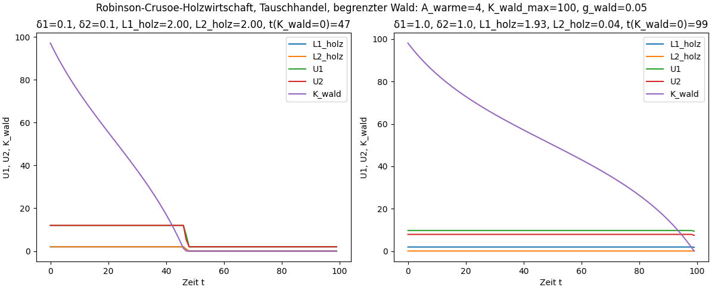
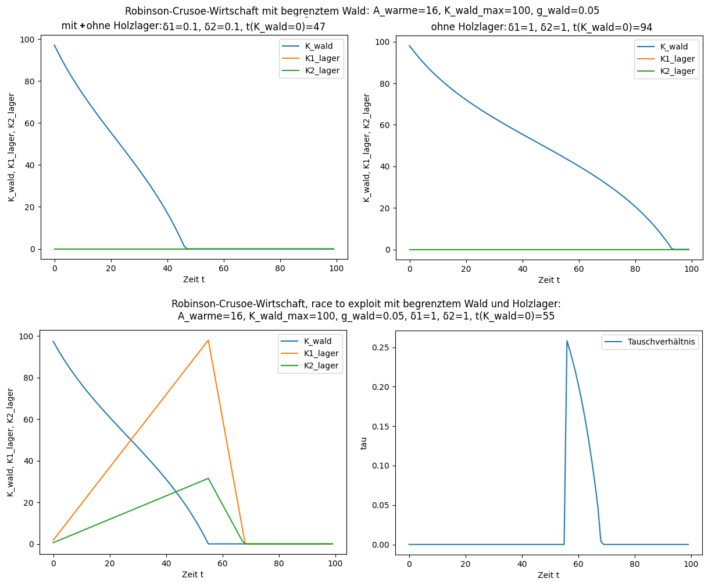
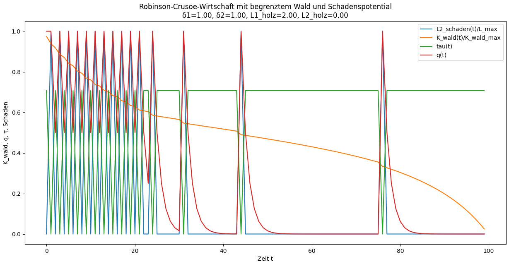
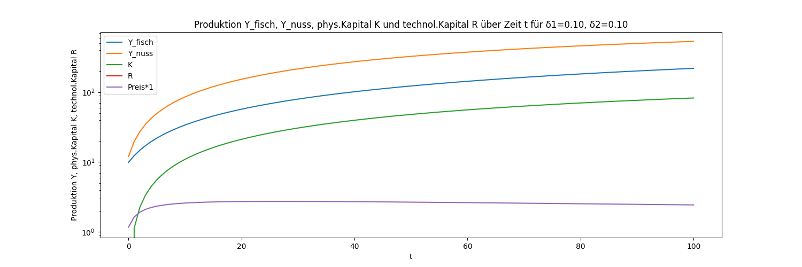
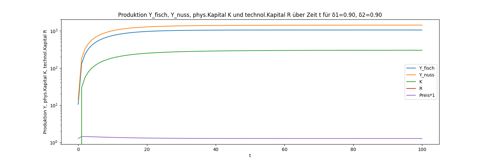
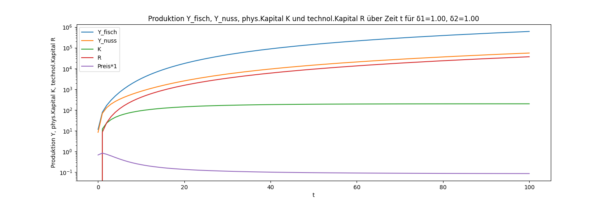

## Mini-WM Teil 2: Robinson und Freitag<a id="mini-wm-teil-2-robinson-und-freitag"></a>
<!-- Start table of contents, generated by md_toc_update.py, do not edit -->
## Inhaltsverzeichnis

  - [Mini-WM Teil 2: Robinson und Freitag](MiniWM_Teil02_RobinsonFreitag.md#mini-wm-teil-2-robinson-und-freitag)
    - [Zwei-Personen-Subsistenzwirtschaft](MiniWM_Teil02_RobinsonFreitag.md#zwei-personen-subsistenzwirtschaft)
      - [Autarke Zwei-Personen-Subsistenzwirtschaft](MiniWM_Teil02_RobinsonFreitag.md#autarke-zwei-personen-subsistenzwirtschaft)
      - [Gemeinschaftliche Zwei-Personen-Subsistenzwirtschaft](MiniWM_Teil02_RobinsonFreitag.md#gemeinschaftliche-zwei-personen-subsistenzwirtschaft)
      - [Warentausch in einer Zwei-Personen-Subsistenzwirtschaft](MiniWM_Teil02_RobinsonFreitag.md#warentausch-in-einer-zwei-personen-subsistenzwirtschaft)
      - [Öffentliche Güter](MiniWM_Teil02_RobinsonFreitag.md#offentliche-guter)
      - [Race to exploit](MiniWM_Teil02_RobinsonFreitag.md#race-to-exploit)
      - [Fremd- und Selbstschädigung](MiniWM_Teil02_RobinsonFreitag.md#fremd--und-selbstschadigung)
    - [Zwei-Personen-Wirtschaft mit Konsum, Investitionen und Forschung](MiniWM_Teil02_RobinsonFreitag.md#zwei-personen-wirtschaft-mit-konsum-investitionen-und-forschung)
    - [Exkurs: Approximation rekursiver Differenzengleichungen](MiniWM_Teil02_RobinsonFreitag.md#exkurs-approximation-rekursiver-differenzengleichungen)
    - [Interessante Punkte in der Robinson-Freitag-Wirtschaft](MiniWM_Teil02_RobinsonFreitag.md#interessante-punkte-in-der-robinson-freitag-wirtschaft)
    - [Links und Anmerkungen](MiniWM_Teil02_RobinsonFreitag.md#links-und-anmerkungen)
<!-- End of TOC, generated by md_toc_update.py, do not edit -->

Im [1. Teil des minimalistischen Wirtschaftsmodells (Mini-WM)](MiniWM_Teil01_RobinsonCrusoe.md) wirtschaftete Robinson allein auf seiner einsamen Insel. Jetzt bekommt er Gesellschaft von Freitag. In Daniel Defoes Original von 1719 rettete Robinson Freitag vor den Kannibalen; wir modellieren dieses Ereignis als natürliches Bevölkerungswachstum.

Wie in Teil 1 entwickeln wir die 2-Personenwirtschaft wieder Schritt für Schritt:
1. Reine Subsistenzwirtschaft
2. Subsistenzkonsum, Genusskonsum, Investitionen und Produktivitätssteigerung durch Forschung

Robinson und Freitag können auf unterschiedliche Weise koopererieren:
* Autarkie: Jeder wirtschaftet autark für sich (keine Kooperation), oder
* Gemeinschaftswirtschaft: beide wirtschaften gemeinschaftlich, d.h. alle Erträge werden gemeinschaftliches Eigentum und kooperativ untereinander verteilt, oder
* Tauschhandel: beide tauschen Waren und einigen sich auf eine Tauschmenge unter Maximierung ihrer jeweiligen Nutzenfunktion.

Wir beginnen mit dem einfachsten Fall, der reinen Subsistenzwirtschaft, berechnen die 3 Formen (Autarkie, Gemeinschaftswirtschaft, Tauschhandel) und vergleichen die resultierenden wirtschaftl. Kenngrößen.

### Zwei-Personen-Subsistenzwirtschaft<a id="zwei-personen-subsistenzwirtschaft"></a>

Wir verwenden wieder eine Cobb-Douglas-Produktionsfunktion $Y = A L^α K^β$. Robinson sei der $1$. Akteur ($i=1$), Freitag der $2.$ Akteur ($i=2$). Beide produzieren Fische und Kokosnüsse mit individuell unterschiedlichem Arbeitseinsatz $L_i$, Faktorproduktivität $A_i$ und Elastizität $α_i$:  
$Y_{fisch} = \sum_{i=1}^{2} Y_{i,fisch}(L_{i,fisch}) = \sum_{i=1}^{2} A_{i,fisch} L_{i,fisch}^{α_{i,fisch}}$  
$Y_{nuss} = \sum_{i=1}^{2} Y_{i,nuss}(L_{i,nuss}) = \sum_{i=1}^{2} A_{i,nuss} L_{i,nuss}^{α_{i,nuss}}$  

Beide konsumieren unterschiedlich viele Fische $C_{i,fisch,subsistenz}$ und Kokosnüsse $C_{i,nuss,subsistenz}$ zwecks Subsistenz, aber nur genauso viel wie sie zusammen produziert haben: Produktion = Subsistenzkonsum. Folglich gilt die Konsumrestriktion:  
$C_{fisch,subsistenz} = \sum_{i=1}^{2} C_{i,fisch,subsistenz} = Y_{fisch}$  
$C_{nuss,subsistenz} = \sum_{i=1}^{2} C_{i,nuss,subsistenz} = Y_{nuss}$  

Beide haben individuell unterschiedliche Nutzen:  
$U_i = A_{i,subsistenz} L_{i,subsistenz}^{α_{i,subsistenz}} C_{i,fisch,subsistenz}^{β_{i,subsistenz}} C_{i,nuss,subsistenz}^{γ_{i,subsistenz}}$  

Ebenso gilt weiterhin die Zeitrestriktion auf 24 Stunden:  
$L_{i,fisch} + L_{i,nuss} + L_{i,subsistenz} = 24$  
mit dem Arbeitseinsatz $L_{i,fisch}$ zum Fischen, dem Arbeitseinsatz $L_{i,nuss}$ zum Sammeln von Kokosnüssen und dem Einsatz $L_{i,subsistenz}$ zur Aufrechterhaltung der eigenen Subsistenz (Essen, Schlafen, Erholung), jeweils in Stunden.  

Wir verwenden hier Cobb-Douglas-Funktionen, weil sie mathematisch einfach sind und in vielen ökonomischen Modellen verwendet werden. Trotzdem hat die Cobb-Douglas-Funktion Schwächen, z.B. wenn eine Produktion unterhalb einer kritischen Schwelle kaum noch funktioniert. Beispiel: Eine Produktion muss erst vorbereitet und hochgefahren werden; Menschen benötigen mindestens 8 Stunden Schlaf. Unterhalb solcher kritischen Schwellen entspricht das Verhalten einer Cobb-Douglas-Funktion mit $α_i > 1$ und erst oberhalb setzt ein Grenznutzen mit $α_i < 1$ ein. Um Schwelleneffekte zu modellieren, kann z.B. die Hill-Funktion $S(L) = L^h / (L^h + L_0^h) = 1 / (1 + (L_0/L)^h)$ mit der Schwelle $L_0$ verwendet werden. Parameter $h$ kontrolliert dabei die Steilheit des Übergangs.

#### Autarke Zwei-Personen-Subsistenzwirtschaft<a id="autarke-zwei-personen-subsistenzwirtschaft"></a>

Robinson und Freitag wirtschaften jeder für sich alleine. Daher maximiert jeder seine eigene Nutzenfunktion $U_i$ unabhängig vom anderen.

[mini_wm_robinson_two_persons_subsistence.py](../src/mini_wm_robinson_two_persons_subsistence.py) berechnet die Allokierungen $L_{i,fisch}$, $L_{i,nuss}$, $L_{i,subsistenz}$ und die Nutzen $U_i$ anhand von Beispielwerten mit unterschiedlichen Faktorproduktivitäten und Nutzenfunktionen, aber gleichen Elastizitäten für Robinson und Freitag:

|  Akteur  | $L_{fisch}$ | $L_{nuss}$ | $L_{subsistenz}$ | $Y_{fisch}$ | $C_{fisch}$ | $Y_{nuss}$ | $C_{nuss}$ | $U$ |
| -------- | --- | --- | ---- | ----- | ----- | ----- | ----- | ---- |
| Robinson | 6.3 | 5.1 | 12.6 | 14.51 | 14.51 | 10.61 | 10.61 | 0.95 |
| Freitag  | 6.3 | 5.1 | 12.6 |  7.25 |  7.25 | 21.23 | 21.23 | 1.03 |

Da im Beispiel Robinsons Faktorproduktivität für Fische doppelt so hoch ist wie die von Freitag, und Freitags Faktorproduktivität für Kokosnüsse doppelt so hoch ist wie die von Robinson, ist es nicht verwunderlich, dass Robinson mehr Fische und Freitag mehr Kokosnüsse produziert, um ihre Nutzen zu maximieren.

#### Gemeinschaftliche Zwei-Personen-Subsistenzwirtschaft<a id="gemeinschaftliche-zwei-personen-subsistenzwirtschaft"></a>

Robinson und Freitag verteilen die gemeinschaftlichen Erträge kooperativ und gerecht anhand einer festgelegten Verteilungsregel. Welches Verteilungskriterium gerecht ist, mag unterschiedlich gesehen werden. Verteilungskriterien können z.B. sein:
* gleicher Nutzen ($U_1 = U_2$)
* gleicher Konsum ($C_{1,fisch,subsistenz} = C_{2,fisch,subsistenz}$, $C_{1,nuss,subsistenz} = C_{2,nuss,subsistenz}$)
* gleiche Arbeitszeit ($L_{1,fisch} + L_{1,nuss} = L_{2,fisch} + L_{2,nuss}$)
* Nutzen proportional zum Arbeitseinsatz ($U_i ∝ L_{i,fisch} + L_{i,nuss}$)
* Konsum proportional zum Arbeitseinsatz ($C_{i,fisch,subsistenz} + C_{i,nuss,subsistenz} ∝ L_{i,fisch} + L_{i,nuss}$).

Erträge, Konsum und Nutzen anhand der Beispielwerte in [mini_wm_robinson_two_persons_subsistence.py](../src/mini_wm_robinson_two_persons_subsistence.py):

|  Akteur, Verteilung der gemeinschaftlichen Erträge | $L_{fisch}$ | $L_{nuss}$ | $L_{subsistenz}$ | $Y_{fisch}$ | $C_{fisch}$ | $Y_{nuss}$ | $C_{nuss}$ | $U$ |
| ------------------------- | --- | --- | ---- | ----- | ----- | ----- | ----- | ---- |
| Robinson, gleicher Nutzen | 9.5 | 2.2 | 12.3 | 17.76 | 11.58 |  7.61 | 17.05 | 1.48 |
| Freitag, gleicher Nutzen  | 2.9 | 8.2 | 13.0 |  4.88 | 11.06 | 25.72 | 16.28 | 1.48 |
| Robinson, gleicher Konsum | 9.0 | 2.0 | 13.0 | 17.33 | 11.17 |  7.35 | 16.43 | 1.42 |
| Freitag, gleicher Konsum  | 3.0 | 8.0 | 13.0 |  5.00 | 11.17 | 25.51 | 16.43 | 1.54 |
| Robinson, gleiche Arbeit  | 9.2 | 2.1 | 12.6 | 17.56 | 11.28 |  7.51 | 16.74 | 1.42 |
| Freitag, gleiche Arbeit   | 3.0 | 8.4 | 12.6 |  5.00 | 11.28 | 25.98 | 16.74 | 1.54 |
| Robinson, Nutzen ∝ Arbeit | 9.2 | 2.1 | 12.6 | 17.55 | 11.39 |  7.51 | 16.93 | 1.48 |
| Freitag, Nutzen ∝ Arbeit  | 3.0 | 8.4 | 12.6 |  4.99 | 11.15 | 25.98 | 16.57 | 1.48 |
| Robinson, Konsum ∝ Arbeit | 9.3 | 2.1 | 12.5 | 17.63 | 11.30 |  7.54 | 16.97 | 1.44 |
| Freitag, Konsum ∝ Arbeit  | 3.0 | 8.3 | 12.7 |  4.96 | 11.29 | 25.91 | 16.48 | 1.52 |

Die Tabelle zeigt, wie eine gemeinschaftliche Wirtschaft mit regelbasierter Verteilung der Erträge den individuellen Nutzen gegenüber Autarkie erhöhen kann.

#### Warentausch in einer Zwei-Personen-Subsistenzwirtschaft<a id="warentausch-in-einer-zwei-personen-subsistenzwirtschaft"></a>

Nehmen wir an, Robinson und Freitag betreiben miteinander Handel. Robinson tauscht einen Teil der von ihm produzierten Fische oder Kokosnüsse mit Freitag und umgekehrt. Da beide i.A. mit unterschiedlichen Faktorproduktivitäten und Elastizitäten produzieren und unterschiedl. Nutzenfunktionen haben, kann der Warentausch den individuellen Nutzen erhöhen.

Nehmen wir an, dass Robinson besonders gut im Fischen ist (im Modell: $A_{1,fisch}$ groß, $A_{1,nuss}$ klein), während Freitag besser im Ernten von Kokosnüssen sei (im Modell: $A_{2,fisch}$ klein, $A_{2,nuss}$ groß). Robinson tauscht daher $T_{1,fisch}$ seiner Fische gegen $T_{2,nuss}$ von Freitags Kokosnüssen:  
$C_{1,fisch,subsistenz} = Y_{1,fisch} - T_{1,fisch}$  
$C_{2,fisch,subsistenz} = Y_{2,fisch} + T_{1,fisch}$  
$C_{1,nuss,subsistenz} = Y_{1,nuss} + T_{2,nuss}$  
$C_{2,nuss,subsistenz} = Y_{2,nuss} - T_{2,nuss}$  
mit den Nebenbedingungen:  
$0 ≤ T_{1,fisch} ≤ Y_{1,fisch}$  
$0 ≤ T_{2,nuss} ≤ Y_{2,nuss}$  

Das Tauschverhältnis ist damit $T_{fn} = T_{1,fisch} / T_{2,nuss}$. Das Tauschverhältnis folgt aus den Tauschanteilen, umgekehrt folgen die Tauschanteile $T_{1,fisch}$ und $T_{2,nuss}$ aber nicht aus dem Tauschverhältnis.

Robinson und Freitag maximieren ihre jeweilige Nutzenfunktion $U_i$. Beide haben aber nicht automatisch dasselbe Maximum: Robinson hätte gerne viele Kokosnüsse für wenige Fische; Freitag hätte gerne viele Fische für wenige Kokosnüsse. Daher braucht es eine [Verhandlungslösung](https://de.wikipedia.org/wiki/Verhandlungsl%C3%B6sung):

Beide versuchen, sich gegenüber dem Autarkie-Nutzen ohne Warentausch zu verbessern. Die beiden Nutzenfunktionen $U_i(T_{1,fisch}, T_{2,nuss})$ hängen von den Tauschanteile $T_{1,fisch}$ und $T_{2,nuss}$ ab. Robinson wird daher versuchen so zu tauschen, dass $U_1(T_{1,fisch}, T_{2,nuss}) - U_1^0$ möglichst gross wird, während Freitag versuchen wird, einen Tausch mit möglichst grossem $U_2(T_{1,fisch}, T_{2,nuss}) - U_2^0$ abzuschließen. $U_1^0$ resp. $U_2^0$ sind dabei die Autarkie-Nutzen:  
$U_i^0 = \max{U_i}$ unter Autarkie-Bedingungen ohne Tauschhandel.

Die [Nash-Lösung](https://de.wikipedia.org/wiki/Nash-L%C3%B6sung) liefert eine Pareto-optimale Lösung des Problems mittels Nash-Produkt der Nutzenfunktionen:  
$\max{(U_1(T_{1,fisch}, T_{2,nuss}) - U_1^0) \cdot (U_2(T_{1,fisch}, T_{2,nuss}) - U_2^0)}$  
mit den Nebenbedingungen $U_1(T_{1,fisch}, T_{2,nuss}) ≥ U_1^0$ und $U_2(T_{1,fisch}, T_{2,nuss}) ≥ U_2^0$

Der Handel wird nur dann durchgeführt, wenn beide profitieren. Spieltheoretischer Hintergrund:  
Der Satz von Nash besagt: Es gibt genau eine Pareto-optimale, symmetrische, von positiven linearen Transformationen unabhängige und von irrelevanten Alternativen unabhängige Verhandlungslösung. [^1] Diese Verhandlungslösung kann wie folgt ermittelt werden: Ist $\left( B, d \right)$ eine Verhandlungssituation, so nimmt die Funktion 
$f: B→ℝ, f(x_1,x2) = (x_1 - d_1)(x_2 - d_2)$ in genau einem Punkt aus B das Maximum an, und dieser Punkt ist die Nash’sche Verhandlungslösung. Die Nash’sche Verhandlungslösung ist nicht monoton! [^1] Eine Lösung ist nicht [Pareto-optimal](https://de.wikipedia.org/wiki/Pareto-Optimum), wenn sich die Spieler durch Kooperation verbessern könnten.  
$d_1, d_2$ sind die Drohpunkte der Spieler, bei denen ein Spieler die Verhandlungen scheitern lassen würde, da die Verhandlungslösung keinen höheren Nutzen bringt. Bei Robinson und Freitag also gerade der Autarkie-Nutzen ohne Tauschhandel.  
Die verallgemeinerte Nash-Verhandlungslösung gilt auch für $N ≥ 2$ Spieler:  
$\max{\prod{(U_i - d_i)^{w_i}}}$ mit den Nebenbedingungen $U_i ≥ d_i$ für alle $i$.  
Für Gewichte $w_i = 1$ ergibt sich die symmetrische Lösung; mit $w_i ≠ 1$ lässt sich eine unterschiedliche Verhandlungsmacht von Spielern modellieren (z.B. wenn Robinson das einzige Boot besitzt oder nur Freitag ohne Höhenangst auf die Kokospalmen klettern kann).

[mini_wm_robinson_two_persons_subsistence.py](../src/mini_wm_robinson_two_persons_subsistence.py) maximiert das Nash-Produkt der Nutzenfunktionen numerisch:

|  Akteur | $L_{fisch}$ | $L_{nuss}$ | $L_{subsistenz}$ | $Y_{fisch}$ | $C_{fisch}$ | $Y_{nuss}$ | $C_{nuss}$ | $U$ |
| --------------------- | --- | --- | ---- | ----- | ----- | ----- | ----- | ---- |
| Robinson, autark      | 6.3 | 5.1 | 12.6 | 14.51 | 14.51 | 10.61 | 10.61 | 0.95 |
| Freitag, autark       | 6.3 | 5.1 | 12.6 |  7.25 |  7.25 | 21.23 | 21.23 | 1.03 |
| Robinson, Warentausch | 9.5 | 2.2 | 12.3 | 17.81 | 11.48 |  7.64 | 16.89 | 1.41 |
| Freitag, Warentausch  | 2.8 | 8.1 | 13.0 |  4.86 | 11.18 | 25.69 | 16.44 | 1.56 |

Robinson tauscht 6.32 seiner Fische (36% seiner Produktion) gegen 9.25 von Freitags Kokosnüssen (36% von Freitags Produktion). Der Tauschkurs Fische zu Kokosnüsse beträgt $T_{1,fisch}/T_{2,nuss} = 6.32/9.25 = 0.68$, die Handelsintensität (Anteil der gehandelten Güter am Gesamtertrag) beträgt 28%.

Die Tabelle zeigt, wie Warentausch die Produktion spezialisiert: Robinson steckt seine Arbeitskraft v.a. in den Fischfang, Freitag v.a. in die Produktion von Kokosnüssen. Das ist aufgrund der unterschiedlichen Faktorproduktivitäten im Beispiel schlicht produktiver: Mit Warentausch produzieren beide zusammen 17.81+4.86=22.67 Fische und 7.64+25.69=33.33 Kokosnüsse, autark dagegen nur 14.51+7.25=21.76 Fische und 10.61+21.23=31.84 Kokosnüsse.

Wie zu erwarten, sind die Nutzen $U_1$, $U_2$ bei Warentausch höher als ohne Warentausch (Autarkie). Warentausch ist kein Nullsummenspiel, sondern erlaubt eine bessere Ausnutzung der Ressourcen im Falle unterschiedlicher Produktionsfunktionen.

In diesem Beispiel ist das Nash-Produkt bei Warentausch geringfügig höher als bei Gemeinschaftswirtschaft mit festem Verteilungskriterium. Dies muss nicht in jedem Fall so sein. Theoretisch kann ein regelgebundener Planer bessere, schlechtere oder gleiche Nutzen wie der Warentausch erzeugen. Ist ein Nash-Gleichgewicht nicht pareto-optimal, kenn ein regelgebundener Planer die bessere, kooperative Lösung finden. Ist ein Planer in der Wahl seiner Regeln beschränkt, kann die regelgebundene Lösung schlechter sein. Ein unbegrenzt optimaler Planer kann immer das beste Nash-Gleichgewicht nachbauen und damit mindestens die gleiche Lösung liefern. Ein ganzer Bereich der VWL beschäftigt sich mit der Frage, wann Märkte Pareto-effizient sind und wann nicht... [^2] Regelbasierte Verteilungen von Gütern setzen i.A. Sanktionsmöglichkeiten gegen Regelverletzungen voraus.

#### Öffentliche Güter<a id="offentliche-guter"></a>

Bei öffentlichen Gütern kann ein nachträglicher Tausch individuell produzierter Waren nicht optimal oder nicht möglich sein. Die Verteilung gemeinsamer Ressourcen erfolgt dann oft durch Entscheidungsregeln. 

Robinson und Freitag nutzen den Inselwald zur Brennstoffversorgung. Der Wald kann als begrenztes Kapital modelliert werden:  
$K_{wald,left}(t) = K_{wald}(t) - Y_{holz}$ mit Randbedingung $Y_{holz} <= K_{wald}(t)$  
$K_{wald}(t+1) = K_{wald,left}(t) + (g_{wald} K_{wald,left}(t)) (1 - K_{wald,left}(t) / K_{wald,max})$  

Dabei ist $Y_{holz} = Y_{1,holz} + Y_{2,holz}$ die Holzentnahme von Robinson ($Y_{1,holz}$) und Freitag ($Y_{2,holz}$) zur Brennholzproduktion, z.B. 1 Baum pro Zeiteinheit. $K_{wald,max}$ sei die maximale Größe des Waldes, z.B. 1000 Bäume. $g_{wald}$ modelliert das natürliche Wachstum, z.B. $g_{wald} = 0.05$ wenn max. 5% des Waldes pro Zeiteinheit nachwachsen kann (bis der Wald wieder seine max. Größe von $K_{wald,max}$ Bäumen erreicht hat). 

Für die Brennholzproduktion nehmen wir wieder eine Cobb-Douglas-Produktionsfunktion an:  
$Y_{i,holz} = A_{i,holz} L_{i,holz}^{α_{i,holz}} K_{wald}(t)^{β_{i,holz}}$  
mit der Beispiel-Annahme $α_{i,holz} = 1$, da doppelte Holzfällerarbeit $L_{i,holz}$ doppelt so viel Brennholz $Y_{i,holz}$ ergibt, und $β_{i,holz} = 0$, da 1 Stunde Holz fällen gleich viel Brennholz ergibt, egal wie groß der Wald ist. D.h.  
$Y_{i,holz} = A_{i,holz} L_{i,holz}$  
mit der Faktorproduktivität $A_{i,holz}$ in Brennholz/Zeit.

Robinson und Freitag können unterschiedlich schnell Bäume fällen und zu Brennholz verarbeiten, d.h. die Faktorproduktivitäten $A_{i,holz}$ seien für beide unterschiedlich. Ausserdem können beide zusammen nicht mehr Holz fällen als Bäume existieren, d.h. es gilt die Randbedingung:  
$Y_{1,holz} + Y_{2,holz} = A_{1,holz} L_{1,holz} + A_{2,holz} L_{2,holz} ≤ K_{wald}(t)$  

Man sieht sofort: Robinson und Freitag können nicht unabhängig voneinander und beliebig viel Holz schlagen, um ihren individuellen Nutzen zu erhöhen. Der Nutzen $U_{i,holz} = A_{wärme} C_{i,holz}^{α_{wärme}}$ sei für beide gleich und abhängig vom konsumierten Brennholz $C_{i,holz}$. Ein gemeinsames Lagerfeuer wärmt aber beide genauso gut wie zwei individuelle Feuerstellen mit doppeltem Holzverbrauch. Um ihren individuellen Nutzen zu erhöhen, verbrennen Robinson und Freitag ihr Holz gemeinsam:  
$U_{1,holz} = U_{2,holz} = A_{wärme} (C_{1,holz} + C_{2,holz})^{α_{wärme}} = A_{wärme} (Y_{1,holz} + Y_{2,holz})^{α_{wärme}} = A_{wärme} (A_{1,holz} L_{1,holz} + A_{2,holz} L_{2,holz})^{α_{wärme}}$  
Für zwei individuelle Lagerfeuer gilt dagegen:  
$U_{1,holz} = A_{wärme} (Y_{1,holz})^{α_{wärme}} = A_{wärme} (A_{1,holz} L_{1,holz})^{α_{wärme}}$  
$U_{2,holz} = A_{wärme} (Y_{2,holz})^{α_{wärme}} = A_{wärme} (A_{2,holz} L_{2,holz})^{α_{wärme}}$  
Der Mehrnutzen $ΔU_i$ des gemeinsamen Lagerfeuers gegenüber individueller Verbrennung besteht für Robinson also aus  
$ΔU_1 = A_{wärme} (A_{1,holz} L_{1,holz} + A_{2,holz} L_{2,holz})^{α_{wärme}} - A_{wärme} (A_{1,holz} L_{1,holz})^{α_{wärme}}$ mit $ΔU_1 ≥ 0$ für $L_{2,holz} ≥ 0$  
und für Freitag aus  
$ΔU_2 = A_{wärme} (A_{1,holz} L_{1,holz} + A_{2,holz} L_{2,holz})^{α_{wärme}} - A_{wärme} (A_{2,holz} L_{2,holz})^{α_{wärme}}$ mit $ΔU_2 ≥ 0$ für $L_{1,holz} ≥ 0$  
und ist damit für beide stets ≥ 0. Robinson und Freitag werden ihre Holzproduktion daher stets gemeinsam in Wärme verwandeln. Der Wald ist eine [Allmende](https://de.wikipedia.org/wiki/Allmende), eine gemeinsame und erschöpfbare Ressource; die Wärme des Lagerfeuers ist ein [öffentliches Gut](https://de.wikipedia.org/wiki/%C3%96ffentliches_Gut), ein gemeinsamer Nutzen.

Andererseits hat jeder das Eigeninteresse, möglichst wenig zum gemeinsamen Lagerfeuer beizutragen, d.h. möglichst wenig selbst gefälltes Holz beizusteuern und vom Holz des anderen zu profitieren. Nehmen wir an, Robinson kann in 1 Stunde 1 Baum fällen und zu Brennholz zu verarbeiten; Freitag benötige dafür 2 Stunden. D.h. die Faktorproduktivitäten seien $A_{1,holz} = 1$ und $A_{2,holz} = 0.5$. Die doppelte Menge Brennholz gebe doppelte Wärme und doppelten Nutzen ($α_{wärme}=1$). Holzproduktion ist gleich Holzkonsum, d.h. für das gemeinsame Lagerfeuer gilt:  
$U_{1,holz} = U_{2,holz} = A_{wärme} (Y_{1,holz} + Y_{2,holz})^{α_{wärme}} = A_{wärme} (A_{1,holz} L_{1,holz} + A_{2,holz} L_{2,holz}) = A_{wärme} (L_{1,holz} + L_{2,holz}/2)$  

Der Alternativnutzen zur Holzproduktion sei $U_{i,alternativ}(L_{i,holz})$. Dies ist der Nutzen, den Robinson resp. Freitag erzielen können, wenn sie ihren Arbeitseinsatz $L_{i,holz}$ anderweitig nutzen würden. Für den Augenblick nehmen wir an, der Alternativnutzen sei ebenfalls linear zur eingesetzten Zeit: $U_{i,alternativ} = A_{i,alternativ} L_{i,holz}$. Da die Holzproduktion zu Lasten der Alternativproduktion geht, hat also jeder den Anreiz $U_{i,holz} - U_{i,alternativ}$ zum gemeinsamen Lagerfeuer beizutragen. Der Nutzen aus Konsum der Holz- und Alternativproduktion ist:  
$U_1 = U_{1,holz} + U_{1,alternativ} = A_{wärme} (A_{1,holz} L_{1,holz} + A_{2,holz} L_{2,holz}) + A_{1,alternativ} L_{1,alternativ}$  
$U_2 = U_{2,holz} + U_{2,alternativ} = A_{wärme} (A_{1,holz} L_{1,holz} + A_{2,holz} L_{2,holz}) + A_{2,alternativ} L_{2,alternativ}$  

Robinson und Freitag können z.B. wählen, ob sie sich 0, 1 oder 2 Stunden in der Holzproduktion engagieren. Mit den Beispielwerten $A_{1,holz} = 1$, $A_{2,holz} = 0.5$, $α_{wärme} = 1$, $A_{1,alternativ} = A_{2,alternativ} = 1$ sowie $L_{i,alternativ} = 2 - L_{i,holz}$ ergeben sich folgende Spielmatrizen:  
* $A_{wärme} = 0.5$:  
    |                | $L_{2,holz}=0$ | $L_{2,holz}=1$ | $L_{2,holz}=2$ |
    | -------------- | -------------- | -------------- | -------------- |
    | $L_{1,holz}=0$ |  (2.00,  2.00) |  (2.25,  1.25) |  (2.50,  0.50) |
    | $L_{1,holz}=1$ |  (1.50,  2.50) |  (1.75,  1.75) |  (2.00,  1.00) |
    | $L_{1,holz}=2$ |  (1.00,  3.00) |  (1.25,  2.25) |  (1.50,  1.50) |
* $A_{wärme} = 0.9$:  
    |                | $L_{2,holz}=0$ | $L_{2,holz}=1$ | $L_{2,holz}=2$ |
    | -------------- | -------------- | -------------- | -------------- |
    | $L_{1,holz}=0$ |  (2.00,  2.00) |  (2.45,  1.45) |  (2.90,  0.90) |
    | $L_{1,holz}=1$ |  (1.90,  2.90) |  (2.35,  2.35) |  (2.80,  1.80) |
    | $L_{1,holz}=2$ |  (1.80,  3.80) |  (2.25,  3.25) |  (2.70,  2.70) |
* $A_{wärme} = 4$:  
    |                | $L_{2,holz}=0$ | $L_{2,holz}=1$ | $L_{2,holz}=2$ |
    | -------------- | -------------- | -------------- | -------------- |
    | $L_{1,holz}=0$ |  (2.00,  2.00) |  (4.00,  3.00) |  (6.00,  4.00) |
    | $L_{1,holz}=1$ |  (5.00,  6.00) |  (7.00,  7.00) |  (9.00,  8.00) |
    | $L_{1,holz}=2$ |  (8.00, 10.00) | (10.00, 11.00) | (12.00, 12.00) |

Anhand der Spielmatrizen erkennt man sofort die dominierenden Strategien:
* Für $A_{wärme} = 0.5$ dominiert die Strategie $L_{i,holz}=0$, da die Nutzen $U_1(1,j)$ für Spieler 1 in der ersten Zeile immer höher sind als $U_1(i,j)$ in jeder anderen Zeile, unabhängig von der Wahl von Spieler 2. Umgekehrt sind die Nutzen $U_2(i,1)$ für Spieler 2 in der ersten Spalte immer höher sind als $U_2(i,j)$ in jeder anderen Spalte, unabhängig von der Wahl von Spieler 1. Also werden sich beide für $L_{i,holz}=0$ entscheiden und das gemeinsame Lagerfeuer fällt aus. Die Strategiekombination ist ausserdem ein Pareto-effizientes Nash-Gleichgewicht: Es existiert keine andere Kombination, bei der sich beide verbessern.
* Für $A_{wärme} = 4$ dominiert die Strategie $L_{i,holz}=2$, da die Nutzen $U_1(3,j)$ für Spieler 1 in der dritten Zeile immer höher sind als $U_1(i,j)$ in jeder anderen Zeile. Umgekehrt sind die Nutzen $U_2(i,3)$ für Spieler 2 in der dritten Spalte immer höher als $U_2(i,j)$ in jeder anderen Spalte. Also werden sich beide für $L_{i,holz}=2$ entscheiden und das gemeinsame Lagerfeuer liefert beiden maximalen Nutzen. Auch diese Strategiekombination ist Pareto-effizient, da beide den höchsten Nutzen erreichen.
* Für $A_{wärme} = 0.9$ dominiert wieder die Strategie $L_{i,holz}=0$ (Werte $U_1$ in der ersten Zeile immer höher als in allen anderen Zeilen, Werte $U_2$ in der ersten Spalte immer höher als in allen anderen Spalten). Auch hier fällt das Lagerfeuer aus, die Strategiekombination ist aber nicht Pareto-effizient: Würden beide die Strategie $L_{i,holz}=2$ vereinbaren, steigt der Nutzen für beide von $2.0$ auf $12.0$.

Die Zone $2/3 < A_{wärme} < 1$ ist besonders interessant: In dieser Zone ist beiderseitiges Beitragen kollektiv vorteilhaft, aber individuelles Beitragen für beide unattraktiv. Genau dort entsteht ein nicht-pareto-effizientes Nash-Gleichgewicht. Die Spielmatrix zeigt: Abhängig vom relativen Nutzen des Holzeinsatzes gegenüber alternativen Verwendungen - hier modelliert durch $A_{wärme}$ gegenüber $A_{i,alternativ}$ - kann eine regelbasierte Verhandlungslösung oder ein Warentausch die bessere (den Nutzen maximierende) Lösung sein. 

[mini_wm_robinson_forrest.py](../src/mini_wm_robinson_forrest.py) berechnet die optimalen Nutzen bei Tauschhandel durch Maximierung des Nash-Produktes $(U_1 - U_1^0)(U_2 - U_2^0)$. Durch seine höhere Brennholzproduktion kann Robinson mehr vom öffentlichen Gut Wärme produzieren, dafür kompensiert Freitag ihn mit einem Anteil $τ$ seiner Alternativgüter. Mit unterschiedlichen Faktorproduktivitäten der Holzproduktion profitieren beide davon:  
$U_1 = A_{wärme} (A_{1,holz} L_{1,holz} + A_{2,holz} L_{2,holz}) + A_{1,alternativ} L_{1,alternativ} + τ A_{2,alternativ} L_{2,alternativ}$  
$U_2 = A_{wärme} (A_{1,holz} L_{1,holz} + A_{2,holz} L_{2,holz}) + A_{2,alternativ} L_{2,alternativ} - τ A_{2,alternativ} L_{2,alternativ}$  
Das Nash-Produkt $(U_1 - U_1^0)(U_2 - U_2^0)$ wird maximiert, wobei der Drohpunkt $(U_1^0, U_2^0)$ wieder der Autarkie-Nutzen ohne Tauschhandel ist.  
Für das Beispiel ergeben sich folgende Nutzen bei Tauschhandel:  
| $A_{wärme}$ | Dominante Strategien  |    Pareto-optimal?   | Allokation und Nutzen bei Tauschhandel        |
| --- | ----------------------------- | -------------------- | --------------------------------------------- |
| 0.5 | $L_{holz}=(0,0)$, $U= (2, 2)$ |    Pareto-optimal    | $L_{holz}=(0,0)$, $τ=0.01$, $U=( 2.00, 2.00)$ |
| 0.9 | $L_{holz}=(0,0)$, $U= (2, 2)$ | Nicht Pareto-optimal | $L_{holz}=(2,0)$, $τ=0.50$, $U=( 2.80, 2.80)$ |
| 4.0 | $L_{holz}=(2,2)$, $U=(12,12)$ |    Pareto-optimal    | $L_{holz}=(2,2)$, $τ=0.10$, $U=(12.00,12.00)$ |

Im interessanten Fall $A_{wärme} = 0.9$ ist das Nash-Gleichgewicht $L_{holz}=(0,0)$ mit Nutzen $U=(2, 2)$ nicht Pareto-optimal, beide könnten mit der Strategie $L_{holz}=(2,2)$ einen höheren Nutzen erzielen. Dieser wird durch Tauschhandel erreicht: Robinson stellt das öffentliche Gut effizient bereit, weil er produktiver beim Holz ist; Freitag kompensiert ihn dafür mit Alternativgütern. Dadurch wird das ineffiziente Trittbrettfahrer-Gleichgewicht überwunden und der Tauschhandel schlägt das nicht-Pareto-optimale Gleichgewicht; im Beispiel bei $L_{holz}=(2,0)$, $τ=0.50$ und Nutzen $U=(2.80, 2.80)$.

Der umgekehrte Fall ist ebenfalls möglich - Tauschhandel ohne oder unter falschen Randbedingungen kann zu geringerem Nutzen für alle führen. Je nach Randbedingungen kann kurzfristig rationales Handeln langfristig auch zu niedrigerem Nutzen für alle bis zur Zerstörung der Produktionsgrundlage führen.  
Wir nehmen an, dass der gemeinsam genutzte Wald ein begrenztes Kapital darstellt:  
$K_{wald,left}(t) = K_{wald}(t) - Y_{holz}$ mit Randbedingung $Y_{holz} <= K_{wald}(t)$  
$K_{wald}(t+1) = K_{wald,left}(t) + g_{wald} K_{wald,left}(t) (1 - K_{wald,left}(t) / K_{wald,max})$  
Die natürliche Regeneration des Waldes sei begrenzt, z.B. $g_{wald}=0.05$, d.h. 5% des Waldes regeneriert sich pro Zeiteinheit bis zur maximalen Größe von $K_{wald,max}$. Kurzsichtige Abholzung bringt einen kurzfristigen Zusatznutzen. Der zukünftige Nutzen aus Holzkonsum wird diskontiert:  
$U_i = \sum_{t=0}^{∞} δ_i^t U_{i,holz}(t) = \sum_{t=0}^{∞} δ_i^t A_{wärme} C_{holz}(t)$ mit $C_{holz}(t) =  Y_{holz}(t)$, d.h. Holzkonsum = Holzproduktion  
Ist der Diskontfaktor hoch ($δ_i$ nahe 1), wird die Zukunft nur geringfügig diskontiert, d. h. die Zukunft ist wichtig und ein zukünftiger Nutzen hat hohes Gewicht. Ein niedriger Diskontfaktor ($δ_i$ nahe 0) repräsentiert eine hohe Gegenwartspräferenz.

Nehmen wir an, die Diskontfaktoren $δ_i$ sind klein, Robinson und Freitag handeln kurzsichtig. Robinson kann heute Holz schlagen und Wärme bekommen, der Schaden liegt in der Zukunft und trifft beide. Beispiel:  

| $A_{wärme}$ | $δ_i$ | $L_{1,holz}$ | $L_{2,holz}$ | $τ$  | $t_{exploited}$ | $K_{wald}(t=t_{max})$ | Nashprodukt | $\sum(Y_{holz}(t))$ | $\sum(U_i(t))$ |
| ----------- | ----- | ------------ | ------------ | ---- | --------------- | --------------------- | ----------- | ------------------- | -------------- |
|     0.5     |  0.10 |     0.00     |     0.00     | 0.00 |         ∞       |         100.00        |       0.00  |        0.00         |    400.00      |
|     0.5     |  1.00 |     0.00     |     0.00     | 0.00 |         ∞       |         100.00        |       0.00  |        0.00         |    400.00      |
|     0.9     |  0.10 |     2.00     |     0.00     | 0.50 |        94       |           0.00        |       0.79  |      188.31         |    550.65      |
|     0.9     |  1.00 |     1.94     |     0.00     | 0.49 | $t_{max}$       |           0.00        |    6039.92  |      194.29         |    555.43      |
|     4.0     |  0.10 |     2.00     |     2.00     | 1.00 |        47       |           0.00        |      39.51  |      142.31         |   1348.73      |
|     4.0     |  1.00 |     1.93     |     0.04     | 0.95 | $t_{max}$       |           0.00        |  239294.80  |      194.24         |   1757.86      |

Die Tabelle zeigt die Ressourcenaufteilung $L_{1,holz}$, $L_{2,holz}$, $τ$, die Zeit $t_{exploited}$ bis zur vollständigen Abholzung des Waldes, den Waldbestand $K_{wald}(t=t_{max})$ zum maximalen Zeitpunkt $t_{max}$, das Nashprodukt $(U_1 - U_1^0)(U_2 - U_2^0)$, sowie die Holzproduktion $\sum(Y_{holz})$ und den nicht-diskontierten Gesamtnutzen $\sum(U_i)$ über den gesamten Zeitraum $0 ≤ t ≤ t_{max}$. Statt einer unendlichen Summe bis $t→∞$ berechnet [mini_wm_robinson_forrest.py](../src/mini_wm_robinson_forrest.py) den diskontierten Nutzen numerisch bis $t_{max}=100$, d.h. $U_i = \sum_{t=0}^{t_{max}} δ_i^t U_{i,holz}(t)$. Das Nashprodukt wird daher maximal, wenn der Wald bei $t = t_{max}$ abgeholzt ist, d.h. komplett in Brennholzproduktion aufgegangen ist. Die Abholzung bei $t = t_{max}$ ist der Numerik geschuldet; für echte Nachhaltigkeit ersetze man gedanklich $t_{max}=100$ durch $t_{max}=∞$.

Der Berechnung des diskontierten Autarkie-Nutzens, d.h. des Drohpunktes $U_1^0, U_2^0$ im Nashprodukt $(U_1 - U_1^0)(U_2 - U_2^0)$, liegt eine vereinfachende Annahme zu Grunde: Bei Abbruch scheitern alle Verhandlungen, d.h. der Autarkie-Nutzen ist der Nutzen, wenn Robinson und Freitag streng jeder für sich handeln (keinerlei Kooperation, kein gemeinsames Feuer, keine Kooperation bei Holzentnahme) und ihre individuelle Nutzenfunktion maximieren. Im Detail könnten Robinson und Freitag aber zwei unterschiedliche Verhandlungen führen: Tausch von Wärme gegen Alternativprodukt, sowie Kooperation bei der Holzentnahme. Beides wären unterschiedliche Verhandlungen mit unterschiedlichen Drohpunkten und Autarkie-Nutzen; Autarke Feuer müssen nicht unbedingt Absprachen zur Holzentnahme verhindern. [mini_wm_robinson_forrest.py](../src/mini_wm_robinson_forrest.py) geht aber vereinfachend davon aus, dass nur ein Drohpunkt existiert; dass also der Abbruch einer Verhandlung automatisch zum Scheitern jedweder Kooperation führt (Küchenpsychologie: ganz oder gar nicht).

Die Tabelle zeigt:
* $A_{wärme} < 2/3$: Die Alternativproduktion ist lohnenswerter als die Holzproduktion. Keine Waldnutzung, der Wald überlebt bis in alle Ewigkeit.
* $A_{wärme} > 2/3$: Je höher $A_{wärme}$ (d.h. je mehr sich Holzproduktion gegenüber Alternativproduktion lohnt) und je niedriger $δ_i$ (d.h. je kleiner die Zukunftspräferenz), desto schneller wird der Wald komplett abgeholzt ($t_{exploited}$ wird kleiner). Je schneller der Wald abgeholzt wird, desto niedriger die gesamte Holzproduktion und deren Erträge, obwohl der individuelle, diskontierte Nutzen dadurch steigt. Eine Vereinbarung auf ein höheres $δ_i$ wäre für beide vorteilhaft, als einseitige Maßnahme aber nachteilig. [^3]

Das Diagramm zeigt den Vergleich von $δ_i=0.1$ und $δ_i=1.0$ für $A_{wärme}=4$:



Interessant ist eine Begrenzung der Holzentnahme durch Regulierung im Fall von $δ_i=0.1$ und $A_{wärme}=4$ (lohnenswerte Brennholzproduktion und geringe Zukunftspräferenz), z.B. durch eine Strafe bei zu hoher Holzentnahme:

| $A_{wärme}$ | $δ_i$ |       Strafe      | $L_{1,holz}$ | $L_{2,holz}$ | $τ$  | $t_{exploited}$ |  Nashprodukt | $\sum(Y_{holz})$ | $\sum(U_i)$ |
| ----------- | ----- | ----------------- | ------------ | ------------ | ---- | --------------- |  ----------- | ---------------- | ----------- |
|     4.0     |  0.10 |       keine       |     2.00     |     2.00     | 1.00 |        47       |       39.51  |      142.31      |   1348.73   |
|     4.0     |  0.10 | $Y_{i,holz}≥1.94$ |     1.94     |     2.00     | 0.00 |        48       |       94.08  |      143.65      |   1356.70   |
|     4.0     |  0.10 | $Y_{i,holz}≥0.97$ |     0.97     |     1.94     | 0.00 |       100       |      873.89  |      194.00      |   1661.00   |
|     4.0     |  0.10 |  $Y_{holz}≥1.94$  |     1.93     |     0.03     | 0.00 |       100       |     3574.13  |      194.00      |   1756.52   |
|     4.0     |  1.00 |       keine       |     1.93     |     0.04     | 0.95 |       100       |   239294.80  |      194.24      |   1757.86   |

Im 2. Fall, d.h. Strafe bei Überschreitung von $Y_{i,holz}=1.94$ erhält jeder Akteur eine Strafe für jede Entnahme, die über 1.94 Holzeinheiten pro Zeit hinausgeht. Die Maßnahme hat kaum Effekt: Der effizientere Robinson muss seine Holzproduktion einschränken, Freitag produziert weiterhin Holz, der nachträgliche Handel Wärme gegen Alternativprodukt kommt zum Erliegen. Statt nach 47 Zeitschritten wird der Wald nach 48 Zeitschritten komplett abgeholzt. Die gleiche Strafe bei Überschreitung von $Y_{i,holz}=0.97$ (3. Zeile) kommt dem Ziel näher (Wald bleibt für $t<t_{max}$ erhalten), verschiebt die Holzproduktion aber auf je ca. 50% Robinson und Freitag, wobei Freitag für die gleiche Holzmenge doppelt soviel Zeit einsetzt. Die Produktivität sinkt folglich.  
Die Strafe bei Überschreitung von $Y_{holz}=1.94$ (4. Zeile) ist besser: Übersteigt die Entnahme in der Summe 1.94 Holzeinheiten pro Zeit, erhalten beide entsprechend ihrem Holzanteil eine Strafe. Damit entspricht die Holzentnahme und Ressourcenallokation bei geringer Zukunftspräferenz $δ_i=0.1$ plus Strafe ab $Y_{holz}≥1.94$ (Zeile 4) praktisch der Entnahme bei hoher Zukunftspräferenz $δ_i=1$ (ohne Regulierung, Zeile 5). Ungeschickte Regulierung verfehlt ihr Ziel und/oder verringert Produktivität; bessere Regulierung erreicht eine nachhaltigere Waldwirtschaft ohne Produktivitätsverlust auch bei kurzsichtig handelnden Akteuren.  
Die Randbedingungen (Institutionen) legen die Menge erlaubter Lösungen fest. Tauschhandel wählt die optimale Allokierung innerhalb dieser Lösungsmenge. Ein ganzer Bereich der Wirtschaftswissenschaft, die Ressourcenökonomie, beschäftigt sich mit der Frage, wie begrenzte natürliche Ressourcen effizient und nachhaltig bewirtschaften werden können.

#### Race to exploit<a id="race-to-exploit"></a>

Der Effekt wird zusätzlich verschärft, wenn jeder ein privates Brennholzlager aufbaut, um genau diesen Zukunftsschaden zu kompensieren. Dann hat jeder eine zusätzliche Motivation, der Abholzung durch den jeweils anderen zuvor zu kommen - nicht durch Kurzsichtigkeit, sondern durch kurzfristig rationales Handeln: ein race to exploit. 

Für die Produktion nehmen wir wieder Cobb-Douglas-Produktionsfunktionen an:  
$Y_{i,holz,feuer} = A_{i,holz} L_{i,holz,feuer}$ = Brennholzproduktion für Lagerfeuer  
$Y_{i,holz,lager} = A_{i,holz} L_{i,holz,lager}$ = Brennholzproduktion für privates Lager  
$Y_{i,alternativ} = A_{i,alternativ} L_{i,alternativ}$ = Alternativproduktion  

Zeitrestriktion:  
$L_{i,holz,feuer} + L_{i,holz,lager} + L_{i,alternativ} = L_{max}$  

Ressourcenrestriktion:   
$Y_{holz} = Y_{1,holz,feuer} + Y_{1,holz,lager} + Y_{2,holz,feuer} + Y_{2,holz,lager} <= K_{wald}(t)$  

Waldentwicklung über der Zeit:  
$K_{wald,left}(t) = K_{wald}(t) - Y_{holz}$  
$K_{wald}(t+1) = K_{wald,left}(t) + (g_{wald} K_{wald,left}(t)) (1 - K_{wald,left}(t) / K_{wald,max})$  

Lagerentwicklung über der Zeit:  
$K_{i,lager}(t+1) = K_{i,lager}(t) + Y_{i,holz,lager}(t) - C_{i,holz,lager}(t)$  

Ressourcenrestriktion:   
$C_{i,holz,lager}(t) <= K_{i,lager}(t)$  

Konsum:  
$C_{i,holz} = ρ Y_{i,holz,feuer} + C_{i,holz,lager}$  
$C_{1,alternativ} = Y_{1,alternativ} + τ_{2,alternativ} Y_{2,alternativ}$  
$C_{2,alternativ} = Y_{2,alternativ} - τ_{2,alternativ} Y_{2,alternativ}$  

Nutzen:  
$U_{i,holz}(t) = (A_{warme} (C_{1,holz}(t) + C_{2,holz}(t)))^{α_{holz}}$  
$U_{i,alternativ}(t) = (C_{i,alternativ}(t))^{α_{alternativ}}$  
$U_{i}(t) = U_{i,holz}(t) + U_{i,alternativ}(t)$ 

Nashlösung: [^4]  
$(\sum_{t=0}^{t=t_{max}} (δ_1^t (U_1(t) - U_{1,autarkie}(t)))) (\sum_{t=0}^{t=t_{max}} (δ_2^t (U_2(t) - U_{2,autarkie}(t)))) → \max$

Erwarteter Effekt: Ein race to exploit setzt ein und der Wald wird schnell abgeholzt. Dann steigt der Tauschverhältnis $τ$ für Alternativprodukte gegen Wärme. Ist Freitags Lager leer, Robinsons Lager aber noch nicht, wird $τ$ besonders groß, weil Robinson ein Wärme-Monopol hat. 

Der Tauschanteil $τ_{2,alternativ}$ ist der Anteil an Freitags Alternativproduktion, den er gegen Robinsons höheren Holzanteil am gemeinsamen Lagerfeuer tauscht. Das Tauschverhältnis $τ$ ist entsprechend Freitags Tauschmenge pro Robinsons höherer Holzmenge: $τ = τ_{2,alternativ} Y_{2,alternativ} / (C_{1,holz} - C_{2,holz})$.

Der Zugriffsfaktor $ρ$ spiegelt die unterschiedliche Verfügbarkeit von Holz wieder: Lagerholz ist für jeden Akteur immer sicher verfügbar, die Verfügbarkeit von Waldholz ist dagegen unsicherer, da kein Akteur die 100%ige Verfügungsgewalt über den Wald hat. Sicheres Lagerholz hat eine höhere Verfügbarkeit als Waldholz; je höher Zugriffsfaktor, desto höher die Sicherheit eines zukünftigen Konsums. $ρ$ sind unterschiedlich unter Kooperation und Autarkie.

Die Autarkie-Nutzen werden aus $L_{i,holz,feuer,autarkie}, L_{i,holz,lager,autarkie}, L_{i,alternativ,autarkie}$ so bestimmt, dass die diskontierten Nutzen $\sum_{n=t}^{t=t_{max}} (δ_i^{n-t} (U_i(L_{i,holz,feuer,autarkie}, L_{i,holz,lager,autarkie}, L_{i,alternativ,autarkie}))$ für jeden Akteur ohne Kooperation maximal werden unter der Annahme, dass der jeweils andere den Wald maximal abholzt.

Der Tauschanteil $τ_{2,alternativ}$ wird für $K_{wald} > 0$ so bestimmt, dass das Nashprodukt $(U_1 - U_{1,autarkie}) (U_2 - U_{2,autarkie})$ maximal wird; $τ_{2,alternativ} = 0$ für $K_{wald} ≤ 0$.

Das Spiel hat 4 unterschiedliche Zustände $s(t)$, die nacheinander durchlaufen werden. Jeder Zustand hat einen unterschiedlichen Drohpunkt und einen unterschiedliches Tauschverhältnis $τ$:  
1. $K_{wald}(t) > 0$: Der Wald schrumpft, die Lagerbestände steigen. Da Robinson produktiver ist im Holzfällen, kann sein Lager schneller wachsen als Freitags Holzlager. Holz ist verfügbar, $τ$ ist klein.
2. $K_{wald}(t) = 0, K_{1,lager}(t) > 0, K_{2,lager}(t) > 0$: Der Wald ist abgeholzt, beide Lager sind gefüllt. Holz bleibt verfügbar, aber keine Holzproduktion, $τ$ gross.
3. $K_{wald}(t) = 0, K_{1,lager}(t) > 0, K_{2,lager}(t) = 0$: Wald abgeholzt, Freitags Lager aufgebraucht, nur Robinson hat noch Lagerholz und damit ein Monopol. Holz erzielt Monopolpreise, $τ$ gross.
4. $K_{wald}(t) = 0, K_{1,lager}(t) = 0, K_{2,lager}(t) = 0$: Wald abgeholzt, Lager alle, Nutzen ist konstant und besteht nur noch aus Alternativproduktion. Kein Tausch, $τ=0$

Das Drohpotential ist zustandsabhängig: Solange Freitag selber Holz hat oder produzieren kann, ist Robinsons Verhandlungsmacht eingeschränkt. Sind Wald und Freitags Brennholzlager verbraucht, hat Robinson ein starkes Drohpotential. Da dies sowohl Robinson als auch Freitag wissen, werden beide versuchen, ihre Holzlager möglichst schnell zu füllen (und damit den race to exploit anheizen) und sparsam zu verwenden. Der race to exploit entsteht nicht, weil Holz sofort konsumiert wird, sondern weil das Eigentum an Holz (in Form des Holzlagers) später die Verhandlungsmacht darstellt.

Nach Abholzung des Waldes und gefüllten Holzlagern ist das Lagerfeuer ein ausschließbares öffentliches Gut: Robinson finanziert das öffentliche Gut mit seinem Lagerholz, Freitag bezahlt ihn dafür mit Alternativprodukten. Robinson tauscht Wärme aus seinem Lagerholz gegen Freitags Alternativproduktion zu einem Monopolpreis, weshalb $τ$ groß wird. Robinsons Drohung ist: "Wenn Du zu wenig zahlst, wähle ich Autarkie und mache ein privates Lagerfeuer ohne Dich". Freitags Drohung ist: "Wenn $τ$ zu hoch ist, dann wähle ich Autarkie, verzichte auf Deine Wärme und bezahle nichts". 

Im Monopol-Szenario kann Robinson extrem billig produzieren. Er verlangt trotzdem einen hohen Preis, weil Freitag keine Alternative hat: "Holz ist nicht nur Wärme, sondern Macht". Der Monopolpreis entsteht nicht aus Grenzkosten, sondern aus Freitags Zahlungsbereitschaft. Der Wert des Lagerholzes ist für Robinson: eigene Wärme plus Freitags Zahlungsbereitschaft. Das macht den race to exploit so attraktiv. Ein race to exploit ist nicht irrational und entsteht nicht aus Konsumstreben, sondern um Verhandlungsmacht zu erreichen.

[mini_wm_robinson_race_to_exploit.py](../src/mini_wm_robinson_race_to_exploit.py) berechnet ein Beispiel für $δ_i = 0.1$ und $δ_i = 1$ mit und ohne Holzlager:  



* $δ_i = 0.1$ (Zeitverlauf oben links): Der Wald wird mit und ohne Holzlager schnell abgeholzt
* $δ_i = 1$ ohne Holzlager (Zeitverlauf oben rechts): der Wald überlebt länger
* $δ_i = 1$ mit Holzlager (untere Diagramme): Der Wald wird trotz maximalem Diskontfaktor schnell abgeholzt. Robinson und Freitag lagern möglichst viel Holz in ihre privaten Lager ein, danach macht das Tauschverhältnis einen Sprung nach oben, bis die Lager leer sind.

Ohne Holzlager ist der Wald bei hohem Diskontfaktor relativ langlebig, weil Holz nur durch Wärmekonsum relevant ist. Mit Holzlagern wird dagegen gefälltes Holz zu einer privaten, sicheren und handelbaren Verhandlungsmasse. Dadurch entsteht trotz hohem Diskontfaktor $δ_i = 1$ der race to exploit. Der Wald wird nicht schneller abgeholzt, weil Robinson und Freitag kurzsichtig mehr Wärme konsumieren wollen, sondern weil beide Akteure Waldholz in gesichertes Lagerholz und damit in spätere Verhandlungsmacht umwandeln. Der race to exploit entsteht nicht aus Kurzsichtigkeit, sondern ist rational.

Der race to exploit wäre wahrscheinlich vermeidbar, wenn Freitag ein Lager auch für seine Alternativproduktion hätte. Dann könnte Freitag sich auf die Alternativproduktion konzentrieren und Robinson für Wärme zusätzlich bezahlen. Freitag könnte so kalkulieren: Da Robinson doppelt so schnell Holz fällen kann, kann ich beim race to exploit nur verlieren. Also mache ich gar nicht erst mit, sondern baue lieber ein Lager mit Alternativprodukten auf und bezahle Robinson den Preis für Wärme. Da Robinson das weiss, braucht er auch keinen race to exploit befürchten. Beide hätten eine effiziente Arbeitsteilung mit hohem Nutzen. In dem Fall käme der race to exploit nur zustande, wenn Unsicherheit über das Verhalten des jeweils anderen herrscht. Das wäre dann ein Signalspiel: Freitag würde versuchen, aus dem Verhalten von Robinson - wie schnell baut er sein Lager auf - auf dessen Präferenz zu schließen. Umgekehrt würde Robinson versuchen, aus Freitags Verhalten auf dessen Kooperationsbereitschaft zu schließen. Solange Robinson auf Freitags Zahlungsfähigkeit vertraut, und umgekehrt Freitag auf Robinsons Wärmelieferung vertraut, wäre ein race to exploit nicht rational. Dazu bräuchte es Vertrauen, Reputation, Verträge, Signale oder externe Beschränkungen (z.B. Sanktionen bei nicht-nachhaltiger Holzentnahme).

#### Fremd- und Selbstschädigung<a id="fremd--und-selbstschadigung"></a>

Der race to exploit kann noch verschärft werden. Robinson und Freitag könnten sich nicht nur mit Autarkie gegenseitig drohen, sondern zusätzlich auch mit Schädigung des anderen. Z.B. könnte Freitag mit der vorsätzlichen Vernichtung von Wald drohen. Ohne Entästen und Zerkleinern könnte Freitag Bäume viel schneller fällen und im Meer entsorgen, nur um Robinson zu schädigen. Solange der Schaden des anderen größer ist, ist eine Drohung mit Selbstschädigung nicht unglaubwürdig. Sabotage (Vergeltung, Rache, Sanktionierung) unter Inkaufnahme von Selbstschädigung kann die spätere Verhandlungsmacht des anderen einschränken und Drohpunkte verschieben. Schwächere Akteure können Ressourcen, die sie selbst nicht effizient nutzen können, gezielt zerstören, um die spätere Marktmacht des stärkeren Akteurs zu begrenzen; der zukünftige Nutzen aus Schädigung des anderen muss nur größer sein als der eigene Schaden. Dann kann aus dem race to exploit ein race to preempt werden: Wer die Ressource nicht rechtzeitig in eigenes Kapital verwandelt, riskiert, dass sie vom anderen zerstört wird.

Für reine Schädigung nehmen wir an, dass Freitag den Wald mit $Y_{2,schaden} = A_{2,schaden} L_{2,schaden}^{α_{2,schaden}}$ abholzt. $A_{2,schaden}$ ist viel größer als $A_{2,holz}$, weil Abholzen + Entsorgen schneller geht als Abholzen + Brennholz produzieren. $Y_{2,schaden}$ kann nicht konsumiert werden und hat damit keinen Nutzen. 

Unter Autarkie-Bedingungen ohne Kooperation muss Robinson damit rechnen, dass Freitag den Wald maximal abholzt mit $Y_{2,schaden} = A_{2,schaden} L_{max}^{α_{2,schaden}}$ - solange Freitags Drohung glaubwürdig ist. Robinson wird daher seine Einschätzung von Freitags Signalen abhängig machen: Macht Freitag seine Drohung wahr, ist sie offensichtlich glaubwürdig; macht er sie trotz hohen Monopolpreisen nicht wahr, ist sie offensichtlich nicht glaubwürdig. Sei $q$ Robinsons Einschätzung, wie glaubwürdig Freitags Drohung ist, d.h. welche Schadensintensität Robinson von Freitag erwartet. Dann würde Robinson seinen diskontierten Autarkie-Nutzen so kalkulieren, dass Freitag den Wald im Mittel mit $A_{2,schaden} (q L_{max})^{α_{2,schaden}} + A_{2,holz} ((1-q) L_{max})^{α_{2,holz}}$ abholzt (solange Wald vorhanden, sonst ist Robinsons Autarkie-Nutzen $A_{1,alternativ} * L_{max}$). Für $δ_i = 1$ ist der diskontierte Nutzen unabhängig vom Zeitpunkt, an dem Freitag seine Drohung wahr macht. $q = 1$ heisst: Robinson glaubt, dass Freitag gefährlich und seine Drohung glaubwürdig ist. $q = 0$ heisst: Robinson glaubt, dass Freitag nur redet, seine Drohung ist unglaubwürdig. Robinson aktualisiert $q$ entsprechend seiner Beobachtung: $q$ ist zunächst 1 (Freitag ist alles zuzutrauen) und sinkt mit ausbleibender Schädigung (Freitag traut sich anscheinend doch nicht). Macht Freitag seine Drohung wahr, steigt $q$ sprunghaft an.

Freitag setzt seine Drohung genau dann um, wenn Robinsons Preis für Wärme zu hoch wird (schließlich ist die vorsätzliche Schädigung des Waldes auch für ihn selbst ungünstig). Wir erhalten damit ein Modell mit nur noch 2 Unbekannten: L1_holz, L2_holz; der Rest ergibt sich automatisch:

* Produktion:  
    $Y_{i,holz} = A_{i,holz} * L_{i,holz}^{α_{i,holz}}$  
    $Y_{i,alternativ} = A_{i,alternativ} * L_{i,alternativ}$  
    $Y_{2,schaden} = A_{2,schaden} * L_{2,schaden}^{α_{2,schaden}}$  
* Konsum:  
    $C_{i,holz} = Y_{i,holz}$  
    $C_{1,alternativ} = Y_{1,alternativ} + τ_{2,alternativ} * Y_{2,alternativ}$  
    $C_{2,alternativ} = Y_{2,alternativ} - τ_{2,alternativ} * Y_{2,alternativ}$  
* Nutzen:  
    $U_{i,holz,autarkie} = A_{warme} * C_{i,holz}$  
    $U_{i,holz,kooperation} = A_{warme} * (C_{1,holz} + C_{2,holz})$  
    $U_{i,alternativ} = C_{i,alternativ}$  
* Zeitrestriktion:  
    $L_{1,holz} + L_{1,alternativ} = L_{max}$  
    $L_{2,holz} + L_{2,schaden} + L_{2,alternativ} = L_{max}$  
* Waldentwicklung:  
    $K_{wald,left}(t) = K_{wald}(t) - Y_{1,holz} - Y_{2,holz} - Y_{2,schaden}$  
    $K_{wald}(t+1) = K_{wald,left}(t) + (g_{wald} K_{wald,left}(t)) (1 - K_{wald,left}(t) / K_{wald,max})$  
* Robinsons Einschätzung, wie glaubwürdig Freitag seine Drohung wahrmacht (erwartete Schadensintensität):  
    $q(t=0) = 1$  
    $q(t+1) = g_q q(t)$ mit konstantem Parameter $0 < g_q <= 1$ falls $L_{2,schaden}(t) = 0$  
    $q(t+1) = q(t) + η (L_{2,schaden}(t) / L_{max} - q(t))$ mit konstanter Anpassung $0 < η <= 1$ falls $L_{2,schaden}(t) > 0$  
    $q(t) = 1$ bedeutet: Robinson glaubt: Freitag ist gefährlich, seine Drohung ist glaubwürdig.  
    $q(t) = 0$ bedeutet: Robinson glaubt: Freitag redet nur, seine Drohung ist unglaubwürdig.  
* Robinsons Autarkie-Nutzen $U_{1,autarkie}$ für $K_{wald} > 0$:  
    $K_{wald,left,autarkie}(t) = K_{wald,autarkie}(t) - A_{2,schaden} (q L_{max})^{α_{2,schaden}} - A_{2,holz} ((1-q) L_{max})^{α_{2,holz}} - Y_{1,holz,autarkie}$  
    $K_{wald,autarkie}(t+1) = K_{wald,left,autarkie}(t) + (g_{wald} K_{wald,left,autarkie}(t)) (1 - K_{wald,left,autarkie}(t) / K_{wald,max})$  
    $U_{1,autarkie} = A_{warme} A_{1,holz} L_{1,holz,autarkie}^{α_{1,holz}} + A_{1,alternativ} (L_{max}-L_{1,holz,autarkie})$  
    $L_{1,holz,autarkie}$ wird so bestimmt, dass Robinsons diskontierter Autarkie-Nutzen maximal wird.  
* Freitags Autarkie-Nutzen $U_{2,autarkie}$ für $K_{wald} > 0$:  
    $K_{wald,left,autarkie}(t) = K_{wald,autarkie}(t) - A_{1,holz} L_{max}^{α_{1,holz}} - Y_{2,holz,autarkie}$  
    $K_{wald,autarkie}(t+1) = K_{wald,left,autarkie}(t) + (g_{wald} K_{wald,left,autarkie}(t)) (1 - K_{wald,left,autarkie}(t) / K_{wald,max})$  
    $U_{2,autarkie} = A_{warme} A_{2,holz} L_{2,holz,autarkie}^{α_{2,holz}} + A_{2,alternativ} (L_{max}-L_{2,holz,autarkie})$  
    $L_{2,holz,autarkie}$ wird so bestimmt, dass Freitags diskontierter Autarkie-Nutzen maximal wird.  
* Autarkie-Nutzen für $K_{wald} <= 0$:  
    $U_{i,autarkie} = A_{i,alternative} L_{max}$  
* Der Tauschanteil $τ_{2,alternativ}$ wird für $K_{wald} > 0$ so bestimmt, dass $(U_1 - U_{1,autarkie}) (U_2 - U_{2,autarkie})$ maximal wird. $τ_{2,alternativ} = 0$ für $K_{wald}(t) = 0$.  
* Tauschverhältnis (Freitags Tauschmenge geteilt durch Robinsons Mehranteil am Feuerholz):  
    $τ = τ_{2,alternativ} Y_{2,alternative} / (C_{1,holz} - C_{2,holz})$ falls $C_{1,holz} > C_{2,holz}$, sonst $0$  
* Reaktionsfunktion: In jedem Zeitschritt berechnet und vergleicht Freitag seinen diskontierten Nutzen ohne Schädigung und mit einmaliger Schädigung. Ist der diskontierte Kooperationsüberschuss mit einmaliger Schädigung größer als ohne Schädigung, dann lohnt sich eine Schädigung für Freitag, weil die Schädigung die zukünftigen Preise drückt. Dann reagiert Freitag mit $L_{2,schaden}(t+1) = L_{max}$, sonst mit $L_{2,schaden}(t+1) = 0$.  
    Alternative Strafe: $L_{2,schaden}(t+1) = L_{max} (1 - e^{(-β(τ-τ_{thresh}))})$ mit Eskalationshärte $β$, d.h. je höher der Preis, desto stärker die Reaktion. Dann begrenzt Freitag den Schaden, kann aber mit Eskalation drohen.  
* Die Parameter $q$ (von Robinson erwartete Schadensintensität), $g_q$ (Abnahme von $q$ bei ausbleibendem Schaden), $η$ (Zunahme von $q$ bei eintretendem Schaden) und $A_{2,schaden}$ (Schadensniveau) sind Konfliktparameter. Sie müssen hoch genug sein, so dass Freitag tatsächlich glaubwürdig Schaden anrichten kann und Robinson diese Glaubwürdigkeit aktualisiert.

Das Python-skript [mini_wm_robinson_race_to_preempt.py](../src/mini_wm_robinson_race_to_preempt.py) [^5] berechnet die Nash-Lösung:  



Das Diagramm zeigt den jojo-Effekt aus Ausbeutung, Glaubwürdigkeitsverlust und Strafaktion: $L_{2,schaden}(t) = 0$ → Glaubwürdigkeit $q(t)$ sinkt → Preis $τ(t)$ steigt, Robinsons Nutzen $U_1(t)$ steigt, Freitags Nutzen $U_2(t)$ sinkt → Freitags diskontierter Nutzen ohne Schädigung kleiner als mit einmaliger Schädigung → $L_{2,schaden}(t+1) = L_{max}$ → Glaubwürdigkeit $q(t)$ springt nach oben, Preis $τ$ nach unten → $L_{2,schaden}(t) = 0$ usw. Die Schädigung verschiebt die Drohpunkte im Nash-Produkt und ist letztlich eine Investition in die Glaubwürdigkeit der Drohung.

Das Beispiel zeigt, dass selbstschädigendes Verhalten nicht nur eine psychologische, sondern auch eine spieltheoretische Erklärung haben kann. Unter Umständen kann Fremd- und Selbstschädigung rational, d.h. eine Nash-Lösung sein.

### Zwei-Personen-Wirtschaft mit Konsum, Investitionen und Forschung<a id="zwei-personen-wirtschaft-mit-konsum-investitionen-und-forschung"></a>

Im nächsten Schritt vereinigen wir die Produktion von Fischen und Nüssen mit Subsistenz- und Genusskonsum, Investitionen sowie Forschung zur Produktivitätssteigerung in einem Modell:

* 2 Personen, 2 Güter, Tauschhandel, Innovation, Forschung. 

* Robinson und Freitag produzieren Fische und Kokosnüsse. Robinson ist besser in der Fischproduktion, Freitag ist besser bei Kokosnüssen, deshalb tauscht Robinson einen Teil seiner Fische gegen einen Teil von Freitags Kokosnüssen. 

* Der Konsum besteht aus Subsistenzkonsum und Genusskonsum. Im Gegensatz zum Subsistenzkonsum sei der Nutzen aus Genusskonsum additiv; in der vereinfachten Variante:  
    $U_{i,genuss}(L_{i,genuss}, C_{i,fisch,genuss}, C_{i,nuss,genuss}) = A_{i,genuss} (L_{i,genuss} + C_{i,fisch,genuss}/r_{i,fisch,genuss} + C_{i,nuss,genuss}/r_{i,nuss,genuss})^{α_{i,genuss}}$  
    z.B. mit $r_{i,fisch,genuss} = 3, r_{i,nuss,genuss} = 5$, d.h. der Nutzen aus 1 Stunde Erholung entspricht dem Nutzen aus Genuss von 5 Nüssen oder 3 Fischen.  
    Annahme: Die Genussfunktion macht die Ressourcen $L_{i,genuss}$, $C_{i,fisch,genuss}$ und $C_{i,nuss,genuss}$ zu perfekten Substituten; Erholung, Genuss von Fischen und Genuss von Kokosnüssen sind vollständig gegeneinander austauschbar.

* Robinson und Freitag investieren einen Teil ihrer Zeit und Erträge in Fischzucht und Kokosnüsse. Eine zeitlich konstante Investion in begrenztes Kapital führt aber zur Inkonsistenz, sobald das maximal mögliche Kapital erreicht ist. Dann muss entweder die Investion unstetig auf 0 springen, oder die Investition ist wirkungslos.  
    Beispiel Investition in Kokosnüsse:  
    $K_{i,nuss}(t+1) = K_{i,nuss}(t) + I_{i,nuss} (1 - K_{i,nuss}(t) / K_nuss_max)$ (Kokosnuss-Kapital)  
    $I_{i,nuss} = A_{i,nuss,invest} * C_{i,nuss,invest}^{α_{i,nuss,invest}}$ (Investition in Kokosnussanbau)  
    Ist $K_{i,nuss}(t) = K_{nuss,max}$ erreicht, dann müssen $C_{i,nuss,invest}$ und $L_{i,nuss,invest}$ auf $0$ springen. Dann kann diese Sprungstelle (Unstetigkeit) zu lokalen Extrema in der Nutzenfunktion führen, was eine numerische Optimierung sensitiv gegen ihre Startwerte macht.   
    Wir ersetzen daher Investitionen durch glatte Exponentialfunktionen:  
    $K_{i,fisch}(t) = K_{fisch,max} (1 - exp(-λ_{i,fisch,invest} * t))$ und  
    $K_{i,nuss}(t) = K_{nuss,max} (1 - exp(-λ_{i,nuss,invest} * t))$  
    Die Entscheidungsvariablen $L_{i,fisch,invest}$ und $L_{i,nuss,invest}$ werden abgelöst durch die Entscheidungsvariablen $λ_{i,fisch,invest}$ und $λ_{i,nuss,invest}$ und legen fest, wie schnell das Kapital wächst. Vergleichbar mit der Tilgungsrate von Krediten ist dies eine Entscheidung, die Robinson bzw. Freitag durch Maximierung ihrer Nutzenfunktion festlegen.  

* Die Produktionsfunktionen erfordern ein Anfangskapital, da die Cobb-Douglas-Funktion $Y = A L^{α_L} K^{α_K}$ keine Produktion mit $K=0$ erzeugt. Das Anfangskapital $K_{i,fisch,basis}$ bzw. $K_{i,nuss,basis}$ sei von der Natur bereitgestellt. $K_{max}$ ist die Grenze des zusätzlichen von Robinson und Freitag durch Investitionen akkumulierten Kapitals; das maximal mögliche Gesamtkapital erhöht sich ebenfalls um das Anfangskapital:  
    $Y_{i,fisch}(t, L_{i,fisch}) = A_{i,fisch} L_{i,fisch}^{α_{i,L,fisch}} (K_{i,fisch,basis} + K_{i,fisch}(t))^{α_{i,K,fisch}}$ (Fischproduktion mit Anfangskapital $K_{i,fisch,basis}$)  
    $Y_{i,nuss}(t, L_{i,nuss}) = A_{i,nuss} L_{i,nuss}^{α_{i,L,nuss}} (K_{i,nuss,basis} + K_{i,nuss}(t))^{α_{i,K,nuss}}$ (Kokosnussproduktion mit Anfangskapital $K_{i,nuss,basis}$)  
    $K_{i,fisch,gesamt} = K_{i,fisch,basis} + K_{max}$ (Gesamtes Fischkapital)  
    $K_{i,nuss,gesamt} = K_{i,nuss,basis} + K_{max}$ (Gesamtes Kokosnusskapital)  

* Robinson und Freitag investieren einen Teil ihrer Zeit in Forschung zur Steigerung ihrer Produktivität:  
    $A_{i,fisch}(R_{i,fisch}(t)) = A_{i,fisch,0} + γ_{i,fisch,research} R_{i,fisch}(t)$  
    $A_{i,nuss}(R_{i,nuss}(t)) = A_{i,nuss,0} + γ_{i,nuss,research} R_{i,nuss}(t)$  
    Das technol. Wissenskapital $R_{i,fisch}(t)$, $R_{i,nuss}(t)$ wird nur durch Arbeitseinsatz aufgebaut:  
    $R_{i,fisch}(t+1) = R_{i,fisch}(t) + A_{i,fisch,research} (1 + R_{i,fisch}(t))^{α_{i,research}} L_{i,fisch,research}, R_{i,fisch}(0) = 0$  
    $R_{i,nuss}(t+1) = R_{i,nuss}(t) + A_{i,nuss,research} (1 + R_{i,nuss}(t))^{α_{i,research}} L_{i,nuss,research}, R_{i,nuss}(0) = 0$  
    Die Parameter $α_{i,research}$ entscheiden über das Wachstum von $R_{i,fisch}(t)$, $R_{i,nuss}(t)$. Mit $α_{i,research} ≪ 0$ wächst die Produktivität extrem langsam, mit $α_{i,research} = 0$ linear, mit $α_{i,research} = 1$ exponentiell, und mit $0 < α_{i,research} < 1$ zwischen linear und exponentiell.  
    Wie beim physischen Kapital $K_{i,fisch}(t)$, $K_{i,nuss}(t)$ ersetzen wir die rekursive Differenzengleichung durch eine glatte, stetig differenzierbare und nicht-rekursive Approximation:  
    $R_{i,fisch}(t) = (1 + (1-α_{i,research}) A_{i,fisch,research} L_{i,fisch,research} t)^(1/(1-α_{i,research})) - 1$ für $0 <= α_{i,research} < 1$  
    $R_{i,fisch}(t) = (A_{i,fisch,research} + 1)^t - 1$ für $α_{i,research} = 1$  
    $R_{i,nuss}(t) = (1 + (1-α_{i,research}) A_{i,nuss,research} L_{i,nuss,research} t)^(1/(1-α_{i,research})) - 1$ für $0 <= α_{i,research} < 1$  
    $R_{i,nuss}(t) = (A_{i,nuss,research} + 1)^t - 1$ für $α_{i,research} = 1$  

Das [Modell der Inselökonomie](MiniWM_Teil02_Modell_Inseloekonomie.md) enthält die vollständige Definition dieses Modells mit allen Formeln.

Das Python-skript [mini_wm_robinson_two_persons.py](../src/mini_wm_robinson_two_persons.py) berechnet die Nash-Lösung an einem Beispiel für niedrige, mittlere und maximale Diskontfaktoren ($δ_i=0.1, δ_i=0.9, δ_i=1.0$):

  
  
  

Die Diagramme zeigen:
* Niedriger Diskontfaktor $δ_i=0.1$: Geringe Investitionen, keine Forschung, langsamer Anstieg von Produktion und Kapital
* Mittlerer Diskontfaktor $δ_i=0.9$: Höhere Investitionen, keine Forschung, rascher Anstieg von Produktion und Kapital bis zur Sättigung (K_max erreicht, danach konstante Produktion)
* Hoher Diskontfaktor $δ_i=1.0$: Hohe Investitionen und Forschung, rascher Anstieg von Produktion und Kapital und weiteres Wachstum nachdem K_max erreicht ist

Mit $α_{i,research}=0.5$ und $δ_i=1$ liegt das Wachstum im Beispiel wie erwartet zwischen linear und exponentiell. Da Investionen in technologischen Fortschritt und Produktivitätssteigerung nur zukünftigen Nutzen bringen, ist bei kleinen Diskontfaktoren der Forschungsanteil klein bzw. 0 ($δ_i = 0.1$: $L_{1,research} = L_{2,research} = 0$) und bei großen Diskontfaktoren hoch ($δ_i = 1$: $L_{1,fisch,research} = 11.8$, $L_{2,nuss,research} = 12.8$).

Die Diagramme zeigen den Fall einmaliger Verhandlungen am Beginn und Beibehaltung der Nash-Lösung über den gesamten Zeitraum. Alternativ kann man zu jedem Zeitpunkt die Nash-Lösung neu bestimmen auf der Basis des zu jedem Zeitpunkt akkumulierten Kapitals. Dies ist erheblich rechenaufwendiger (da komplette Optimierung zu jedem Zeitpunkt statt einmalig zu Beginn). Permanente Neuverhandlungen ändern die absoluten Werte, die Diagramme zeigen aber den gleichen Verlauf.

### Exkurs: Approximation rekursiver Differenzengleichungen<a id="exkurs-approximation-rekursiver-differenzengleichungen"></a>

Viele numerische Optimierungen werden einfacher und schneller, wenn die Modellfunktionen glatt, stetig differenzierbar und nichtrekursiv sind. Eine rekursive Differenzengleichungen kann unter geeigneten Bedingungen durch eine Differentialgleichung mit einer stetig differenzierbaren, nichtrekursiven Modellfunktion approximiert werden.

Für lineare rekursive Differenzengleichungen wie z.B. $R(t+1) = R(t) + A (1 + R(t))$, $R(0)=0$ liefert sympy.rsolve die Lösung $R(t) = (A + 1)^t - 1$.

Nichtlineare rekursive Differenzengleichungen wie  z.B. $R(t+1) = R(t) + A (1 + R(t))^α$, $R(0)=0$ können wie folgt durch eine differenzierbare, nicht-rekursive Funktion $R_a(t)$ approximiert werden:  
1. Bildung des Differenzenquotienten $ΔR / Δt$:  
    $R(t+1) = R(t) + A (1 + R(t))^α$  
    $R(t+1) - R(t) = A (1 + R(t))^α$  
    $(R_a(t+Δt) - R_a(t)) ≈ A (1 + R_a(t))^α Δt$  
    $(R_a(t+Δt) - R_a(t)) / Δt = ΔR_a / Δt ≈ A (1 + R_a(t))^α$  
2. Übergang $Δt → 0$, Ersetzen des Differenzenquotienten $ΔR_a / Δt$ durch den Differentialquotienten $dR_a / dt$:  
    $dR_a / dt = A (1 + R_a(t))^α$  
    Die Modellfunktion $R_a(t)$ approximiert die Differenzengleichung $R(t)$.
3. Trennung der Variablen: $R_a$ auf die linke Seite, $t$ auf die rechte Seite bringen:  
    $dR_a = A (1 + R_a(t))^α dt$  
    $(1 + R_a(t))^{-α} dR_a = A dt$  
4. Integration beider Seiten für $0≤α<1$:  
    $\int (1 + R_a(t))^{-α} \, dR_a = \int A \, dt$  
    Potenzregel: $\int x^{p} \, dx = x^{p+1} / (p+1)$, $p≠1$  
    ⇒ $(1 + R_a(t))^{1-α} / (1-α) = A t + C$ für $0≤α<1$  
5. Anfangsbedingung einsetzen für $0≤α<1$:  
    $R_a(0) = 0$  
    ⇒ $(1 + 0)^{1-α} / (1-α) = A \cdot 0 + C$  
    ⇒ $C = 1 / (1-α)$  
    ⇒ $(1 + R_a(t))^{1-α} / (1-α) = A t + 1 / (1-α)$  
    ⇒ $(1 + R_a(t))^{1-α} = (1-α) A t + 1$  
6. Auflösen nach $R_a$ für $0≤α<1$:  
    $R_a(t) = ((1-α) A t + 1)^{1/(1-α)} - 1$  
7. Kontrolle durch Ableitung: Mit $β = 1/(1-α)$ ⇔ $α = 1-1/β$ liefert sympy.simplify $0$ für den Ausdruck $dR_a/dt - A (1 + R_a)^α$ für $0≤α<1$.

Viele gewöhnliche Differentialgleichungen (ordinary differential equations, ODEs) lassen sich mit [sympy.solvers.ode](https://docs.sympy.org/latest/guides/solving/solve-ode.html) lösen. Beispiel mit Differentialgleichung $dR(t)/dt = A (1 + R(t))^α, R(0) = R_0$:
```
import sympy as sp
A, alpha, R0, t = sp.symbols("A alpha R0 t", real=True, positive=True)
R = sp.Function('R')(t)
ode = sp.Derivative(R, t) - A * (1 + R)**alpha # ODE: dR(t)/dt - A * (1 + R(t))^alpha = 0
sol = sp.dsolve(ode, R)
```
`sp.dsolve` liefert die beiden Lösungen: 
* Für $α≠1$: $R(t) = (C_1(1-α) + (1-α)At)^{1/(1-α)} - 1$
* Für $α=1$: $R(t) = C_1 e^{At} - 1$

Randbedingung $R(0) = R_0$ einsetzen liefert die Lösungen:
* Für $α≠1$:  
    $R(0) = (C_1(1-α))^{1/(1-α)} - 1 = R_0$  
    $⇔ C_1(1-α) = (R_0+1)^{1-α}$  
    $⇒ R(t) = ((R_0+1)^{1-α} + (1-α)At)^{1/(1-α)} - 1$  
* Für $α=1$:  
    $R(0) = C_1 - 1 = R_0 ⇔ C_1 = R_0 + 1 ⇒ R(t) = (R_0+1)e^{At} - 1$

### Interessante Punkte in der Robinson-Freitag-Wirtschaft<a id="interessante-punkte-in-der-robinson-freitag-wirtschaft"></a>

* Warentausch ist kein Nullsummenspiel, sondern erlaubt eine besseres Ausnutzung der Ressourcen im Falle unterschiedlicher Produktionsfunktionen.

* Die Frage, wann Märkte Pareto-effizient sind und wann nicht, lässt sich pauschal nicht beantworten. Man kann die Frage im Einzelfall berechnen oder empirisch begründen.

* Der Drohpunkt $(U_1^0, U_2^0)$ im Nash-Produkt $(U_1 - U_1^0)(U_2 - U_2^0)$ ist der Autarkie-Nutzen, bei denen jeder Spieler die Verhandlungen abbrechen würde. Die Drohung muss glaubwürdig sein; der Drohpunkt ist daher kein beliebig wählbarer Referenzpunkt, der lediglich das Nash-Produkt maximiert.

* Ein race to exploit entsteht nicht aus Irrationalität, Konsumstreben oder Kurzsichtigkeit, sondern um Drohpunkte (Autarkie-Nutzen) der Nash-Lösung zu verschieben, glaubwürdig zu machen und dadurch Verhandlungsmacht zu erreichen, selbst bei langsichtigen Akteuren mit hohem Diskontfaktor. Unter Umständen kann sogar Fremd- und Selbstschädigung eine Nash-Lösung sein.

* Bei Optimierung mit scipy.optimize.minimize ist es günstig, wenn die Zielfunktion (z.B. das Nash-Produkt) eine möglichst überall glatte Funktion ist. Randbedingungen sollten daher möglichst nicht in der Zielfunktion eingebaut sein, sondern explizit als constraint-Argument mitgegeben werden. Beispiel: Eine (mathematisch korrekte) Zielfunktion `U = lambda x: (U1_delta * U2_delta) if (U1_delta := U1(x) - U1_0) > 0 and (U2_delta := U2(x) - U2_0) > 0 else 0` ist numerisch ungünstig, da `0` im else-Zweig keine Information über die Richtung der Lösung enthält. Besser ist daher die Zielfunktion `U = lambda x: (U1(x) - U1_0) * (U2(x) - U2_0)` mit den expliziten Randbedingungen als constraint-Argument `[{"type": "ineq", "fun": lambda x: U1(x) - U1_0}, {"type": "ineq", "fun": lambda x: U2(x) - U2_0}]`.

* scipy.optimize.minimize verwendet constraints nicht nur zur Prüfung, ob Randbedingungen erfüllt sind oder nicht, sondern auch um die Grenzflächen zu approximieren. Daher sollte das constraints-Argument keinen Skalar liefern, sondern einen normierten Vektor über alle Randbedingungen. Wenn scipy.optimize.minimize lokal über x variiert, liefert der Gradient des vom constraints-Argument gelieferten Vektors die Richtungsinformation.

* Eine harte Randbedingung wie z.B. "$K_{wald}(t)$ kann nicht negativ werden" führt zu sprunghaftem Verhalten ($L_{i,holz}$ fallen schlagartig auf 0 sobald der Wald komplett abgeholzt ist, $τ$ wird 0 bzw. undefiniert). Dann können lokale Optimierer wie scipy.optimize.minimize in lokale Minima laufen und sensitiv auf ihre Startwerte reagieren. Dann hilft nur eine globale Suche nach guten Startwerten (z.B. grid-search mit möglichst wenigen Parametern) gefolgt von lokaler Optimierung z.B. mit scipy.optimize.minimize. Alternativ globale Suche z.B. mit scipy.optimize.differential_evolution. Erfahrung aus [mini_wm_robinson_forrest.py](../src/mini_wm_robinson_forrest.py): Möglichst vermeiden, wenn aber unumgänglich (wie z.B. Modellierung mit kompletter Waldabholzung), dann am besten Modellierung mit möglichst wenigen Parametern und grid-search für gute Startwerte von scipy.optimize.minimize. Noch besser: Approximation durch eine glatte, stetige Funktion.

### Links und Anmerkungen<a id="links-und-anmerkungen"></a>

[^1]: https://de.wikipedia.org/wiki/Verhandlungsl%C3%B6sung#Die_Nash%E2%80%99sche_Verhandlungsl%C3%B6sung
[^2]: https://de.wikipedia.org/wiki/Wohlfahrtstheoreme
[^3]: https://de.wikipedia.org/wiki/Tragik_der_Allmende
[^4]: Die Autarkie-Nutzen $U_{i,autarkie}$ und der Tauschanteil $τ_{2,alternativ}$ sind abhängig vom Zustand $s(K_{wald}(t), K_{1_lager}(t), K_{2_lager}(t))$:  
    Freitag tauscht $τ_{2,alternativ} Y_{2,alternativ}$ Alternativprodukte gegen Robinsons Wärme. $τ_{2,alternativ}$ wird so bestimmt, dass die Nashlösung $(U_1(s) - U_{1,autarkie}(s)) (U_2(s) - U_{2,autarkie}(s))$ maximal wird.  
    Der Nutzen unter Autarkiebedingungen ist:  
    $U_{i,autarkie}(t) = (A_{warme} (ρ A_{i,holz} L_{i,holz,feuer,autarkie}(t) + C_{i,holz,lager,autarkie}(t)))^{α_{holz}} + (A_{i,alternativ} L_{i,alternativ,autarkie}(t))^{α_{alternativ}}$  
    $L_{i,holz,feuer,autarkie}(t)$, $C_{i,holz,lager,autarkie}(t)$ und $L_{i,alternativ,autarkie}(t)$ werden so bestimmt, dass der diskontierte Nutzen unter Autarkiebedingungen maximal wird:  
    $U_{i,autarkie,diskont}(t) = \sum_{n=t}^{t_{max}} δ_i^{n-t} U_{i,autarkie}(n) → \max$  
    Unter Autarkiebedingungen ist der Waldverlauf:  
    $K_{wald,autarkie,left}(n) = \max(0, K_{wald,autarkie}(n) - Y_{1,holz}(n) - Y_{2,holz}(n))$  
    $K_{wald,autarkie}(n+1) = K_{wald,autarkie,left}(n) + g_{wald} K_{wald,autarkie,left}(n) (1 - K_{wald,autarkie,left}(n) / K_{wald,max})$  
    Damit Freitag den Waldverlauf für seinen Autarkie-Nutzen berechnen kann, muss er davon ausgehen, dass Robinson maximal abholzt, d.h. Freitag nimmt für seinen Autarkie-Nutzen an: $Y_{1,holz}(n) = A_{1,holz} L_{max}$. Um mit Autarkie zu drohen, muss Freitag davon ausgehen, dass Robinson nicht-kooperativ ist und maximal abholzt. Umgekehrt genauso: Damit Robinson den Waldverlauf für seinen Autarkie-Nutzen berechnen kann, muss er davon ausgehen, dass Freitag maximal abholzt, d.h. Robinson nimmt für seinen Autarkie-Nutzen an: $Y_{2,holz}(n) = A_{2,holz} L_{max}$. Jeweils mit der Randbedingung $Y_{1,holz}(n)+Y_{2,holz}(n)≤K_{wald,autarkie}(n)$.  
    Aus Gründen der Rechenzeit werden die Autarkie-Nutzen nur nach Zustandswechsel neu berechnet. Wir gehen vereinfachend davon aus, dass die Drohpunkte und Autarkie-Nutzen innerhalb eines Zustandes näherungsweise konstant sind. Für jeden Zustand stellen sich unterschiedl. Nashlösungen und Gleichgewichte ein. Robinson und Freitag verhandeln nach jedem Zustandswechsel neu, nicht aber zu jedem einzelnen Zeitpunkt t.  
[^5]: Das Modell zeigt die ökonomischen Effekte, hat aber numerische Unstetigkeiten: diskrete Zeitschritte, harte Begrenzung auf $K_{wald} ≥ 0$, die Reaktion $L_{2,schaden}$ springt zwischen $0$ und $L_{max}$ und $q$ ist unstetig. Die zu maximierende Nutzenfunktion ist nicht glatt, dadurch ist die numerische Lösung abhängig von Startwerten und kann in lokale Maxima laufen. Das python-skript sucht zuerst gute Startwerte mittels grid-search mit gegebener Schrittweite; die Schrittweite ist dabei pragmatisch so groß gewählt, dass die Rechenzeiten noch akzeptabel sind. Die mittels grid-search gefundenen Startwerte werden danach durch scipy.optimize.minimize lokal optimiert.  

