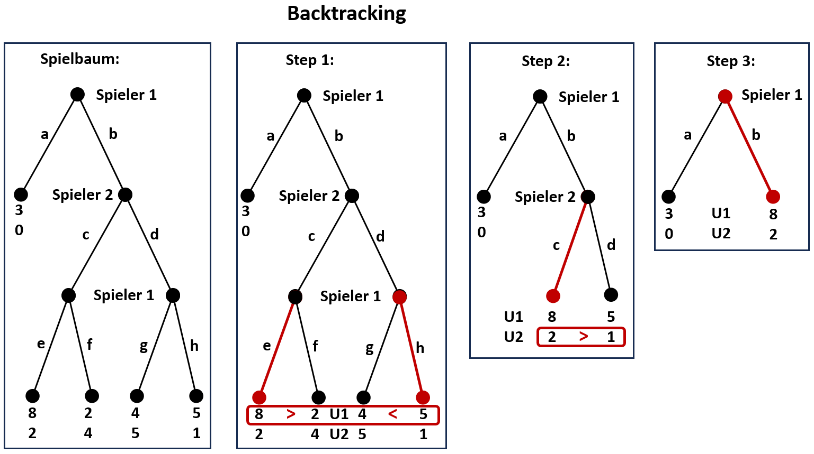
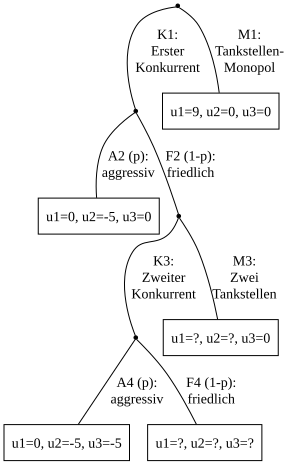
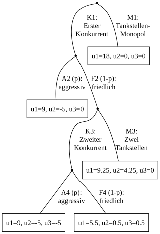
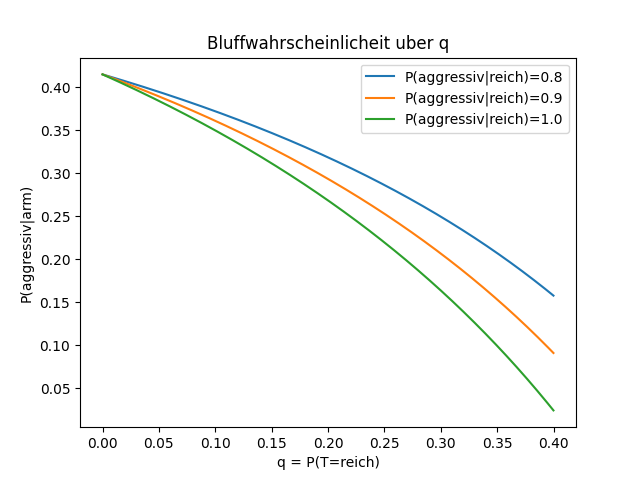
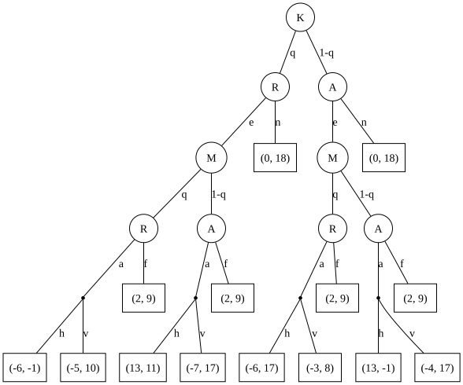

# Einführung in die Spieltheorie<a id="einfuhrung-in-die-spieltheorie"></a>
<!-- Start table of contents, generated by md_toc_update.py, do not edit -->
## Inhaltsverzeichnis

- [Einführung in die Spieltheorie](#einfuhrung-in-die-spieltheorie)
  - [Definitionen](#definitionen)
    - [Strategische Normalform](#strategische-normalform)
    - [Extensivform](#extensivform)
  - [Nash-Gleichgewicht bei vollständiger Information](#nash-gleichgewicht-bei-vollstandiger-information)
    - [Nash-Gleichgewicht in reinen Strategien mit kleiner Strategiemenge](#nash-gleichgewicht-in-reinen-strategien-mit-kleiner-strategiemenge)
      - [Beispiel 1: konkurrierende Unternehmen](#beispiel-1-konkurrierende-unternehmen)
    - [Nash-Gleichgewicht in reinen Strategien mit großer oder unbegrenzter Strategiemenge](#nash-gleichgewicht-in-reinen-strategien-mit-großer-oder-unbegrenzter-strategiemenge)
      - [Beispiel 2: konkurrierende Unternehmen](#beispiel-2-konkurrierende-unternehmen)
      - [Beispiel 3: konkurrierende Tankstellen](#beispiel-3-konkurrierende-tankstellen)
    - [Nash-Gleichgewicht in gemischten Strategien](#nash-gleichgewicht-in-gemischten-strategien)
      - [Beispiel 4: Diebstahlkontrolle](#beispiel-4-diebstahlkontrolle)
    - [Rückwärtsinduktion](#ruckwartsinduktion)
    - [Sequentielle Spiele](#sequentielle-spiele)
      - [Beispiel 5: Markteintritt](#beispiel-5-markteintritt)
      - [Chainstore-Paradoxon](#chainstore-paradoxon)
  - [Bayes-Gleichgewicht bei unvollständiger Information](#bayes-gleichgewicht-bei-unvollstandiger-information)
    - [Beispiel 6: Sheriff's dilemma](#beispiel-6-sheriffs-dilemma)
    - [Beispiel 7: Markteintritt](#beispiel-7-markteintritt)
    - [Perfect Bayesian Equilibrium (PBE)](#perfect-bayesian-equilibrium-pbe)
    - [Beispiel 8: Bier-Quiche-Spiel](#beispiel-8-bier-quiche-spiel)
  - [Hilbert-Tankstellen](#hilbert-tankstellen)
  - [Paradoxa](#paradoxa)
  - [Literatur](#literatur)
<!-- End of TOC, generated by md_toc_update.py, do not edit -->

## Definitionen<a id="definitionen"></a>

* In klassischen Entscheidungssituationen beeinflusst die Entscheidung eines Spielers nicht das Verhalten anderer Mitspieler oder der Umwelt. In strategischen Entscheidungssituationen hat die Entscheidung eines Spielers dagegen Auswirkungen auf das Verhalten der anderen Mitspieler.

* Nichtkooperative Spiele: Die nichtkooperative Spieltheorie beschreibt v.a. wie individuelle Ziele in vollständig definierten strategischen Entscheidungssituationen optimal erreicht werden können.

* In deterministischen Spielen gibt es keine Zufallskomponenten im Spielverlauf; Unsicherheit entsteht nur durch die Entscheidungen anderer Spieler.

* Nullsummenspiel (Konstantsummenspiel): Der Gewinn eines Spielers entspricht exakt dem Verlust anderer Spieler. Da der Nutzen immer relativ ist, kann jedes Konstantsummenspiel durch eine geeignete Transformation der Nutzenfunktionen als Nullsummenspiel dargestellt werden.

### Strategische Normalform<a id="strategische-normalform"></a>

* Menge der Spieler $N = \lbrace 1, 2, 3, ..., n \rbrace$.

* Spielregeln: Alle zulässigen Handlungen in jeder denkbaren Situation.

* Teilentscheidung: Zug oder Aktion in einer konkreten Situation.

* Eine Strategie ist ein vollständiger Plan, der für jede mögliche Entscheidungssituation festlegt, welche Aktion der Spieler ausführt:  
    $s_i ∈ S_i = \lbrace s_{i1}, s_{i2}, s_{i3}, ..., s_{im} \rbrace$, wobei $s_{ij}$ die $j$-te Strategie des $i$-ten Spielers ist.

* Strategienkombination aller Spieler: $s = (s_1, s_2, s_3, ..., s_n)$ mit der Menge der Strategien $s_i = \lbrace s_{i1}, s_{i2}, s_{i3}, ..., s_{im} \rbrace$ des $i$-ten Spielers. Jede Strategienkombination $s$ beschreibt einen konkreten Spielverlauf.

*  $(s_i; s_{-i})$ = Auswahl des $i$-ten Spielers in Abhängigkeit der anderen Spieler mit $s_{-i} = (s_1, ..., s_{i-1}, s_{i+1}, ..., s_n)$

* Der Nutzen $u_i(s)$ des $i$-ten Spielers hängt entweder nur von seiner eigenen Strategie $s_i$ ab, d.h. $u_i(s) = u_i(s_i)$, oder von allen Entscheidungen ab, d.h. $u_i(s) = u_i(s_i; s_{-i})$.

* Ein Spiel $G = (N, S, U)$ in strategischer Normalform ist ein Tupel der Menge der Spieler $N = \lbrace 1, 2, 3, ..., n \rbrace$, der jeweiligen Handlungsmöglichkeiten (Strategien) $s_i ∈ S_i, S = S_1 \times S_2 \times ... \times S_n$ und der Menge $U$ der jeweiligen Bewertung (Nutzen) $u_i(s) = u_i(s_i; s_{-i})$ mit $1≤i≤n$.

* Common-Knowledge-Annahme: Alle Spieler kennen $G = (N, S, U)$.

* Matrixdarstellung: Ein nichtkooperatives Mehrpersonenspiel mit einer beschränkten Anzahl Strategien kann vollständig durch eine Matrix beschrieben werden, z.B. im Falle eines 2-Personenspiels mit 2 Strategien je Spieler durch eine 2x2-Matrix:

    |                 |               **$s_{21}$**               |               **$s_{22}$**               |   |  **$\min(u_1)$**   |
    | --------------- | ---------------------------------------- | ---------------------------------------- |---| ------------------ |
    | **$s_{11}$**    | $u_1(s_{11},s_{21}); u_2(s_{11},s_{21})$ | $u_1(s_{11},s_{22}); u_2(s_{11},s_{22})$ |   | $\min(u_1,s_{11})$ |
    | **$s_{12}$**    | $u_1(s_{12},s_{21}); u_2(s_{12},s_{21})$ | $u_1(s_{12},s_{22}); u_2(s_{12},s_{22})$ |   | $\min(u_1,s_{12})$ |
    | **$\min(u_2)$** |                      $\min(u_2,s_{21})$  |                      $\min(u_2,_s{22})$  |   |                    |
   
    wobei $s_{11}, s_{12}$ die Strategien des 1. Spielers, $s_{21}, s_{22}$ die Strategien des 2. Spielers, $u_1$ der Nutzen des 1. Spielers und $u_2$ der Nutzen des 2. Spielers sind.  
    Für den jeweiligen Spieler ist diejenige Strategie optimal, bei der der Nutzen auch im ungünstigsten Fall am höchsten ist.  
    Für Spieler 1 ist diejenige Strategie $s_{1j}$ optimal, bei der $\min(u_1,s_{1j})$ am höchsten ist.  
    Für Spieler 2 ist diejenige Strategie $s_{2j}$ optimal, bei der $\min(u_2,s_{2j})$ am höchsten ist.

* Beispiel für die 2x2-Matrix eines Nullsummenspiels: Elfmeterschiessen. Der Torschütze wählt nur die linke oder rechte Ecke, der Torwart wählt ebenfalls nur die linke oder rechte Ecke. Wählen beide die gleiche Ecke, gewinnt der Torwart. Wählen beide unterschiedliche Ecken, gewinnt der Torschütze. Nutzen für den Torschütze: $u_1=1$ bei Gewinn (unterschiedl. Wahl), $u_1=-1$ bei Verlust (gleiche Wahl), Nutzen für den Torwart: $u_2=1$ bei Gewinn (gleiche Wahl), $u_2=-1$ bei Verlust (unterschiedl. Wahl). Dann ist die 2x2-Matrix:

    |          | **Torwart S2 wählt links** | **Torwart S2 wählt rechts** |   | **$\min(u_1)$** |
    | --------------------------- | ------- | ------- |---| --- |
    | **Schütze S1 wählt links**  | -1 ;  1 |  1 ; -1 |   |  -1 |
    | **Schütze S1 wählt rechts** |  1 ; -1 | -1 ;  1 |   |  -1 |
    | **$\min(u_2)$**             |      -1 |      -1 |   |     |

    Für beide Spieler beträgt der Nutzen im ungünstigsten Fall -1 für jede Strategie; sofern die Entscheidungen beider Spieler unabhängig voneinander sind, ist die gewählte Ecke also egal.
    
* Beispiel [Gefangenendilemma](https://de.wikipedia.org/wiki/Gefangenendilemma): Ein (und nur ein) Gefangener kann die Rolle als Kronzeuge wählen, d.h. seine Tat gestehen, die anderen Gefangenen belasten und dafür Strafminderung erhalten. Leugnen beide Gefangene, erhält keiner Strafminderung (Nutzen = -2, in dubio pro reo). Gesteht einer, erhält dieser Strafminderung (Nutzen = -1), der andere Strafverschärfung (Nutzen = -10). Gestehen beide, erhalten beide längere Strafen (Nutzen = -5). 2x2-Matrix des Gefangenendilemma:

    |           | **Gefangener 2 wählt Leugnen** | **Gefangener 2 wählt Gestehen** |   | **$\min(u_1)$** |
    | ------------------------------- | -------- | -------- |---| ----------------- |
    | **Gefangener 1 wählt Leugnen**  | -2 ;  -2 | -10 ; -1 |   | $\min(u_1,s_{11}) = -10$ |
    | **Gefangener 1 wählt Gestehen** | -1 ; -10 |  -5 ; -5 |   | $\min(u_1,s_{12}) =  -5$ |
    | **$\min(u_2)$**                 | $\min(u_2,s_{21}) = -10$ | $\min(u_2,s_{22}) = -5$ |   |   |

    Für beide Gefangenen ist Strategie 2 (Gestehen) optimal mit Nutzen von -5 im ungünstigsten Fall. MaxMin wählt diejenige Strategie (beste Antwort), bei der der Nutzen auch im ungünstigsten Fall am höchsten ist. Dies ist noch kein Gleichgewicht. Ein Nash-Gleichgewicht (s.u.) entsteht erst, wenn sich kein Spieler durch eine einseitige Änderung seiner Strategie verbessern kann. Im Gefangenendilemma ist Strategie 2 (Gestehen) die dominante Strategie (d.h. die optimale Strategie hängt nicht von der Entscheidung der Mitspieler ab).

    Das skript [prisoners_dilemma.py](../src/prisoners_dilemma.py) löst das Gefangenendilemma mit den python libraries nashpy und gambitpy.

* Allgemeines, symmetrisches Zwei-Personen-Gefangenendilemma:

    |       | **Spieler 2 wählt Kooperation** | **Spieler 2 wählt Abweichen** |   | **$\min(u_1)$** |
    | ------------------------------- | ----- | ----- |---| ------------------------------ |
    | **Spieler 1 wählt Kooperation** | a ; a | c ; b |   | $\min(u_1,s_{11}) = \min(a,c)$ |
    | **Spieler 1 wählt Abweichen**   | b ; c | d ; d |   | $\min(u_1,s_{12}) = \min(b,d)$ |
    | **$\min(u_2)$**                  | $\min(u_2,s_{21}) = \min(a,c)$ | $\min(u_2,s_{22}) = \min(b,d)$ |   |   |

    I.A. wird $b > a > d > c$ gewählt. Ist der Schaden beim Mitspieler höher als der eigene Nutzen, wählt man ausserdem $a+a > b+c > d+d$.  
    Für den jeweiligen Spieler ist diejenige Strategie optimal, bei der der Nutzen auch im ungünstigsten Fall am höchsten ist.  
    Für Spieler 1 ist diejenige Strategie $s_{1j}$ optimal, bei der $\min(u_1,s_{1j})$ am höchsten ist.  
    Für Spieler 2 ist diejenige Strategie $s_{2j}$ optimal, bei der $\min(u_2,s_{2j})$ am höchsten ist.

### Extensivform<a id="extensivform"></a>

* Alternativ zur strategischen Normalform kann ein nichtkooperatives Mehrpersonenspiel mit beschränkter Anzahl Strategien auch durch einen Baum vollständig beschrieben werden. Jeder Entscheidungsknoten hat weitere Äste; an jedem Endknoten endet das Spiel. Jedem Entscheidungsknoten wird ein Spieler zugeordnet, der an diesem Punkt des Spieles eine Entscheidung treffen muss.

* Ein Spiel $Γ = (K, P, U)$ in Extensivform ist ein Tupel mit Spielbaum $K$ mit eindeutigem Ursprung, allen Entscheidungs- und Endknoten, der Zuordnung (Partition) $P$ der Spieler zu den Entscheidungsknoten und den Zuordnungen der Nutzen $U_i ∈ U$ aller Spieler zu den Endknoten.

* Common-Knowledge-Annahme: Alle Spieler kennen $Γ = (K, P, U)$.

## Nash-Gleichgewicht bei vollständiger Information<a id="nash-gleichgewicht-bei-vollstandiger-information"></a>

Das [Nash-Gleichgewicht](https://de.wikipedia.org/wiki/Nash-Gleichgewicht) beschreibt in nicht-kooperativen Spielen eine Kombination von Strategien, wobei jeder Spieler genau eine Strategie wählt, von der aus es für keinen Spieler sinnvoll ist, von seiner gewählten Strategie als einziger abzuweichen. In einem Nash-Gleichgewicht ist daher jeder Spieler auch im Nachhinein mit seiner Strategiewahl einverstanden, er würde sie genauso wieder treffen. Im Nash-Gleichgewicht kann sich kein Spieler durch eine einseitige Änderung seiner Strategie verbessern. Die Strategien der Spieler sind gegenseitig beste Antworten.

Dominante Strategien: Hängt die optimale Strategie nicht von der Entscheidung der Mitspieler ab, ist diese Strategie dominant. Was ein Spieler tut, ist das Beste für ihn, ganz unabhängig davon, was die anderen tun. Beispiel Gefangenendilemma: Gestehen ist die dominante Strategie, da sie unabhängig von der Entscheidung des Mitgefangenen zur Strafminderung führt. Für eine dominante Strategie $s_i^o$ gilt: $u_i(s_i^o,s_{-i}) ≥ u_i(s_i,s_{-i})$ für jede beliebige Wahl $s_{-i}$ der Mitspieler und für jede eigene Wahl $s_i ∈ S_i$.

Reine Strategien: Der Spieler trifft eine ganz bestimmte Entscheidung.

Gemischte Strategien: Der Spieler trifft eine zufällige Entscheidung zwischen zwei oder mehr möglichen Handlungsmöglichkeiten (den reinen Strategien), aber mit bestimmten Wahrscheinlichkeiten für die reinen Strategien.

Während die Existenz eines Nash-Gleichgewichtes in reinen Strategien nicht garantiert werden kann, existiert mindestens ein Nash-Gleichgewicht bei einem Spiel in gemischten Strategien, sofern von endlich vielen reinen Strategien ausgegangen wird.

### Nash-Gleichgewicht in reinen Strategien mit kleiner Strategiemenge<a id="nash-gleichgewicht-in-reinen-strategien-mit-kleiner-strategiemenge"></a>

#### Beispiel 1: konkurrierende Unternehmen<a id="beispiel-1-konkurrierende-unternehmen"></a>

Beispiel für ein nicht-kooperatives Zweipersonenspiel mit 4 reinen Strategien pro Spieler (keine Zufallsentscheidungen). Die Spieler seien 2 konkurrierende Unternehmen, die ihre Preise unabhängig voneinander wählen müssen. Der Gewinn jedes Unternehmens (= Nutzen) hängt von der eigenen Wahl und der des Konkurrenten ab. Die Spielmatrix mit Nutzen $u_1$ des Unternehmens 1, Nutzen $u_2$ des Unternehmens 2, Preiswahlmöglichkeiten $s_{11},...,s_{14}$ des Unternehmens 1 und Preiswahlmöglichkeiten $s_{21},...,s_{24}$ des Unternehmens 2 habe folgende Werte:

|                 | **$s_{21}$** |  **$s_{22}$**   |  **$s_{23}$**   |  **$s_{24}$**   | **$\max(u_2)$** |
| --------------- | ------------ | --------------- | --------------- | --------------- | --------------- |
|   **$s_{11}$**  |    6   ;  6  |   10   ;    7   |   12   ;  **9** |   14   ;    1   |  9 |
|   **$s_{12}$**  |    8   ; 10  | **12** ; **12** |   14   ;   10   | **16** ;    6   | 12 |
|   **$s_{13}$**  | **10** ; 12  |   10   ;   14   |   16   ;   16   |   14   ; **18** | 18 |
|   **$s_{14}$**  |    1   ; 14  |    6   ; **16** | **18** ;   14   |   12   ;   12   | 16 |
| **$\max(u_1)$** |   10         |   12            |   18            |   16            |    |

Die Zeile $\max(u_1)$ gibt die beste Strategie für Unternehmens 1 an für jede Strategie $s_{2j}$ des Konkurrenten (beste Antwort: $\max(u_1)$ über jede Spalte). Die Spalte $\max(u_2)$ gibt die beste Strategie für Unternehmens 2 an für jede Strategie $s_{1j}$ des Konkurrenten (beste Antwort: $\max(u_2)$ über jede Zeile). Z.B. ist Strategie $s_{13}$ optimal für Unternehmen 1, falls Unternehmen 2 Strategie $s_{21}$ wählt, usw. Die jeweiligen Maxima sind in der Matrix fett dargestellt.

Die Kombination $(s_{12}, s_{22})$ ist das einzige Nash-Gleichgewicht: Das einzige Feld der Tabelle, bei der sowohl Unternehmen 1 als auch 2 eine für sie optimale Strategie gewählt haben. Ist dieses Gleichgewicht einmal erreicht, bringt eine andere Strategie keinem der Beteiligten einen Vorteil. 

Zum Vergleich: Hätten beide Unternehmen die MaxMin-Strategie gewählt (d.h. Wahl der besten Strategie, die auch im ungünstigsten Verhalten des Konkurrenten am besten abschneidet, s.o.), dann wäre Unternehmen 1 mit Strategie $s_{13}$ mit $u_1=10$ und Unternehmen 2 mit Strategie $s_{23}$ mit $u_2=9$ gestartet:

|                 | **$s_{21}$** |  **$s_{22}$**   |  **$s_{23}$**   |  **$s_{24}$**   | **$\min(u_1)$** |
| --------------- | ------------ | --------------- | --------------- | --------------- | --------------- |
|   **$s_{11}$**  |    6   ;  6  |   10   ;    7   |   12   ;    9   |   14   ;    1   |  6 |
|   **$s_{12}$**  |    8   ; 10  |   12   ;   12   |   14   ;   10   |   16   ;    6   |  8 |
|   **$s_{13}$**  |   10   ; 12  |   10   ;   14   |   16   ;   16   |   14   ;   18   | 10 |
|   **$s_{14}$**  |    1   ; 14  |    6   ;   16   |   18   ;   14   |   12   ;   12   |  1 |
| **$\min(u_2)$** |           6  |             7   |             9   |             1   |    |

Die Anfangskombination wäre aber instabil: Unternehmen 1 startet mit $s_{13}$, Unternehmen 2 reagiert darauf mit $s_{24}$ ($u_2=18$), Unternehmen 1 reagiert daraufhin mit $s_{12}$ ($u_1=16$) usw. bis schließlich das Nash-Gleichgewicht erreicht und nicht mehr verlassen wird:  
$s_{13}$ → $s_{24}$ → $s_{12}$ → $s_{22}$ → $s_{12}$ → Nash-Gleichgewicht $(s_{12}, s_{22})$

### Nash-Gleichgewicht in reinen Strategien mit großer oder unbegrenzter Strategiemenge<a id="nash-gleichgewicht-in-reinen-strategien-mit-großer-oder-unbegrenzter-strategiemenge"></a>

#### Beispiel 2: konkurrierende Unternehmen<a id="beispiel-2-konkurrierende-unternehmen"></a>

Beispiel für ein nicht-kooperatives Zweipersonenspiel mit reinen und reellwertigen Strategien (keine Zufallsentscheidungen, aber eine unbegrenzte Anzahl von Strategien/Entscheidungsmöglichkeiten). Zwei konkurrierende, nicht kooperierende Unternehmen mit gleichem Produkt und gleichen Kosten. Der Stückpreis hängt von der verkauften Menge ab (Mengenrabatt): Stückpreis $p = 100 - 2(x_1+x_2)$, wobei Unternehmen 1 $x_1$ Einheiten und Unternehmen 2 $x_2$ Einheiten verkauft. Jede verkaufte Einheit verusacht Kosten von 4. Beispielsweise können $x_i$ die verkauften Menge an Stahl in Tonnen und Preis und Kosten in 100 Euro/Tonne sein.

Beide Unternehmen wollen ihren Gewinn maximieren. Der Gewinn $g_i$ beider Unternehmen ergibt sich aus `(Stückpreis - Kosten) * (verkaufte Einheiten)`:  
$g_1 = (p-4) x_1 = (100 - 2(x_1+x_2) - 4) x_1 = -2 x_1^2 - 2 x_1 x_2 + 96 x_1$  
$g_2 = (p-4) x_2 = (100 - 2(x_1+x_2) - 4) x_2 = -2 x_2^2 - 2 x_1 x_2 + 96 x_2$  

Ein Extremwert einer Funktionen $f(x)$ wird bei $∂f/∂x = 0$ erreicht. Die Gewinne werden also maximal bei:  
$∂g_1/∂x_1 = -4 x_1 - 2 x_2 + 96 = 0 ⇔ x_1 = -x_2/2 + 24 = BR_1(x_2)$  
$∂g_2/∂x_2 = -4 x_2 - 2 x_1 + 96 = 0 ⇔ x_2 = -x_1/2 + 24 = BR_2(x_1)$  

Der Schnittpunkt der beiden best-response-Kurven $BR_1(x_2)$ und $BR_2(x_1)$ ergibt sich in:  
$x_1 = (x_1/2 - 24)/2 + 24 = x_1/4 + 12 ⇔ x_1 = 4 \cdot 12 / 3 = 16, x_2 = 16$

Das Nash-Gleichgewicht liegt in diesem Beispiel also bei $x_1 = x_2 = 16$ und $p = 100 - 2(x_1+x_2) = 36$. $x_1 = x_2$ war zu erwarten, da beide Unternehmen den gleichen Markt mit identischen Kosten bedienen und ein linearer und symmetrischer Zusammenhang zwischen Preisen und Mengen angenommen wurde.

#### Beispiel 3: konkurrierende Tankstellen<a id="beispiel-3-konkurrierende-tankstellen"></a>

Beispiel: Zwei nichtkooperative Tankstellen $T_1$ und $T_2$ mit reinen Preisstrategien konkurrieren um Kunden. Beide beziehen ihr Benzin vom gleichen Großhändler zu 1 Euro/liter und haben gleiche Fixkosten von 1000 Euro/Tag für Gehälter, Pacht, Steuern, etc. Wir nehmen an, dass beide Tankstellen jeweils 10000 liter/Tag verkaufen, wenn beide Tankstellen ihr Benzin mit 2 Euro/liter anbieten.

Sei $p_1$ der Preis in Euro/liter an Tankstelle $T_1$, $x_1$ die verkaufte Menge in liter/Tag, $e_1 = 1$ der Einkaufspreis in Euro/liter und $f_1 = 1000$ die Fixkosten der Tankstelle in Euro/Tag. Entsprechend $p_2$, $x_2$, $e_2$, $f_2$ für Tankstelle $T_2$.

Der Umsatz einer Tankstelle hänge von der Preisdifferenz zum Konkurrenten ab. Je billiger das Benzin im Vergleich zum Konkurrenten wird, desto höher der Verkauf; aber nicht schlagartig, sondern linear, da die Wartezeit bei größerem Ansturm länger wird. Die Preisdifferenz ist quasi bezahlte Wartezeit der Kunden. 1 Euro Preisdifferenz verkaufe 5000 liter mehr zu Lasten des Konkurrenten und der Zusammenhang sei der Einfachheit halber linear: $Δx_1 = 5000 \cdot (p_2 - p_1)$ bzw. $Δx_2 = 5000 \cdot (p_1 - p_2)$.

Gleichzeitig wird insgesamt mehr Benzin verbraucht, wenn der Preis sinkt. Die Nachfrage steige mit sinkendem Preis: $Δx_i = 1000 \cdot (2 - p_i)$. 

Dies ist ein stark vereinfachtes lineares Nachfrage-Modell.

Daraus ergibt sich:  
$x_1 = 10000 + 5000 \cdot (p_2 - p_1) + 1000 \cdot (2 - p_1) = 5000 \cdot p_2 - 6000 \cdot p_1 + 12000$  
$x_2 = 10000 + 5000 \cdot (p_1 - p_2) + 1000 \cdot (2 - p_2) = 5000 \cdot p_1 - 6000 \cdot p_2 + 12000$  
Wir betrachten nur Preise im Bereich, in dem die Mengen $x_1, x_2 > 0$ sind.

Beide Tankstellen möchten ihre Gewinne $g_1 = (p_1 - e_1) \cdot x_1 - f_1$ bzw. $g_2 = (p_2 - e_2) \cdot x_2 - f_2$ maximieren:  
$g_1 = (p_1 - 1) \cdot x_1 - f_1$  
$g_1 = (p_1 - 1) \cdot (5000 \cdot p_2 - 6000 \cdot p_1 + 12000) - 1000$  
$g_1 = 5000 \cdot p_1 \cdot p_2 - 6000 \cdot p_1^2 + 18000 \cdot p_1 - 5000 \cdot p_2 - 13000$  
$g_2 = (p_2 - 1) \cdot x_2 - f_2$  
$g_2 = (p_2 - 1) \cdot (5000 \cdot p_1 - 6000 \cdot p_2 + 12000) - 1000$  
$g_2 = 5000 \cdot p_1 \cdot p_2 - 6000 \cdot p_2^2 + 18000 \cdot p_2 - 5000 \cdot p_1 - 13000$

Ein Extremwert (Maxima oder Minima) einer Funktionen $f(x)$ wird bei $∂f/∂x = 0$ erreicht. Die Gewinne werden also maximal bei:  
$∂g_1/∂p_1 = 5000 \cdot p_2 - 12000 \cdot p_1 + 18000 = 0 ⇔ p_1 = (5/12) \cdot p_2 + (3/2)$  
$∂g_2/∂p_2 = 5000 \cdot p_1 - 12000 \cdot p_2 + 18000 = 0 ⇔ p_2 = (5/12) \cdot p_1 + (3/2)$

Die Kurven schneiden sich in:  
$p_1 = (5/12) \cdot ((5/12) \cdot p_1 + (3/2)) + (3/2) ⇔ p_1 = (51/24) / (1 - (5/12)^2) ≈ 2.57$  
$p_2 = (5/12) \cdot ((5/12) \cdot p_2 + (3/2)) + (3/2) ⇔ p_2 = (51/24) / (1 - (5/12)^2) ≈ 2.57$

Das Nash-Gleichgewicht liegt also beim Preis $p_1 = p_2 = 2.57$ Euro/liter und die Tankstellen verkaufen jeweils $x_1 = x_2 = 10000 + 1000 \cdot (2 - 2.57) = 9429$ liter/Tag.

Würden für die Einkaufspreise $0$ Euro angenommen, so ergäbe sich ein Nash-Gleichgewicht bei einem Preis von $1,71$ Euro/liter. Eine Erhöhung des Einkaufspreises von $0$ auf $1$ Euro führt also zu einer Erhöhung des Verkaufspreises von nur $0,86$ Euro. Der intuitive Ansatz "Preis = Kosten + Marge" funktioniert nicht in Konkurrenzsituationen.

Das Pythonskript [nash_equilibrium_gas_stations.py](../src/nash_equilibrium_gas_stations.py) berechnet die Nash-Gleichgewichte für das obige Tankstellen-Beispiel bei unterschiedlichen Einkaufspreisen, Fixkosten und Umsatzsteuern und gibt Verkaufspreis, Mengen und Gewinn aus:

| Anzahl Tankstellen | Einkaufspreis Euro/Liter | Fixkosten Euro/Tag | Umsatzsteuer | Verkaufspreis Euro/Liter | Gewinn Euro/Tag | Gewinn Euro/Liter | Gesamtmenge Liter/Tag |
| ------------------ | ------------------------ | ------------------ | ------------ | ------------------------ | --------------- | ----------------- | --------------------- |
|          2         |              1           |         1000       |     19%      |          2.73            |     11024       |         1.19      |          18531        |
|          2         |              1           |         1000       |      0%      |          2.57            |     13816       |         1.47      |          18857        |
|          2         |              0           |         1000       |     19%      |          1.71            |     13817       |         1.34      |          20571        |
|          2         |              1           |            0       |     19%      |          2.73            |     12024       |         1.30      |          18531        |
|          3         |              1           |         1000       |     19%      |          1.81            |      2588       |         0.38      |          20561        |
|          3         |              1           |         1000       |      0%      |          1.64            |      3490       |         0.50      |          21083        |
|          3         |              0           |         1000       |     19%      |          0.72            |      3822       |         0.48      |          23833        |
|          3         |              1           |            0       |     19%      |          1.81            |      3588       |         0.52      |          20561        |

* Eine dritte Tankstelle führt zur Verringerung des Preises um 34% und zur Verringerung des Gewinns pro Liter um 68%.
* Eine Erhöhung der Umsatzsteuer von 0 auf 19% erhöht den Preis nur um 6-10%, verringert den Gewinns pro Liter aber um 19-24%.
* Eine Erhöhung der Fixkosten um 1000 Euro/Tag beeinflusst nur den Gewinn, nicht den Verkaufspreis (was nicht erstaunlich ist, da der Fixkostenanteil bei Ableitung der Gewinnfunktion entfällt und damit das Nash-Gleichgewicht der Preise unabhängig von den Fixkosten ist).

### Nash-Gleichgewicht in gemischten Strategien<a id="nash-gleichgewicht-in-gemischten-strategien"></a>

In gemischten Strategien treffen die Spieler zufällige Entscheidungen zwischen zwei oder mehr Handlungsmöglichkeiten (den reinen Strategien), aber mit bestimmten Wahrscheinlichkeiten für die reinen Strategien. Für Mehrpersonen-Nullsummenspiele mit endlicher Strategiemenge ist die Bestimmung von Nash-Gleichgewichten in gemischten Strategien ein lineares Optimierungsproblem, das sich mit Hilfe des Simplex-Algorithmus lösen lässt.

Das Indifferenzprinzip der Spieltheorie besagt: Eine gemischte Strategie ist nur dann optimal (eine beste Antwort), wenn jede mit positiver Wahrscheinlichkeit gewählte reine Strategie ebenfalls optimal (eine beste Antwort) ist. D.h. reine Strategien, die nicht optimal (keine beste Antwort) sind, werden für die optimale gemischte Strategie nicht gewählt (bzw. mit Wahrscheinlichkeit 0 gewählt). Die optimale gemischte Strategie ist daher eine Mischung der besten Antworten in reinen Strategien.

#### Beispiel 4: Diebstahlkontrolle<a id="beispiel-4-diebstahlkontrolle"></a>

Ein Laden verkauft Waren zum Stückpreis von 100 Euro, kämpft aber gegen Verlust durch Diebstahl. Ehrliche Kunden bezahlen den vollen Verkaufspreis, unehrliche Kunden streichen diesen als Gewinn ein, müssen aber mit Kontrollen rechnen. Wird ein Kunde beim Diebstahl erwischt, muss dieser den doppelten Preis an den Ladenbesitzer bezahlen sowie eine Geldstrafe von 50 Euro an den Staat. Häufige Kontrollen verringern Verluste, zuviele Kontrollen kosten aber Zeit und vergraulen Kunden. Jede Kontrolle koste daher 10 Euro. Für jeden nicht entdeckten Diebstahl verliere der Händler den Waren-Einkaufspreis von 50 Euro; für jeden ehrlichen Kunden gewinnt der Händler 50 Euro.

Das Bimatrixspiel sieht daher wie folgt aus:

|                                    | $s_{21}$: Kunde ehrlich (q) | $s_{22}$: Kunde klaut (1-q) |
| ---------------------------------- | --------------------------- | --------------------------- |
| $s_{11}$: Händler kontrolliert (p) |            40, 0            |          200, -250          |
| $s_{12}$: Händler vertraut (1-p)   |            50, 0            |          -50,  100          |

Ein Spieler (Händler bzw. Kunde) ist in seiner Strategiewahl indifferent, wenn der Erwartungsnutzen für beide Strategien gleich ist.  
Erwartungsnutzen für den Händler (Spieler 1): $E[U_{1}(s_{11})] = 40 q + 200 (1-q)$ und $E[U_{1}(s_{12})] = 50 q - 50 (1-q)$  
Indifferenzbedingung für den Händler (Spieler 1): $40 q + 200 (1-q) = 50 q - 50 (1-q) ⇔ q = 25/26 ≈ 96.2\%$  
Erwartungsnutzen für den Kunden (Spieler 2): $E[U_{2}(s_{21})] = 0 p + 0 (1-p)$ und $E[U_{2}(s_{22})] = -250 p + 100 (1-p)$  
Indifferenzbedingung für den Kunden (Spieler 2): $0 p + 0 (1-p) = -250 p + 100 (1-p) ⇔ p = 2/7 ≈ 28.6\%$  
Das Nash-Gleichgewicht liegt folglich bei $p = 2/7, q = 25/26$.

Für ein allgemeines 2x2-Spiel gilt analog:

|                | $s_{21}$ (q) | $s_{22}$ (1-q) |
| -------------- | ------------ | -------------- |
| $s_{11}$ (p)   | $a_1$, $a_2$ |  $b_1$, $b_2$  |
| $s_{12}$ (1-p) | $c_1$, $c_2$ |  $d_1$, $d_2$  |

Erwartungsnutzen für Spieler 1: $E[U_{1}(s_{11})] = a_1 q + b_1 (1-q)$ und $E[U_{1}(s_{12})] = c_1 q + d_1 (1-q)$  
Indifferenzbedingung für Spieler 1: $a_1 q + b_1 (1-q) = c_1 q + d_1 (1-q) ⇔ q = (d_1-b_1) / ((a_1-c_1) + (d_1-b_1))$  
Erwartungsnutzen für Spieler 2: $E[U_{2}(s_{21})] = a_2 p + c_2 (1-p)$ und $E[U_{2}(s_{22})] = b_2 p + d_2 (1-p)$  
Indifferenzbedingung für Spieler 2: $a_2 p + c_2 (1-p) = b_2 p + d_2 (1-p) ⇔ p = (c_2-d_2) / ((b_2-a_2) + (c_2-d_2))$  

### Rückwärtsinduktion<a id="ruckwartsinduktion"></a>

Rückwärtsinduktion (Backward Induction) ermittelt die besten Antworten ausgehend von den Endknoten eines Spielbaumes. Genauer: Teilspielperfekte Gleichgewichte können durch Rückwärtsinduktion ermittelt werden. Ein Nash-Gleichgewicht eines Extensivformspiels ist teilspielperfekt, wenn die Entscheidungen beliebiger Teilspiele Nash-Gleichgewichte ergeben (unabhängig davon, ob ein Teilspiel tatsächlich erreicht wird oder nicht).

Beispiel für 2 Spieler mit kleinem Spielbaum:


Die besten Antworten werden von den Endknoten des Baumes zum Startknoten zurück verfolgt. Im Beispiel kann Spieler 1 immer gewinnen; bei optimalem Spiel (beide Spieler wählen stets die besten Antworten) ist der Spielverlauf b, c, e. Spieler 1 gewinnt mit Nutzen U1 = 8, Spieler 2 verliert mit Nutzen U2 = 2.

Algorithmisch entspricht die Rückwärtsinduktion dem [Backtracking](https://de.wikipedia.org/wiki/Backtracking).

[four_connect.cpp](../src/four_connect.cpp) führt ein Backtracking am Beispiel von ["Vier gewinnt"](https://de.wikipedia.org/wiki/Vier_gewinnt) auf kleinerem Spielfeld durch. [three_connect.py](../src/three_connect.py) und  [three_connect_opt.py](../src/three_connect_opt.py) führen ein Backtracking am Beispiel von "Drei gewinnt" durch.

### Sequentielle Spiele<a id="sequentielle-spiele"></a>

#### Beispiel 5: Markteintritt<a id="beispiel-5-markteintritt"></a>

Beispiel für ein Nash-Gleichgewicht in sequentiellen Spielen: Eine Tankstelle auf dem Land verkauft 10 Million Liter Benzin im Jahr zum Preis von 2 Euro/Liter, welches für 1 Euro/liter vom Großhändler eingekauft wird. Die Fixkosten zum Betrieb der Tankstelle betragen 1 Million Euro im Jahr; der Gewinn beträgt folglich 9 Millionen Euro/Jahr.

Die Tankstelle hat eine Monopolstellung; ein Konkurrent erwägt daher die Eröffnung einer zweiten Tankstelle. Ein möglicher Markteintritt kostet aber einmalig 5 Millionen Euro (Bau einer neuen Tankstelle, Werbung, usw.). Das lohnt sich nur, wenn der erwartete Gewinn die Investitionskosten übersteigt. Um den Konkurrenten von seinem Plan abzuhalten, kann der Monopolist den Preis für sein Benzin soweit senken, dass sich die Investition für den Konkurrenten nicht mehr lohnt.

Der Monopolist hat also 2 Möglichkeiten, auf einen Konkurrenten zu reagieren:  
a) Markt und Gewinn friedlich mit dem Konkurrenten teilen, oder  
b) sein Monopol aggressiv durch Dumpingpreise verteidigen.

Reagiert der Monopolist friedlich, stellt sich ein neues Nash-Gleichgewicht ein mit gleichem Benzinpreis an beiden Tankstellen und geringerem Gewinn. Reagiert der Monopolist aggressiv, ist der Verlust für beide Unternehmen am größten. **Nach** Markteintritt eines Konkurrenten ergäbe daher eine friedliche Reaktion des Monopolisten den größten Nutzen für ihn. Damit der Konkurrent aber genau dies nicht ausnutzen kann, muss der Monopolist seine (für ihn selbst ungünstige) Drohung mit einer gewissen Wahrscheinlichkeit $p$ wahrmachen.

Im Hintergrund wartet bereits ein weiterer Konkurrent, der ebenfalls erwägt, einen Teil des Marktes zu übernehmen. Der zweite Konkurrent wartet aber zunächst ab, wie der Monopolist reagiert; scheitert der erste Konkurrent, wird es der zweite gar nicht erst versuchen. Der Monopolist hat daher einen zusätzlichen Anreiz, $p$ zu erhöhen.

Der Einfachheit halber gelten folgende Annahmen:
* Alle Tankstellen beziehen ihr Benzin vom gleichen Großhändler für 1 Euro/Liter,
* die Betriebskosten von 1 Million Euro/Jahr sind für alle Tankstellen gleich,
* die einmaligen Investitionskosten von 5 Millionen Euro sind für alle Konkurrenten gleich,
* die Nachfrage sinkt mit steigendem Benzinpreis: $x = 20 \cdot (2 - v) + 10 = 50 - 20 v$, wobei $x$ die Gesamtmenge verkauften Benzins in Millionen Liter/Jahr und $v$ der Verkaufpreise in Euro/Liter sind,
* die Tankstellen konkurrieren und verhalten sich nicht kooperativ.

Damit ergibt sich folgender Spielbaum (Spieler 1: Monopolist, Spieler 2: Erster Konkurrent, Spieler 3: Zweiter Konkurrent):



Für den Fall $M3$ (ein Konkurrent, friedliche Reaktion) ergibt sich folgendes Nash-Gleichgewicht:  
Jede der beiden Tankstellen verkauft $x_i$ Millionen Liter/Jahr zum Verkaufspreis $v_i$ in Euro/Liter. Im Gleichgewicht verkauft jede Tankstelle gleich viel Benzin zum gleichen Preis, d.h. $v_1 = v_2 = v$ und $x_1 = x_2 = x/2$. Die Einkaufspreise $e_1 = e_2 = 1$ und Fixkosten $f_1 = f_2 = 1$ sind ebenfalls für beide Tankstellen gleich; nur der Konkurrent hat Investitionskosten $i_2 = 5$.  
Der Gewinn für 1 Jahr ergibt sich direkt aus Menge und Kosten:  
$g_i = (v_i - e_i) \cdot x_i - f_i - i_i$  
$g_1 = (v_1 - e_1) \cdot x_1 - f_1 - i_1 = (v - 1) \cdot (50 - 20 v)/2 - 1 = -10 v^2 + 35 v - 26$  
$g_2 = (v_2 - e_2) \cdot x_2 - f_2 - i_2 = (v - 1) \cdot (50 - 20 v)/2 - 6 = -10 v^2 + 35 v - 31$  
Jede Tankstelle maximiert ihren Gewinn:  
$∂g_1/∂v = -20 v + 35 = 0$  
$∂g_2/∂v = -20 v + 35 = 0$  
Damit ergibt sich das Nash-Gleichgewicht:  
$v = 35/20 = 1.75$ Euro/Liter  
$x = 50 - 20 v = 15$ Millionen Liter  
$g_1 = (v - 1) \cdot x/2 - 1 = 4.625$ Millionen Euro  
$g_2 = (v - 1) \cdot x/2 - 6 = -0.375$ Millionen Euro  

Analog ergibt sich für den Fall $F4$ (zwei Konkurrenten, friedliche Reaktion) folgendes Nash-Gleichgewicht:  
$v_1 = v_2 = v_3 = v$, $x_1 = x_2 = x_3 = x/3$, $e_1 = e_2 = e_3 = 1$, $f_1 = f_2 = f_3 = 1$, $i_1 = 0, i_2 = i_3 = 5$  
$g_1 = (v - 1) \cdot (50 - 20 v)/3 - 1 = (-20 v^2 + 70 v - 50) / 3 - 1$  
$g_1 = g_2 = (v - 1) \cdot (50 - 20 v)/3 - 6 = (-20 v^2 + 70 v - 50) / 3 - 6$  
$∂g_1/∂v = ∂g_2/∂v = ∂g_3/∂v = (-40 v + 70) / 3 = 0$  
$v = 1.75$ Euro/Liter  
$x = 15$ Millionen Liter  
$g_1 = (v - 1) \cdot x/3 - 1 = 2.75$ Millionen Euro  
$g_2 = g_3 = (v - 1) \cdot x/3 - 6 = -2.25$ Millionen Euro  

Auch bei friedlicher Reaktion des Monopolisten ergibt sich für die Konkurrenten noch ein Verlust. Die Konkurrenten sind daher zur Investition bereit, wenn die neuen Tankstellen nach 2-jährigem Betrieb Gewinne erwirtschaften können:  
$g_i = (v_i - e_i) \cdot 2 \cdot x_i - 2 \cdot f_i - i_i$  
D.h. im Fall $M3$ (zwei konkurrierende Tankstellen):  
$g_1 = (v - 1) \cdot 2 \cdot x / 2 - 2 = 9.25$ Millionen Euro  
$g_2 = (v - 1) \cdot 2 \cdot x / 2 - 7 = 4.25$ Millionen Euro  
$g_3 = 0$  
und im Fall $F4$ (drei konkurrierende Tankstellen):  
$g_1 = (v - 1) \cdot 2 \cdot x / 3 - 2 = 5.5$ Millionen Euro  
$g_2 = g_3 = (v - 1) \cdot 2 \cdot x / 3 - 7 = 0.5$ Millionen Euro  

Damit ergibt sich der vollständige Spielbaum mit den Nutzenfunktionen $u_i = g_i =$ Gewinn der Tankstelle $i$ nach zwei Jahren:



Glaubt der erste Konkurrent, dass der Monopolist mit Wahrscheinlichkeit $p_1$ aggressiv reagiert, dann sind seine Erwartungsnutzen wie folgt:  
Erwartungsnutzen bei Markteintritt: $E[u_2 ∣ \text{"Eintreten"}] = -5 \cdot p_1 + 4.25 \cdot (1−p_1) = 4.25 − 9.25 p_1$  
Erwartungsnutzen ohne Markteintritt: $E[u_2 ∣ \text{"Nicht Eintreten"}] = 0$  
Indifferenzbedingung: $4.25 − 9.25 p_1 = 0 ⇔ p_1 = 4.25 / 9.25 ≈ 0.459$  
D.h. der erste Konkurrent tritt nur dann in den Markt ein, wenn der Monopolist seine Drohung mit einer Wahrscheinlichkeit $p_1 < 0.459$ wahrmacht.

Glaubt der zweite Konkurrent nach Eintritt des ersten und friedlicher Reaktion, dass der Monopolist mit Wahrscheinlichkeit $p_2$ aggressiv reagiert, dann sind seine Erwartungsnutzen wie folgt:  
Erwartungsnutzen bei Markteintritt: $E[u_3 ∣ \text{"Eintreten"}] = -5 \cdot p_2 + 0.5 \cdot (1−p_2) = 0.5 − 5.5 p_2$  
Erwartungsnutzen ohne Markteintritt: $E[u_3 ∣ \text{"Nicht Eintreten"}] = 0$  
Indifferenzbedingung: $0.5 − 5.5 p_2 = 0 ⇔ p_2 = 0.5 / 5.5 ≈ 0.09$  
D.h. der zweite Konkurrent tritt nur dann in den Markt ein, wenn der Monopolist seine Drohung mit einer Wahrscheinlichkeit $p_2 < 0.09$ wahrmacht.

Die Wahrscheinlichkeiten sind subjektive Einschätzungen der Konkurrenten, wie wahrscheinlich der Monopolist in diesem Teilspiel aggressiv reagiert. Die Werte $p_1$ und $p_2$ sind die Schwellen, bei denen ein Strategiewechsel für die Konkurrenten vorteilhaft wird.

#### Chainstore-Paradoxon<a id="chainstore-paradoxon"></a>

Das [Chainstore-Paradoxon](https://de.wikipedia.org/wiki/Chainstore-Paradoxon) zeigt ein Dilemma des Backtracking (Rückwärtsinduktion). Ein Unternehmen beherrsche den Markt. Bei einem Marktzutritt eines Konkurrenten und aggressivem Preiskampf erhalten beide die Auszahlung 0, bei friedlicher Teilung des Marktes erhalten beide 2. Tritt der Konkurrenten nicht ein, behält der Marktführer Gewinn 5 und der Konkurrent geht mit Auszahlung 0 leer aus. Für jedes Teilspiel ist das Nash-Gleichgewicht die Markteilung; so auch beim letzten Konkurrenten. Beim Backtracking entscheidet der letzte, $n$-te Konkurrent rational auf Marktzutritt, damit auch der $(n-1)$-te Konkurrent usw. bis zum ersten. Bei perfekter Information (allen Beteiligten sind alle zu erwartenden Auszahlungen bekannt) wird der Marktführer seine Stellung also niemals verteidigen.

Dies wirkt paradox und widerspricht der Erfahrung und Intuition. Wesentliche Voraussetzung der Rückwärtsinduktion ist aber, dass die Anzahl der Wiederholungen bekannt ist. Dies ist i.A. nicht der Fall; der Marktführer kann nicht wissen, gegen wie viele Konkurrenten er sich verteidigen muss. In der Wirklichkeit gibt es keine letzte Runde. Er wird daher in seine Reputation durch Abschreckung investieren. Die [spieltheoretische Reputation](https://de.wikipedia.org/wiki/Reputation_(Spieltheorie)) löst das Paradoxon auf (s.u.).

## Bayes-Gleichgewicht bei unvollständiger Information<a id="bayes-gleichgewicht-bei-unvollstandiger-information"></a>

In Spielen mit vollständiger Information sind alle Spielregeln und alle bisherigen Entscheidungen aller Spieler allen anderen Spielern bekannt (z.B. Schach). In Spielen mt unvollständiger Information ([Bayes-Spiele](https://de.wikipedia.org/wiki/Bayes-Spiel)) ist dies nicht der Fall; es gibt mindestens einen Spieler, welchem nicht jede zuvor getroffene Entscheidung bekannt ist (z.B. Poker). Es müssen Vermutungen über die Entscheidungen der anderen Spieler in Form von Wahrscheinlichkeitsverteilungen (beliefs) aufgestellt werden.


Satz von Bayes: $P(A_i|B) = P(B|A_i) \cdot P(A_i) / P(B)$  
Für disjunkte Ereignisse $A_i$ gilt: $P(B) = \sum_{j=1}^{N} P(B|A_j) \cdot P(A_j)$

### Beispiel 6: Sheriff's dilemma<a id="beispiel-6-sheriffs-dilemma"></a>

Wikipedia-Beispiel für ein Bayes-Gleichgewicht bei unvollständiger Information: [Sheriff's dilemma](https://en.wikipedia.org/wiki/Bayesian_game)

A sheriff faces an armed suspect. Both must simultaneously decide whether to shoot the other or not.

The suspect can either be of type "criminal" or "civilian". The sheriff has only one type. The suspect knows its type and the Sheriff's type, but the Sheriff does not know the suspect's type. Thus, there is incomplete information (because the suspect has private information), making it a Bayesian game. There is a probability p that the suspect is a criminal and a probability 1-p that the suspect is a civilian; both players are aware of this probability (common prior assumption, which can be converted into a complete-information game with imperfect information).

The sheriff would rather defend himself and shoot if the suspect shoots or not shoot if the suspect does not (even if the suspect is a criminal). The suspect would rather shoot if he is a criminal, even if the sheriff does not shoot, but would rather not shoot if he is a civilian, even if the sheriff shoots. Thus, the payoff matrix of this Normal-form game for both players depends on the type of the suspect. This Bayesian game is defined by ⁠$(N,A,T,p,u)$⁠, where:
* Set of players: $N = \lbrace suspect, sheriff \rbrace$
* Action sets (set of actions available to each player): $A_{suspect} = \lbrace shoot, not \rbrace , A_{sheriff} = \lbrace shoot, not \rbrace$
* Type sets (set of types of each player): $T_{suspect} = \lbrace criminal, civilian \rbrace , T_{sheriff} = \lbrace * \rbrace$
* Prior (probability distribution over all possible type profiles): $p_{criminal} = p , p_{civilian} = (1 − p)$
* Payoff functions $u_i$ for each player and type given as follows:
    
    |  **Type="criminal" (p)**   | **sheriff shoots** | **sheriff does not** |
    | -------------------------- | ------------------ | -------------------- |
    | **suspect shoots**         |       0,  0        |         2, −2        |
    | **suspect does not**       |      −2, −1        |        −1, −1        |
    
    |  **Type="civilian" (1-p)** | **sheriff shoots** | **sheriff does not** |
    | -------------------------- | ------------------ | -------------------- |
    | **suspect shoots**         |      −3, −1        |        −1, −2        |
    | **suspect does not**       |      −2, −1        |         0, 0         |
    
    If both players are rational and both know that both players are rational and everything that any player knows is known to be known by every player (i.e., player 1 knows player 2 knows that player 1 is rational and player 2 knows this, etc. ad infinitum – common knowledge), playing the game will be as follows according to perfect Bayesian equilibrium:

    When the type is "criminal", the dominant strategy for the suspect is to shoot, and when the type is "civilian", the dominant strategy for the suspect is not to shoot; alternative strictly dominated strategy can thus be removed. Given this, if the sheriff shoots, he will have a payoff of $0$ with probability $p$ and a payoff of $−1$ with probability ⁠$1-p$⁠, i.e., an expected payoff of ⁠$p-1$⁠; if the sheriff does not shoot, he will have a payoff of $−2$ with probability $p$ and a payoff of $0$ with probability $⁠1-p$⁠, i.e., an expected payoff of $⁠-2p$⁠. Thus, the Sheriff will always shoot if $⁠p-1 > -2p$⁠, i.e. when $⁠p > 1/3$⁠.	

### Beispiel 7: Markteintritt<a id="beispiel-7-markteintritt"></a>

Beispiel für ein Bayes-Gleichgewicht bei unvollständiger Information: Wir verwenden wieder das Szenario von oben. Eine Tankstelle habe ein Monopol, ein Konkurrent erwägt den Markteintritt. Um die Konkurrenz aggressiv durch Dumpingpreise zu verdrängen, muss der Monopolist aber selber über Mittel verfügen. Der Monopolist kann vom Typ reich oder vom Typ arm sein: Nur ein reicher Monopolist kann einen Konkurrenzkampf durchstehen, ein armer Monopolist kann nur bluffen. Welche Mittel der Monopolist zur Verfügung hat, wissen die Konkurrenten nicht; die Konkurrenten können nur die Wahrscheinlichkeiten $q$ (Monopolist reich) oder $1-q$ (Monopolist arm) annehmen. In Spielen wie Poker entspricht dies genau den Annahmen über die unbekannten Karten der Mitspieler.

Der Einfachheit halber nehmen wir an, dass jeder aggressive Konkurrenzkampf den Monopolisten 1 Mio. Euro kostet (Fixkosten eines Jahres) und den Konkurrenten 6 Mio. Euro (Fixkosten plus Investitionskosten). Der 2. Konkurrent wartet die Reaktion nach Markteintritt des 1. Konkurrenten ab; bei friedlicher Reaktion kann er auf erneute friedliche Reaktion hoffen, bei aggressiver Reaktion kann er darauf spekulieren, dass dem Monopolisten das Geld für einen erneuten Preiskampf ausgegangen ist. Die Wahrscheinlichkeiten $(q|\text{Beobachtung=friedlich})$ und $(q|\text{Beobachtung=aggressiv})$, mit der der 2. Konkurrent von einem reichen Monopolisten ausgeht, wird sich daher i.A. von der Wahrscheinlichkeit $q$ unterscheiden, mit der der 1. Konkurrent von einem reichen Monopolisten ausgeht.

Das Bayes-Spiel ⁠$(N,A,T,q,u)$ ist damit definiert durch:
* Menge der Spieler: $N$ = { Sp1 (Monopolist), Sp2 (1. Konkurrent), Sp3 (2. Konkurrent) }
* Menge der Aktionen: $A_1$ = { aggressiv, friedlich } (Monopolist Sp1), $A_2$ = { eintreten, nicht eintreten } (1. Konkurrent Sp2), $A_3$ = { eintreten, nicht eintreten } (2. Konkurrent Sp3),
* Menge der Typen: $T_1$ = { arm, reich } (Monopolist Sp1), $T_2$ = {\*} (1. Konkurrent Sp2), $T_3$ = {\*} (2. Konkurrent Sp3)
* Wahrscheinlichkeiten: $q_{reich} = q, q_{arm} = 1-q$
* Nutzenfunktionen: $u_i$ = Gewinn nach 2 Jahren
    1. Teilspiel: Beim Start gibt es 6 mögliche Spielverläufe:
        1. $T_1$ = reich ($q$), $A_2$ = nicht eintreten: $u_1=18, u_2=0, u_3=0$
        2. $T_1$ = reich ($q$), $A_2$ = eintreten, $A_1$ = aggressiv: $u_1=8, u_2=-6, u_3=0$
        3. $T_1$ = reich ($q$), $A_2$ = eintreten, $A_1$ = friedlich: $u_1=9.25, u_2=4.25, u_3=0$
        4. $T_1$ = arm ($1-q$), $A_2$ = nicht eintreten: $u_1=18, u_2=0, u_3=0$
        5. $T_1$ = arm ($1-q$), $A_2$ = eintreten, $A_1$ = aggressiv: $u_1=-1, u_2=-6, u_3=0$
        6. $T_1$ = arm ($1-q$), $A_2$ = eintreten, $A_1$ = friedlich: $u_1=9.25, u_2=4.25, u_3=0$
    2. Teilspiel:  Nach $A_2$ = eintreten und $A_1$ = friedlich gibt es weitere 6 mögliche Spielverläufe:
        1. $T_1$ = reich ($q|\text{Beobachtung=friedlich}$), $A_3$ = nicht eintreten: $u_1=9.25, u_2=4.25, u_3=0$
        2. $T_1$ = reich ($q|\text{Beobachtung=friedlich}$), $A_3$ = eintreten, $A_1$ = aggressiv: $u_1=8, u_2=-6, u_3=-6$
        3. $T_1$ = reich ($q|\text{Beobachtung=friedlich}$), $A_3$ = eintreten, $A_1$ = friedlich: $u_1=5.5, u_2=0.5, u_3=0.5$
        4. $T_1$ = arm ($1-(q|\text{Beobachtung=friedlich})$), $A_3$ = nicht eintreten: $u_1=9.25, u_2=4.25, u_3=0$
        5. $T_1$ = arm ($1-(q|\text{Beobachtung=friedlich})$), $A_3$ = eintreten, $A_1$ = aggressiv: $u_1=-1, u_2=-6, u_3=-6$
        6. $T_1$ = arm ($1-(q|\text{Beobachtung=friedlich})$), $A_3$ = eintreten, $A_1$ = friedlich: $u_1=5.5, u_2=0.5, u_3=0.5$
    3. Teilspiel:  Nach $A_2$ = eintreten und $A_1$ = aggressiv gibt der 1. Konkurrent auf und es bleiben wieder 6 mögliche Spielverläufe (der 2. Konkurrent verhält sich wie der 1. Konkurrent, aber mit unterschiedl. Wert von $q$):
        1. $T_1$ = reich ($q|\text{Beobachtung=aggressiv}$), $A_2$ = nicht eintreten: $u_1=18, u_2=0, u_3=0$
        2. $T_1$ = reich ($q|\text{Beobachtung=aggressiv}$), $A_2$ = eintreten, $A_1$ = aggressiv: $u_1=8, u_2=-6, u_3=0$
        3. $T_1$ = reich ($q|\text{Beobachtung=aggressiv}$), $A_2$ = eintreten, $A_1$ = friedlich: $u_1=9.25, u_2=4.25, u_3=0$
        4. $T_1$ = arm ($1-(q|\text{Beobachtung=aggressiv})$), $A_2$ = nicht eintreten: $u_1=18, u_2=0, u_3=0$
        5. $T_1$ = arm ($1-(q|\text{Beobachtung=aggressiv})$), $A_2$ = eintreten, $A_1$ = aggressiv: $u_1=-1, u_2=-6, u_3=0$
        6. $T_1$ = arm ($1-(q|\text{Beobachtung=aggressiv})$), $A_2$ = eintreten, $A_1$ = friedlich: $u_1=9.25, u_2=4.25, u_3=0$
    * Da der 1. und 2. Konkurrent nach Start identische Kosten, Gewinnmöglichkeiten und Informationen haben und damit identisch kalkulieren, steigt der 2. Konkurrent nur ein, wenn zuvor der 1. Konkurrent eingetreten ist. Der Fall $A_2$ = "nicht eintreten", $A_3$ = "eintreten" kann daher nicht vorkommen. Aus $A_2$ = "nicht eintreten" folgt stets $A_3$ = "nicht eintreten"; $A_2$ = "nicht eintreten" ist ein Endknoten.

Bimatrizen für das 1. Teilspiel nach Start:

| 1. Teilspiel, $T_1$=reich ($q$)        | $A_2$=eintreten             | $A_2$=nicht eintreten  |
| -------------------------------------- | --------------------------- | ---------------------- |
| $A_1$ = aggressiv, P(aggressiv\|reich) | $u_1=8.00, u_2=-6.0, u_3=0$ | $u_1=18, u_2=0, u_3=0$ |
| $A_1$ = friedlich, P(friedlich\|reich) | $u_1=9.25, u_2=4.25, u_3=0$ | $u_1=18, u_2=0, u_3=0$ |

| 1. Teilspiel, $T_1$=arm ($1-q$)        | $A_2$=eintreten             | $A_2$=nicht eintreten  |
| -------------------------------------- | --------------------------- | ---------------------- |
| $A_1$ = aggressiv, P(aggressiv\|arm)   | $u_1=-1.0, u_2=-6.0, u_3=0$ | $u_1=18, u_2=0, u_3=0$ |
| $A_1$ = friedlich, P(friedlich\|arm)   | $u_1=9.25, u_2=4.25, u_3=0$ | $u_1=18, u_2=0, u_3=0$ |

P(friedlich|reich), P(friedlich|arm), P(aggressiv|reich), P(aggressiv|arm) sind die Annahmen, mit welcher Wahrscheinlichkeit ein reicher bzw. armer Monopolist friedlich oder aggressiv reagiert. Insbesondere ist P(aggressiv|arm) die Wahrscheinlichkeit, mit der ein armer Monopolist blufft. Später folgen diese Wahrscheinlichkeiten abhängig vom Typ aus der Strategie des Monopolisten. Für den Augenblick machen die Konkurrenten z.B. folgende Annahmen über das Verhalten des Monopolisten:  
P(friedlich|reich) = 0.01, P(aggressiv|reich) = 0.99, P(friedlich|arm) = 0.6, P(aggressiv|arm) = 0.4  
Diese Wahrscheinlichkeiten sind im Augenblick exogene Annahmen der Konkurrenten. Weiter unten unter "Perfect Bayesian Equilibrium (PBE)" ergeben sich diese Wahrscheinlichkeiten dann aus den Strategien. 

Damit ergibt sich der Erwartungsnutzen des 1. Konkurrenten bei Markteintritt:  
$E[u_2|eintreten] = (-6.0) \cdot P(aggressiv|reich) \cdot q + (4.25) \cdot P(friedlich|reich) \cdot q + (-6.0) \cdot P(aggressiv|arm) \cdot (1-q) + (4.25) \cdot P(friedlich|arm) \cdot (1-q) = (-6.0) \cdot 0.99 \cdot q + (4.25) \cdot 0.01 \cdot q + (-6.0) \cdot 0.4 \cdot (1-q) + (4.25) \cdot 0.6 \cdot (1-q) = 0.15 - 6.0475 \cdot q$  
Erwartungsnutzen des 1. Konkurrenten ohne Markteintritt: $E[u_2|nicht eintreten] = 0$  

In Python können Formeln für den Erwartungsnutzen etc. mit sympy schnell vereinfacht werden, z.B. durch: 
```python
from sympy import *
q = symbols("q")
simplify((-6.0) * 0.99 * q + (4.25) * 0.01 * q + (-6.0) * 0.4 * (1-q) + (4.25) * 0.6 * (1-q))
solveset((-6.0) * 0.99 * q + (4.25) * 0.01 * q + (-6.0) * 0.4 * (1-q) + (4.25) * 0.6 * (1-q), q)
```

Der 1. Konkurrent ist in seinen Strategien indifferent, wenn $E[u_2|eintreten] = E[u_2|nicht eintreten] ⇔ q = 0.15 / 6.0475 ≈ 0.025$. D.h. der 1. Konkurrent wird in diesem Szenario nur eintreten, wenn er die Wahrscheinlichkeit, dass der Monopolist reich ist, als gering einschätzt und gleichzeitig annimmt, ein armer Monopolist würde mit 40% Wahrscheinlichkeit bluffen und aggressiv spielen. Schon eine sehr kleine Wahrscheinlichkeit, dass der Monopolist reich und aggressiv ist, reicht aus, um den Eintritt unattraktiv zu machen.

Schätzt dagegen der 1. Konkurrent die Wahrscheinlichkeit, dass ein armer Monopolist blufft, als gering ein, z.B. P(aggressiv|arm) = 0.1, P(friedlich|arm) = 0.9, dann steigt das Bayes-Gleichgewicht auf $q = 3.225/9.1225 ≈ 0.35$.

Satz von Bayes: $P(T|A) = P(A|T) \cdot P(T) / P(A)$. In diesem Beispiel ist $T$ ∈ { reich, arm }, $A$ ∈ { eintreten, nicht eintreten }, P(reich) = $q$ und P(arm) = $1-q$. Ausserdem gilt $P(A) = P(A|reich) \cdot P(reich) + P(A|arm) \cdot P(arm)$. Daraus folgt:  
$P(reich|A) = q \cdot P(A|reich) / (q \cdot P(A|reich) + (1-q) \cdot P(A|arm))$

Bei Start kann ein Konkurrent nur $q = P(T=reich)$ annehmen. Nach der ersten beobachteten Reaktion (friedlich oder aggressiv) kann ein Konkurrent aber annehmen:
* $(q|Beobachtung=friedlich) = P(T=reich|Beobachtung=friedlich) = \frac{q \cdot P(friedlich|reich)}{q \cdot P(friedlich|reich) + (1-q) \cdot P(friedlich|arm)}$
* $(q|Beobachtung=aggressiv) = P(T=reich|Beobachtung=aggressiv) = \frac{q \cdot P(aggressiv|reich)}{q \cdot P(aggressiv|reich) + (1-q) \cdot P(aggressiv|arm)}$

Für eine Reihe von unabhängigen Beobachtungen bei konstantem $q$ mit $n_A$ = Anzahl von Beobachtungen mit aggressiver Reaktion und $n_F$ = Anzahl von Beobachtungen mit friedlicher Reaktion ergibt sich:  
$(q|Beobachtungen) = P(T=reich|Beobachtungen) = q \cdot P(aggressiv|reich)^{n_A} \cdot P(friedlich|reich)^{n_F} / Σ_p$ mit  
$Σ_p = q \cdot P(aggressiv|reich)^{n_A} \cdot P(friedlich|reich)^{n_F} + (1-q) \cdot P(aggressiv|arm)^{n_A} \cdot P(friedlich|arm)^{n_F}$

Wenn der Monopolist blufft, dann um den Markteintritt des 1. Konkurrenten zu verhindern. Der 1. Konkurrent wird den Markteintritt nicht riskieren, wenn $E[u_2|eintreten] < E[u_2|nicht eintreten]$. Mit den Beispielwerten also genau dann, wenn  
$E[u_2|eintreten] = (-6.0) \cdot P(aggressiv|reich) \cdot q + (4.25) \cdot P(friedlich|reich) \cdot q + (-6.0) \cdot P(aggressiv|arm) \cdot (1-q) + (4.25) \cdot P(friedlich|arm) \cdot (1-q) < E[u_2|nicht eintreten] = 0$ bzw. wenn gilt:  
$P(aggressiv|arm) > (4.25/10.25 - P(aggressiv|reich) \cdot q) / (1 - q)$

Da der Monopolist durch Konkurrenz verliert, gehen die Beteiligten von $P(aggressiv|reich)$ nahe 1 aus (d.h. falls er es sich leisten kann, wird der Monopolist aggressiv reagieren). Der Monopolist wiederum wird nur "so viel bluffen wie nötig", d.h. nahe an der unteren Schwelle für $P(aggressiv|arm)$ liegen setzen. Das folgende Diagramm zeigt die Schwelle $P(aggressiv|arm)$, mit der der Monopolist mindestens bluffen muss, um die Konkurrenz vom Markteinstieg abzuhalten:  
  
Je höher $q$ = $P$(Monopolist ist reich), desto kleiner die erforderliche Bluff-Wahrscheinlichkeit $P$(aggressiv|arm), d.h. desto seltener braucht der Monopolist tatsächlich bluffen, um die Konkurrenz vom Eintritt abzuhalten. Der arme Monopolist blufft nicht zufällig, sondern genau so viel, wie nötig ist, um den Posterior der Konkurrenz zu kippen. "Reputation ist kein irrationales Prahlen, sondern eine Investition."

### Perfect Bayesian Equilibrium (PBE)<a id="perfect-bayesian-equilibrium-pbe"></a>

"A [perfect Bayesian equilibrium (PBE)](https://de.wikipedia.org/wiki/Perfekt_bayessches_Gleichgewicht) is a set of strategies and beliefs such that the strategies are sequentially rational given the players’ beliefs and the players update beliefs via Bayes rule wherever possible." [^1] Eine Lösung, die nicht sowohl die sequentiellen Strategien als auch die Annahmen der Spieler enthält, kann daher kein perfektes bayessches Gleichgewicht sein.

Im Tankstellenbeispiel hängen die tatsächlichen Kosten eines Konkurrenzkampfes und damit die Kosten eines Bluffes für den Monopolisten davon ab, wie der Konkurrent auf aggressives Verhalten reagiert: Zieht er sich  zurück, behält der Monopolist seine Gewinne, andernfalls realisiert er Verluste. Das hängt wiederum davon ab, ob der Konkurrent selber arm oder reich ist. Ist der Konkurrent reich, kann er den Konkurrenzkampf durchziehen, ist er arm, muss er aufgeben oder selber bluffen. Der Bluff eines armen Konkurrenten ist erfolgreich, wenn der Monopolist arm ist und aufgibt; der Bluff des armen Konkurrenten schlägt fehl, wenn der Monopolist reich ist und nicht aufgibt. 

Die Konkurrenten sollen daher ebenfalls vom Typ arm oder reich sein; der Einfachheit halber mit gleicher Wahrscheinlichkeit $q$ wie der Monopolist. Dies entspricht der Situation beim Pokern (eine Analyse realer Unternehmen würde dagegen i.A. unterschiedliche Wahrscheinlichkeitsverteilungen ergeben). Arme Konkurrenten reagieren entweder mit $P$(aufgeben|arm) durch Aufgeben oder mit $P$(kämpfen|arm) durch Konkurrenzkampf (Bluffen), dito $P$(aufgeben|reich) bzw. $P$(kämpfen|reich). Reagiert ein Konkurrent mit Kämpfen auf aggressives Verhalten des Monopolisten, dann gebe ein armer Monopolist auf und der Konkurrent werde der neue Monopolist. Kämpft ein armer Konkurrent gegen einen reichen Monopolisten, gibt der Konkurrent auf. Kämpft ein reicher Konkurrent gegen einen reichen Monopolist, gehen beide unter. Ein Konkurrenzkampf endet also immer nach der Entscheidung eines Konkurrenten mit einem Sieger oder zwei Verlierern.

Nutzenfunktionen:
* Kein Markteintritt: $(u_1, u_2) = (0, 18)$
* Markteintritt und friedliche Marktteilung: $(u_1, u_2) = (2, 9)$
* Markteintritt, aggressiver reicher Monopolist, reicher Konkurrent gibt auf: $(u_1, u_2) = (-5, 10)$
* Markteintritt, aggressiver reicher Monopolist, armer Konkurrent gibt (sofort und nach geringen Verlusten) auf: $(u_1, u_2) = (-3, 8)$
* Markteintritt, aggressiver armer Monopolist, reicher Konkurrent gibt (nach Zögern) auf: $(u_1, u_2) = (-7, 17)$
* Markteintritt, aggressiver armer Monopolist, armer Konkurrent gibt (zügig) auf: $(u_1, u_2) = (-4, 17)$
* Markteintritt, aggressiver reicher Monopolist, reicher Konkurrent kämpft → beide verlieren: $(u_1, u_2) = (-6, -1)$
* Markteintritt, aggressiver reicher Monopolist, armer Konkurrent kämpft → Konkurrent verliert: $(u_1, u_2) = (-6, 17)$
* Markteintritt, aggressiver armer Monopolist, reicher Konkurrent kämpft → Konkurrent gewinnt: $(u_1, u_2) = (13, 11)$
* Markteintritt, aggressiver armer Monopolist, armer Konkurrent kämpft → Konkurrent gewinnt: $(u_1, u_2) = (13, -1)$

Das 1-Konkurrentenspiel ⁠$(N,A,T,q,u)$ ist damit definiert durch:
* Menge der Spieler: $N$ = { $K$ (Konkurrent), $M$ (Monopolist) }
* Menge der Aktionen: $A_1$ = { $e$ (Eintritt), $n$ (Kein Eintritt) }, $A_2$ = { $a$ (aggressiv), $f$ (Friedlich) }, $A_1|a$ = { $h$ (herausfordern), $v$ (verlieren) }
* Menge der Typen: $T_1$ = { $R$ (Reich), $A$ (arm) }, $T_2$ = { $R$ (Reich), $A$ (arm) }
* Wahrscheinlichkeiten: $P_M(M=R) = q$, $P(M=A) = 1 - q$, $P_K(K=R) = q$, $P(K=A) = 1 - q$
* Nutzenfunktionen: $(u_1, u_2)$ nach Spielbaum (Harsanyi-Transformation):  
    

Das python-skript [pbe_two_gas_stations.py](../src/pbe_two_gas_stations.py) berechnet die Nutzenfunktionen und Gleichgewichte (PBE's). Ex ante entry-Nutzen werden zum Aufstellen der Indifferenzgleichungen benutzt. Sie enthalten das Wissen, das der Konkurrent bei Spielbeginn für seine Entscheidung nutzen kann. Ex post Nutzen werden zur Konsistenzprüfung der PBE's benutzt. Sie enthalten auch neues Wissen aufgrund des Spielablaufs, durch den der Konkurrent seine Entscheidung bereuen könnte und deshalb kein Gleichgewicht herrscht. Die ex ante Nutzen dürfen daher -im Gegensatz zu den ex post Nutzen- nicht von $P(M=R|a)$ abhängen, da das Signal $a$ erst später erzeugt wird. Die ex ante Nutzen für Indifferenzgleichungen und ex post Nutzen für die Konsistenzprüfung dürfen nicht vertauscht werden!

Wenn in Nutzenfunktionen min/max/if-Bedingungen auftreten, kann dies bedeuten dass Wissen verwendet wird, das erst im Nachhinein bekannt wird; z.B.:
* Die Kosten sind aus den Nachfolgern eines Knoten ermittelt; der Spieler kann aber gar nicht wissen, in welchem Zweig des Baumes er sich befindet, da er den Typ des Mitspielers nicht kennen kann, sondern nur dessen Wahrscheinlichkeit $P$(Typ|Signal) nach Empfang eines Signals.
* Der Typ eines Mitspielers wird als bekannt vorausgesetzt, obwohl der Spieler nur die Wahrscheinlichkeit $P$(Typ|Signal) kennen kann.
* Die Entscheidung eines Mitspielers wird als bekannt vorausgesetzt, obwohl der Spieler nur die Wahrscheinlichkeit $P$(Aktion|Signal) kennen kann.

Es gilt:  

Der reiche Konkurrent wählt $h|a$ gdw. $u_1(h|a,K=R) > u_1(v|a,K=R)$ ⇔ $P(M=R|a) < 20/21$  
Der arme Konkurrent wählt $h|a$ gdw. $u_1(h|a,K=A) > u_1(v|a,K=A)$ ⇔ $P(M=R|a) < 20/21$  

Der reiche Konkurrent wählt $e|K=R$ gdw. $u_1(e|K=R,ante) > u_1(n|K=R)$  
Der  arme  Konkurrent wählt $e|K=A$ gdw. $u_1(e|K=A,ante) > u_1(n|K=A)$  
Der reiche Konkurrent ist mit $e|K=R$ ex post PBE-konsistent gdw. $u_1(e|K=R,post) > u_1(n|K=R)$  
Der  arme  Konkurrent ist mit $e|K=R$ ex post PBE-konsistent gdw. $u_1(e|K=A,post) > u_1(n|K=A)$  

Der reiche Monopolist wählt $a$ gdw. $u_2(a|M=R) > u_2(f|M=R)$  
Der  arme  Monopolist wählt $a$ gdw. $u_2(a|M=A) > u_2(f|M=A)$  

Bayes:  

$P(M=R|a) = q \cdot P(a|M=R) / (q \cdot P(a|M=R) + (1-q) \cdot P(a|M=A))$  
$P(M=R|f) = q \cdot (1-P(a|M=R)) / (q \cdot (1-P(a|M=R)) + (1-q) \cdot (1-P(a|M=A)))$  
$P(K=R|e) = q \cdot P(e|K=R) / (q \cdot P(e|K=R) + (1-q) \cdot P(e|K=A))$  
$P(K=R|n) = q \cdot (1 - P(e|K=R)) / (q \cdot (1 - P(e|K=R)) + (1-q) \cdot (1 - P(e|K=A)))$  

Wenn ein Zweig on-path ist (d.h. mit einer Wahrscheinlichkeit $P$(Zweig) > 0 erreicht werden kann), dann werden $P(M=R|a)$ bzw. $P(M=R|f)$ durch Bayes ersetzt. Andernfalls (off-path, Zweig wird bei einer gegebenen Strategie nie erreicht) sind die beliefs $P(M=R|a)$, $P(M=R|f)$, $P(K=R|e)$ frei innerhalb des Wertebereiches $[0,1]$. Dies muss man in der PBE-Suche für jede Strategie (d.h. jeden PBE-Kandidat) individuell prüfen. D.h. konkret:
* Pooling auf $n$: $a$ und $f$ sind beide off-path ⇒ Randbedingung: $0 ≤ P(M=R|a), P(M=R|f) ≤ 1$.
* Wenn reiche und arme Monopolisten nach Eintritt immer $a$ wählen: $a$ ist on-path, $f$ ist off-path ⇒ Randbedingung: $P(M=R|a)$ nach Bayes, $0 ≤ P(M=R|f) ≤ 1$
* Wenn reiche und arme Monopolisten nach Eintritt immer $f$ wählen: $a$ ist off-path, $f$ ist on-path ⇒ Randbedingung: $0 ≤ P(M=R|a) ≤ 1$, $P(M=R|f)$ nach Bayes
* Wenn reiche und arme Monopolisten nach Eintritt unterschiedlich $a$ oder $f$ wählen: $a$ und $f$ sind on-path ⇒ Randbedingung: $P(M=R|a), P(M=R|f)$ nach Bayes.
* Wenn der Konkurrent eintritt: $e$ ist on-path ⇒ Randbedingung: $P(K=R|e)$ nach Bayes
* Wenn der Konkurrent nicht eintritt: $n$ ist on-path, hat aber keine Folgeentscheidungen und kann daher unberücksichtigt bleiben.

Für eine Aktion $a$, die mit positiver Wahrscheinlichkeit $0 < P(a) < 1$ gemischt wird, gilt die Indifferenzbedingung: $u(a) = u(¬a)$.  
Sonst gilt die Konsistenzbedingung $u(a) ≥ u(¬a)$ für $P(a) = 1$ und  $u(¬a) ≥ u(a)$ für $P(a) = 0$.  
* Reicher Monopolist wählt immer $a$ ⇒ $u_2(a|M=R) ≥ u_2(f|M=R)$
* Reicher Monopolist wählt immer $f$ ⇒ $u_2(f|M=R) ≥ u_2(a|M=R)$
* Reicher Monopolist mischt mit $0 < P(a|M=R) < 1$ ⇒ $u_2(a|M=R) = u_2(f|M=R)$
* Armer Monopolist wählt immer $a$ ⇒ $u_2(a|M=A) ≥ u_2(f|M=A)$
* Armer Monopolist wählt immer $f$ ⇒ $u_2(f|M=A) ≥ u_2(a|M=A)$
* Armer Monopolist mischt mit $0 < P(a|M=A) < 1$ ⇒ $u_2(a|M=A) = u_2(f|M=A)$

Beispiel für voll-gemischte Strategie mit $0 < P(e|K=R), P(e|K=A), P(a|M=R), P(a|M=A), P(f|M=R), P(f|M=A) < 1$:  
$u_1(e|K=R,post) = u_1(n|K=R), u_1(e|K=A,post) = u_1(n|K=A), u_2(a|M=R) = u_2(f|M=R), u_2(a|M=A) = u_2(f|M=A), u_1(h|a,K=R) = u_1(v|a,K=R), u_1(h|a,K=A) = u_1(v|a,K=A)$

Voll-gemischte Strategien haben selten PBE's, da aus Ungleichungen (wie bei reinen oder semi-gemischten Strategien) mehr Gleichungen werden, die schwerer zu erfüllen sind. Mehr Mischen erzeugt daher i.A. nicht mehr PBE's, sondern weniger!

Die Suche nach PBE's erfolgt per Fallunterscheidung in [pbe_two_gas_stations.py](../src/pbe_two_gas_stations.py) unter Verwendung von sympy. In einigen Fällen bleibt unklar, ob die resultierenden Gleichungssysteme tatsächlich lösbar sind (d.h. ob diskrete Werte für alle Wahrscheinlichkeiten existieren, die alle Bedingungen eines PBEs erfüllen).

### Beispiel 8: Bier-Quiche-Spiel<a id="beispiel-8-bier-quiche-spiel"></a>

Das [Bier-Quiche-Spiel](https://de.wikipedia.org/wiki/Signalspiel#Das_Bier-Quiche-Spiel) von Cho und Kreps (1987) ist ein [Signalspiel](https://de.wikipedia.org/wiki/Signalspiel) und ein beliebtes Beispiel für [perfekte bayessche Gleichgewichte (PBE)](https://de.wikipedia.org/wiki/Perfekt_bayessches_Gleichgewicht#Das_Bier-Quiche-Spiel). 

Spieler 1 (der Gast) betritt einen Saloon im wilden Westen. Mit Wahrscheinlichkeit $p$ ist Spieler 1 ein Kerl, der am liebsten ein Bier trinkt, und mit $1-p$ ein Feigling, der lieber eine Quiche isst. Im Salon sitzt Spieler 2 (der Macho), der Streit möglichst mit einem Feigling sucht, aber Ruhe bevorzugt, falls Spieler 1 ein Kerl ist. Um Streit zu vermeiden, kann ein Feigling bluffen und ein Bier trinken.

[bier_quiche.md](bier_quiche.md) berechnet die perfekten Bayes-Gleichgewichte für das Bier-Quiche-Spiel.

## Hilbert-Tankstellen<a id="hilbert-tankstellen"></a>

Was passiert, wenn abzählbar unendlich viele Käufer, abzählbar unendlich viele Anbieter, eine unendliche Nachfrage und ein unendliches Angebot zusammentreffen? Dieses Problem wird in den [Hilbert-Tankstellen](HilbertTankstellen.md) berechnet.

<!---
TODO: ## Reputation, wiederholte Spiele
[Folk-Theorem](https://de.wikipedia.org/wiki/Folk-Theorem)
-->

<!---
TODO: ## Tit-for-tat
-->

## Paradoxa<a id="paradoxa"></a>

Die Spieltheorie kann einige interessante Paradoxa erklären, z.B.:
* Das [Braess-Paradoxon](https://de.wikipedia.org/wiki/Braess-Paradoxon): Der Bau von zusätzlichen Straßen verschiebt das Gleichgewicht und verringert dadurch den Verkehrsfluss
* Des [Eisverkäufer-am-Strand-Paradoxon](https://de.wikipedia.org/wiki/Hotellings_Gesetz): Konkurrenz kann auch ein für alle schlechteres Nash-Gleichgewicht schaffen
* Das [Nagel-Schreckenberg-Modell](https://de.wikipedia.org/wiki/Nagel-Schreckenberg-Modell): wie Staus aus dem Nichts entstehen

## Literatur<a id="literatur"></a>

* Erwin Amann: "Spieltheorie für dummies", Wiley, 2. Auflage 2026
* [Wikipedia: Spieltheorie](https://de.wikipedia.org/wiki/Spieltheorie)
* [Wikipedia: Spiel mit perfekter Information](https://de.wikipedia.org/wiki/Spiel_mit_perfekter_Information)
* [Wikipedia: Nash-Gleichgewicht](https://de.wikipedia.org/wiki/Nash-Gleichgewicht)
* [Python library nashpy to find Nash equilibriums in 2 player games](https://nashpy.readthedocs.io/en/stable/)
* [Python library pygambit to find Nash equilibriums in extensive-form games](https://gambitproject.readthedocs.io/en/stable/pygambit.html)

[^1]: https://gametheory101.com/courses/game-theory-101/perfect-bayesian-equilibrium/
