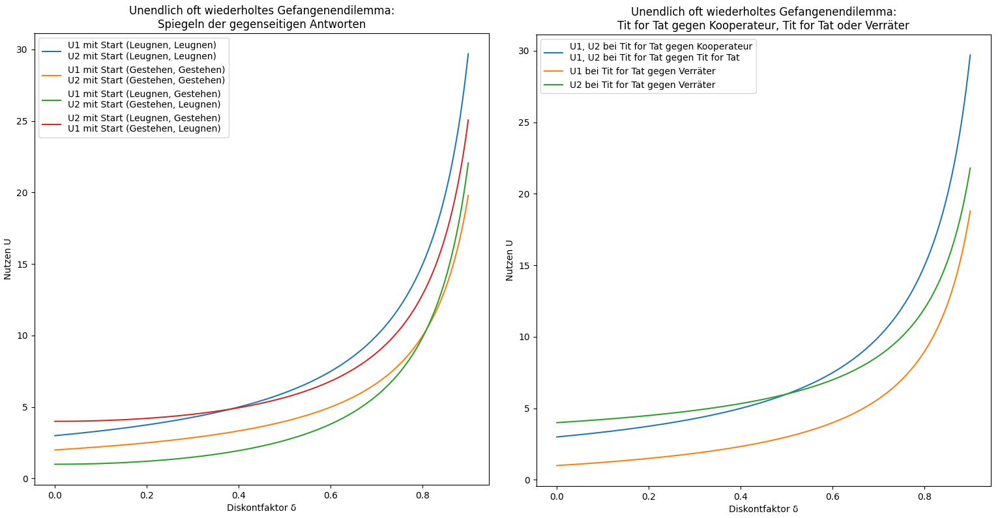
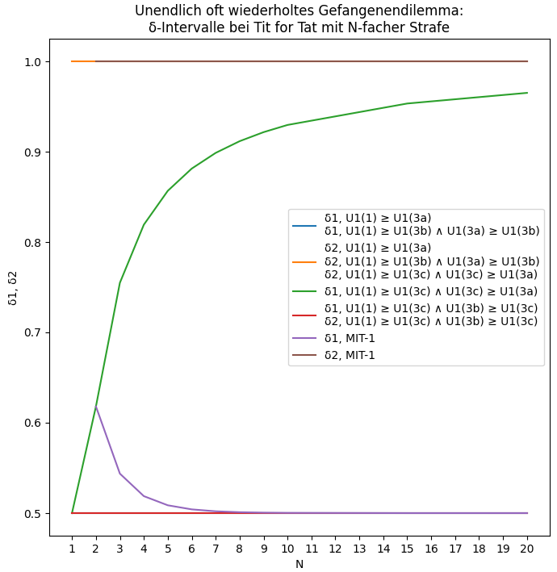
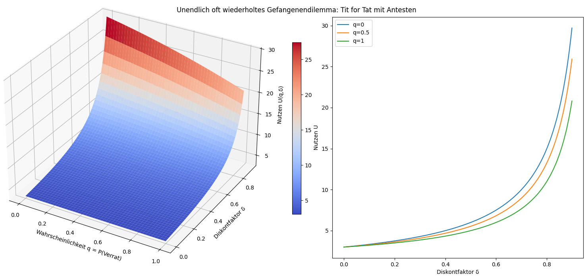
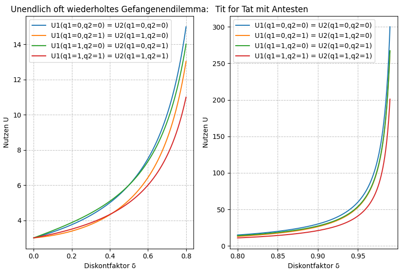
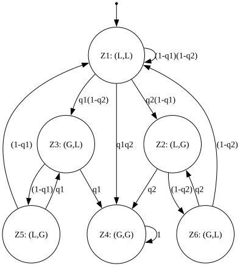
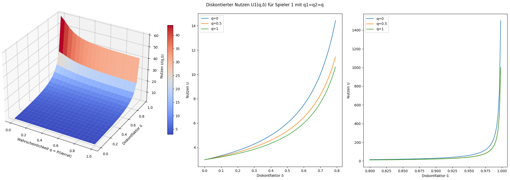
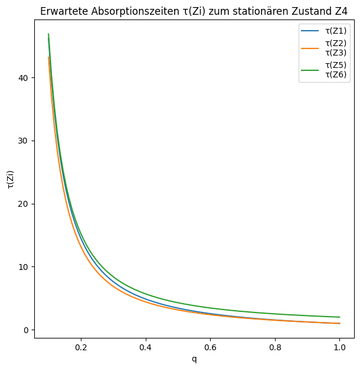

# Folk-Theorem, One-Shot-Deviation-Principle und Markovprozesse im unendlich oft wiederholten Gefangenendilemma
<!-- Start table of contents, generated by md_toc_update.py, do not edit -->
## Inhaltsverzeichnis

- [Folk-Theorem, One-Shot-Deviation-Principle und Markovprozesse im unendlich oft wiederholten Gefangenendilemma](#folk-theorem-one-shot-deviation-principle-und-markovprozesse-im-unendlich-oft-wiederholten-gefangenendilemma)
  - [Unendlich oft wiederholtes Gefangenendilemma](#unendlich-oft-wiederholtes-gefangenendilemma)
    - [Folk-Theorem](#folk-theorem)
    - [Beispiel 1: Spiegelung der Antworten](#beispiel-1-spiegelung-der-antworten)
    - [Beispiel 2: Tit for Tat](#beispiel-2-tit-for-tat)
      - [One-Shot Deviation Principle (OSDP)](#one-shot-deviation-principle-osdp)
    - [Beispiel 3: Grim Trigger](#beispiel-3-grim-trigger)
    - [Beispiel 4: Tit for Tat mit Strafverschärfung](#beispiel-4-tit-for-tat-mit-strafverscharfung)
    - [Beispiel 5: Tit for Tat mit Antesten](#beispiel-5-tit-for-tat-mit-antesten)
      - [Variante A: Tit for Tat mit randomisierter Startstrategie](#variante-a-tit-for-tat-mit-randomisierter-startstrategie)
      - [Variante B: Tit for Tat mit Markov-Prozess](#variante-b-tit-for-tat-mit-markov-prozess)
  - [Literatur](#literatur)
<!-- End of TOC, generated by md_toc_update.py, do not edit -->

## Unendlich oft wiederholtes Gefangenendilemma

Wir betrachten das klassische [Gefangenendilemma](https://de.wikipedia.org/wiki/Gefangenendilemma) mit 2 Spielern, diesmal mit unendlicher Wiederholung. Für das einmalige Spiel sei die Nutzenmatrix für die Strategien $s_{ij}$ mit Spieler $i∈\{1,2\}$, Aktion $A_j∈\{L,G\}$, $L=$ Leugnen und $G=$ Gestehen wie folgt:

| **Verhalten** | **Nutzen** |
| ------------------------------------------------------------------- |---|
| S (suckers payoff, Gutgläubigkeit): Leugnen wenn der andere gesteht | 1 |
| P (punishment, Bestrafung): Beide gestehen und verraten den anderen | 2 |
| R (reward, Belohnung): Kooperation bei Kooperation (beide leugnen)  | 3 |
| T (temptation, Versuchung): Gestehen wenn der andere leugnet        | 4 |

| **Strategiekombination**     | **Nutzen ($U_1$, $U_2$)** |
| ---------------------------- | ------------------------- |
| (L, L): (Leugnen, Leugnen)   |      (R, R) = (3, 3)      |
| (L, G): (Leugnen, Gestehen)  |      (S, T) = (1, 4)      |
| (G, L): (Gestehen, Leugnen)  |      (T, S) = (4, 1)      |
| (G, G): (Gestehen, Gestehen) |      (P, P) = (2, 2)      |

| **Nutzenmatrix** | **$s_{21}$: Gefangener 2 wählt Leugnen** | **$s_{22}$: Gefangener 2 wählt Gestehen** |
| ----------------------------------------- | --------------- | --------------- |
| **$s_{11}$: Gefangener 1 wählt Leugnen**  | (R, R) = (3, 3) | (S, T) = (1, 4) |
| **$s_{12}$: Gefangener 1 wählt Gestehen** | (T, S) = (4, 1) | (P, P) = (2, 2) |

Die dominante Strategie ist: Beide Gestehen mit Nutzen (2, 2). In diesem Beispiel ist die dominante Strategie nicht Pareto-effizient, da sich beide Spieler durch Kooperation verbessern könnten (wenn beide Leugnen und damit den Nutzen (3, 3) erreichen).

"Bei wiederholtem Spiel hängt das Ergebnis davon ab, ob den Spielern die Anzahl der Runden bekannt ist oder nicht. Ist den Spielern das Spielende bekannt, lohnt es sich für eigentlich kooperierende Spieler, in der letzten Runde zu verraten, weil dafür eine Vergeltung nicht mehr möglich ist. Somit wird aber die vorletzte Runde zur letzten, in der effektiv eine Entscheidung zu fällen ist, worauf sich wieder dieselbe Situation ergibt. Durch Induktion folgt, dass das Nash-Gleichgewicht in diesem Fall der ständige Verrat ist. Das heißt, wenn beide Seiten sich permanent verraten, ist dies die einzige Strategie, bei der durch einen Strategiewechsel kein besseres Ergebnis erzielt werden kann. Deshalb ist ein Spiel, bei dem beiden Spielern die Anzahl der Runden bekannt ist, genau wie ein Einmalspiel zu behandeln. Dies ergibt sich aus einer spieltheoretischen Rückwärtsinduktion (backward induction). In der Praxis wird dieses theoretisch rationale Verhalten jedoch nicht immer beobachtet. Dies liegt daran, dass ein rationaler Spieler nicht wissen kann, ob der andere Spieler auch rational agiert. Wenn die Möglichkeit besteht, dass der Mitspieler irrational agieren könnte, ist es auch für den rationalen Spieler von Vorteil, vom ständigen Verrat abzuweichen und stattdessen Tit-for-Tat zu spielen.  
Grundsätzlich anders verhält es sich erst, wenn den Spielern die Anzahl der Runden nicht bekannt ist. Da die Spieler nicht wissen, welche Runde die letzte sein wird, kommt es nicht zur Rückwärtsinduktion. Das unbekannt oft wiederholte Spiel ist damit einem unendlich oft wiederholten Spiel gleichzusetzen.  
Bei unendlich wiederholten Spielen kommt es nicht zur Backward Induction. Die wiederholte Interaktion ermöglicht es, Kooperation in folgenden Runden zu belohnen, was zu höheren Gesamtauszahlungen führt, oder Defektion zu vergelten, was zu geringeren Auszahlungen führt." [^1]

### Folk-Theorem

Das [Folk-Theorem](https://de.wikipedia.org/wiki/Folk-Theorem) beschreibt mögliche Gleichgewichte in wiederholten Spielen:  
"In einem unendlich oft wiederholten Spiel mit $N$ Akteuren und einer endlichen Menge an Aktionen kann jede Kombination von individuell rationalen, erreichbaren Auszahlungen als teilspielperfektes Nash-Gleichgewicht gestützt werden.  
Jeder Spieler diskontiert die Zahlungen $u(t)$ aus den zukünftigen Runden mit einem (individuellen) Diskontfaktor 
δ. Der gegenwärtige Wert des Spiels für den Spieler ist daher gegeben durch  
$U = u(t) + δ \cdot u(t+1) + δ^2 \cdot u(t+1) + δ^3 \cdot u(t+1) + ... = \sum_{i=0}^{∞} δ^i \cdot u(t+i)$  
Ist der Diskontfaktor $δ$ hoch (nahe 1), wird die Zukunft nur geringfügig diskontiert, d. h. die Zukunft ist wichtig und der Spieler ist geduldig. Die zukünftigen Zahlungen haben ein hohes Gewicht.  
Ein langfristiges Gleichgewicht wird erreicht, indem die Spieler sich wechselseitig bei Abweichung vom erwünschten Verhalten eine Bestrafung androhen. Eine solche Bestrafung ist der einmalige Entzug des Vorteils in der Folgeperiode (tit for tat) oder gar die Auflösung des Spiels und damit der Verlust der Vorteile in allen Folgeperioden (grim strategy)." [^2]

Anmerkung: Das Folk-Theorem macht selbst keine Aussage über die genaue Form der Diskontierung, sondern setzt nur eine geeignete Zukunftsbewertung voraus. Die Summation mit Gewicht $δ^i$ ist ein Modell, das die Voraussetzungen des Folk-Theorems erfüllt und wird daher oft benutzt. Andere Summen können die Voraussetzungen des Folk-Theorems aber ebenfalls erfüllen, sofern sie konvergieren, die Zukunft nicht zu stark werten und Drohungen wirksam bleiben.

Beide Gefangene entscheiden simultan. Mit jeder Wiederholung teilt sich jeder Knoten im Spielbaum in 4 weitere Teilbäume, so dass der Spielbaum exponentiell wächst. Die Auszahlungen lassen sich aber durch direkte Summation berechnen; aus den Auszahlungen ergeben sich mögliche Gleichgewichte (kein Spieler kann seinen Nutzen durch einseitigen Strategiewechsel erhöhen) und die optimale Strategie. Das Folk-Theorem garantiert, dass geeignete Strategien diese Auszahlungen als Gleichgewicht stützen können. [Strategien im Gefangenendilemma](https://de.wikipedia.org/wiki/Gefangenendilemma#Strategien) listet unterschiedliche Strategien für das über mehrere Runden gespielte Gefangenendilemma auf, wie z.B. [Tit for Tat](https://de.wikipedia.org/wiki/Tit_for_Tat).

Das Folk-Theorem setzt voraus, dass das Spiel in jedem Knoten ein wohldefiniertes Teilspiel besitzt. "Ein Nash-Gleichgewicht ist [teilspielperfekt](https://de.wikipedia.org/wiki/Teilspielperfektes_Gleichgewicht), wenn es ein Nash-Gleichgewicht in jedem Teilspiel induziert. Ein Teilspiel ist ein Spiel, das in einem einzelnen Entscheidungsknoten des Spielbaums beginnt und alle Knoten enthält, die diesem Knoten nachfolgen. Durch das Teilspiel dürfen keine nachfolgenden [Informationsbezirke](https://de.wikipedia.org/wiki/Informationsbezirk) zertrennt werden." [^3]

Da das Gefangenendilemma ein symmetrisches Spiel mit vollständiger Information ist, ist jede Runde eines wiederholten Gefangenendilemmas ist ein perfektes Teilspiel. Daher liefert das Folk-Theorem die Auszahlungen (Nutzen) bei unendlicher Wiederholung. Signal-Spiele mit unvollständiger Information dagegen sind i.A. nicht teilspielperfekt (nämlich dann, wenn sich die Informationsbezirke im Spielbaum fortpflanzen). In diesen Fällen ist das Folk-Theorem nicht anwendbar.

### Beispiel 1: Spiegelung der Antworten

Beide Gefangene spiegeln die Antwort des anderen, d.h. jeder Spieler wiederholt die Antwort des anderen aus der vorangegangenen Runde. (L, L) führt immer zu (L, L), (G, G) zu (G, G), (L, G) zu (G, L) und (G, L) zu (L, G) in der nächsten Runde. Im Grunde ist dies ein deterministischer Zustandsautomat.

* Starten beide kooperativ mit Leugnen, dann wechseln die Antworten niemals. Auf Zustand (L, L) folgt stets der Folgezustand (L, L). Damit ist $u(t)$ konstant über alle Runden: $u(t) = u(L,L) = (R, R) = (3, 3)$. Gemäß Folk-Theorem ergeben sich folgende Auszahlungen (Nutzen) bei unendlicher Wiederholung:  
    $U = \sum_{i=0}^{∞} δ^i \cdot (R, R)$  
    Aus $\sum_{i=0}^{∞} x^i = \{ 1 / (1 - x) \text{ für } 0≤x<1, ∞ \text{ für } x≥1 \}$ folgt:  
    $U = (R, R) \cdot \sum_{i=0}^{∞} δ^i = (R, R) \cdot 1 / (1 - δ) \text{ für } 0≤δ<1, (∞, ∞) \text{ für } δ=1$  
    Im Beispiel: $U_1 = U_2 = 3 / (1 - δ) \text{ für } 0≤δ<1$  

* Starten beide mit Gestehen (Start: G, G), bleibt der Zustand immer in (G, G) mit Nutzen $U(G,G) = (P, P) = (2, 2)$. Entsprechend folgen die Auszahlungen:  
    $U = (P, P) \cdot \sum_{i=0}^{∞} δ^i = (P, P) \cdot (1 / (1 - δ)) \text{ für } 0≤δ<1, (∞, ∞) \text{ für } δ=1$  
    Im Beispiel: $U_1 = U_2 = 2 / (1 - δ) \text{ für } 0≤δ<1$  

* Starten beide mit (L, G) oder (G, L), dann toggeln die Zustände zwischen (L, G) und (G, L): (L, G) → (G, L) → (L, G) → (G, L) usw. Entsprechend folgen die Auszahlungen für Start mit (L, G):  
    $U = (S, T) \cdot \sum_{i=0}^{∞}δ^{2i} + (T, S) \cdot \sum_{i=0}^{∞}δ^{2i+1}$  
    $U = (S, T) \cdot (1 / (1 - δ^2)) + (T, S) \cdot (δ / (1 - δ^2)) \text{ für } 0≤δ<1, (∞, ∞) \text{ für } δ=1$  
    $U = (S + δ \cdot T, T + δ \cdot S) \cdot (1 / (1 - δ^2)) \text{ für } 0≤δ<1, (∞, ∞) \text{ für } δ=1$  
    Im Beispiel: $U_1 = (1 + 4 δ) / (1 - δ^2), U_2 = (4 + δ) / (1 - δ^2) \text{ für } 0≤δ<1$  
    Entsprechend für Start mit (G, L):  
    $U = (T + δ \cdot S, S + δ \cdot T) \cdot (1 / (1 - δ^2)) \text{ für } 0≤δ<1, (∞, ∞) \text{ für } δ=1$  
    Im Beispiel: $U_1 = (4 + δ) / (1 - δ^2), U_2 = (1 + 4 δ) / (1 - δ^2) \text{ für } 0≤δ<1$  

Zur Erinnerung: Es gilt die geometrische Reihe $\sum_{i=0}^{∞} δ^{ai+b} = δ^b / (1 - δ^{a})$ für $|δ| < 1$,  
$\sum_{i=0}^{∞} δ^{i} = 1 / (1 - δ)$ für $|δ| < 1$, sowie $δ / (1 - δ) = -1 + 1 / (1 - δ)$.

### Beispiel 2: Tit for Tat

Ein Gefangener spielt Tit for Tat, d.h. er kooperiert in der ersten Runde und kopiert in den nächsten Runden die vorherige Antwort des Mitspielers. Diese Strategie ist prinzipiell kooperationswillig, übt aber bei Verrat Vergeltung. Bei erneuter Kooperation des Mitspielers ist sie nicht nachtragend, sondern reagiert ihrerseits mit Kooperation. Der andere Gefangene spielt entweder ebenfalls Tit for Tat, oder er ist ein Kooperateur, der stets leugnet, oder er ist ein Verräter, der stets gesteht.

* Tit for Tat gegen Kooperateur oder Kooperateur gegen Tit for Tat ergeben eine konstante Zustandsfolge (L, L) → (L, L) und damit wie oben:  
    $U_1 = U_2 = R / (1 - δ) = 3 / (1 - δ)$  

* Tit for Tat gegen Tit for Tat ergibt ebenfalls die konstante Zustandsfolge (L, L) → (L, L) und damit ebenfalls:  
    $U_1 = U_2 = R / (1 - δ) = 3 / (1 - δ)$  

* Tit for Tat gegen Verräter ergibt die Zustandsfolge (L, G) → (G, G) → (G, G) und damit:  
    $U = (S, T) + (P, P) \cdot \sum_{i=1}^{∞} δ^i = (S, T) - (P, P) + (P, P) \cdot \sum_{i=0}^{∞} δ^i = (S - P, T - P) + (P, P) \cdot (1 / (1 - δ))$  
    Im Beispiel:  
    $U_1 = S - P + P / (1 - δ) = 2 / (1 - δ) - 1$  
    $U_2 = T - P + P / (1 - δ) = 2 / (1 - δ) + 2$  

Ab einem gewissen Diskontfaktor - d.h. solange der zukünfige Nutzen ein gewisses Gewicht hat - bringt eine nicht-kooperierende Verräter-Strategie für alle Spieler Nachteile (sofern ein Verräter nicht gegen einen Kooperateur antritt und damit ein Verrat unbestraft bleibt). Im Beispiel 1 ist dies bei $δ > 3/2 - \sqrt{5}/2 ≈ 0.382$, im Beispiel 2 bei $δ > 1/2$ der Fall. Das Gefangenendilemma mit Randbedingungen $T > R > P > S$ und $2 R > T + S$ (wie im Beispiel der Fall) begünstigt kooperative Strategien.

Dieses Ergebnis gilt nur für die Auszahlungen dieser 3 Kombinationen; es bedeutet nicht, dass Tit for Tat die die optimale Strategie oder ein teilspielperfektes Gleichgewicht (SPE) ist. Ob eine Strategie ein SPE ist, lässt sich durch das One-Shot Deviation Principle (OSDP) ermitteln:

#### One-Shot Deviation Principle (OSDP)

"In game theory, the one-shot deviation principle is a principle used to determine whether a strategy in a sequential game constitutes a subgame perfect equilibrium (SPE). An SPE is a Nash equilibrium where no player has an incentive to deviate in any subgame... In simpler terms, if no player can profit (increase their expected payoff) by deviating from their original strategy via a single action (in just one stage of the game), then the strategy profile is an SPE." [^4]  
"In finite games or infinetely repeated games with discounting, a set of strategies is a SPE, if and only if no player can profitably deviate from his strategy at a single stage and maintain his strategy everywhere else." [^5]  
"Nash equilibrium: Given the other players are playing their best response in every period, player i has no incentive to unilaterally deviate from their strategy in any period. A Nash equilibrium is subgame-perfect (SPNE) if the players’ strategies constitute a Nash equilibrium in every subgame." [^7]

Kann ein Spieler durch kurzfristige (einmalige) Abweichung von seiner Strategie einen langfristig höheren Nutzen erzielen, dann liegt kein SPE vor. Dies ist genau dann der Fall, wenn der Gewinn durch kurzfristige Abweichung von der Strategie höher ist als die langfristigen Kosten durch nachfolgende Bestrafung. Ein SPE liegt genau dann vor, wenn kein Spieler durch kurzfristige Abweichung von seiner Strategie einen Gewinn erzielen kann, der höher ist als die zukünftigen, diskontierten Kosten durch Bestrafung.

Wir müssen also die diskontierten Auszahlungen aller Strategiekombinationen vergleichen mit den diskontierten Auszahlungen eines Spielers, wenn dieser einmalig von seiner Strategie abweicht. Ist bei keiner Kombination die diskontierte Auszahlung bei Abweichung höher als die Auszahlung ohne Abweichung, ist die Strategie ein SPE.

Im folgenden betrachten wir daher die Folgezustände aller möglichen Startzustände mit und ohne einmalige Abweichung von der Strategie:
* Startzustände aus dem Zustandsraum { (L, L), (L, G), (G, L), (G, G) }
* TfT: Spieler spielt Tit for Tat
* TfTAbw: Spieler spielt Tit for Tat mit einmaliger Abweichung von der Strategie
* Zustandsfolge 1, Spieler 1: TfT, Spieler 2: TfT, (L, L) → (L, L):  
    $U_1 = U_2 = R / (1 - δ) = 3 / (1 - δ)$  
* Zustandsfolge 2a, Spieler 1: TfT, Spieler 2: TfTAbw, ohne Rückkehr zur Kooperation (L, G) → (G, L) → (L, G):  
    $U = (S, T) \cdot \sum_{i=0}^{∞}δ^{2i} + (T, S) \cdot \sum_{i=0}^{∞}δ^{2i+1}$  
    $U = (S, T) \cdot (1 / (1 - δ^2)) + (T, S) \cdot (δ / (1 - δ^2))$  
    $U_1 = (S + T \cdot δ) / (1 - δ^2) = (1 + 4 δ) / (1 - δ^2)$  
    $U_2 = (T + S \cdot δ) / (1 - δ^2) = (4 + δ) / (1 - δ^2)$  
* Zustandsfolge 2b, Spieler 1: TfT, Spieler 2: TfTAbw, mit Rückkehr zur Kooperation (Abweichung), (L, G) → (G, L) → (L, L):  
    $U = (S, T) + (T, S) \cdot δ + (R, R) \cdot \sum_{i=2}^{∞}δ^{i}$  
    $U = (S - R, T - R) + δ (T - R, S - R) + R / (1 - δ)$  
    $U_1 = (S - R) + δ (T - R) + R / (1 - δ) = -2 + 1 δ + 3 / (1 - δ)$  
    $U_2 = (T - R) + δ (S - R) + R / (1 - δ) =  1 - 2 δ + 3 / (1 - δ)$  
* Zustandsfolge 3a, Spieler 1: TfTAbw, Spieler 2: TfT, ohne Rückkehr zur Kooperation, (G, L) → (L, G) → (G, L):  
    $U = (T, S) \cdot \sum_{i=0}^{∞}δ^{2i} + (S, T) \cdot \sum_{i=0}^{∞}δ^{2i+1}$  
    $U = (T, S) \cdot (1 / (1 - δ^2)) + (S, T) \cdot (δ / (1 - δ^2))$  
    $U_1 = (T + S \cdot δ) / (1 - δ^2) = (4 + δ) / (1 - δ^2)$  
    $U_2 = (S + T \cdot δ) / (1 - δ^2) = (1 + 4 δ) / (1 - δ^2)$  
* Zustandsfolge 3b, Spieler 1: TfTAbw, Spieler 2: TfT, mit Rückkehr zur Kooperation (Abweichung), (G, L) → (L, G) → (L, L):  
    $U = (T, S) + (S, T) \cdot δ + (R, R) \cdot \sum_{i=2}^{∞}δ^{i}$  
    $U = (T - R, S - R) + δ (S - R, T - R) + R / (1 - δ)$  
    $U_1 = (T - R) + δ (S - R) + R / (1 - δ) =  1 - 2 δ + 3 / (1 - δ)$  
    $U_2 = (S - R) + δ (T - R) + R / (1 - δ) = -2 + 1 δ + 3 / (1 - δ)$  
* Zustandsfolge 4, Spieler 1: TfTAbw, Spieler 2: TfTAbw, (G, G) → (G, G):  
    $U = (P, P) \cdot \sum_{i=0}^{∞}δ^{i}$  
    $U_1 = U_2 = P / (1 - δ) = 2 / (1 - δ)$  

SPE-Bedingung für Spieler 1: Spieler 1 hat keinen Nutzen von einmaliger Abweichung, wenn $U_1(1) ≥ U_1(3a) ≥ U_1(3b) ∧ U_1(1) ≥ U_1(4)$  
Im Beispiel:  
$U_1(1) ≥ U_1(3a) ⇔ 3 / (1 - δ) ≥ (4 + δ) / (1 - δ^2) ⇔ 1/2 ≤ δ < 1$  
$U_1(3a) ≥ U_1(3b) ⇔ (4 + δ) / (1 - δ^2) ≥ 1 - 2 δ + 3 / (1 - δ) ⇔ 0 ≤ δ ≤ 1/2$  
$U_1(1) ≥ U_1(4) ⇔ 3 / (1 - δ) ≥ 2 / (1 - δ) ⇔ 3 ≥ 2$  

Die SPE-Bedingung ist nur für $δ = 1/2$ erfüllbar. Das gleiche gilt für die SPE-Bedingung für Spieler 2, $U_2(1) ≥ U_2(2a) ≥ U_2(2b) ∧ U_2(1) ≥ U_2(4)$.  

Damit ist Tit for Tat nur für genau $δ = 1/2$ ein SPE; sobald $δ$ minimal abweicht, ist Tit for Tat kein SPE. [^6] [^7] D.h. Tit for Tat ist oft ein Nash-Gleichgewicht, aber nicht teilspielperfekt. Der Grund: Solange nach Verrat und Strafe die Spieler durch Abweichung zur Kooperation zurückkehren können (und die Kosten des Verrats einmalig und begrenzt sind), ist die Drohung nicht glaubwürdig.

### Beispiel 3: Grim Trigger

Die Strategie [Grim Trigger](https://en.wikipedia.org/wiki/Grim_trigger) startet kooperativ, bestraft einen Verrat aber für immer. Grim Trigger ist ein teilspielperfektes Gleichgewicht (SPE) im unendlich wiederholten Gefangenendilemma.

* Grim Trigger gegen Kooperateur, gegen Tit for Tat oder gegen Grim Trigger ergeben eine konstante Zustandsfolge (L, L) → (L, L) und damit die Auszahlungen wie oben:  
    $U_1 = U_2 = R / (1 - δ) = 3 / (1 - δ)$  
* Grim Trigger gegen Verräter ergibt die Zustandsfolge (L, G) → (G, G) → (G, G) und damit die Auszahlungen wie oben:  
    $U_1 = S - P + P / (1 - δ) = -1 + 2 / (1 - δ)$  
    $U_2 = T - P + P / (1 - δ) = 2 + 2 / (1 - δ)$  

Diese Auszahlungen unterscheiden sich noch nicht von denen bei Tit for Tat. Bei einmaligem Abweichen von der Strategie ergibt Grim Trigger aber andere diskontierte Auszahlungen als Tit for Tat:
* Startzustände aus dem Zustandsraum { (L, L), (L, G), (G, L), (G, G) }
* GT: Spieler spielt Grim Trigger
* GTAbw: Spieler spielt Grim Trigger mit einmaliger Abweichung von der Strategie
* Zustandsfolge 1, Spieler 1: GT, Spieler 2: GT, (L, L) → (L, L):  
    $U_1 = U_2 = R / (1 - δ) = 3 / (1 - δ)$  
* Zustandsfolge 2, Spieler 1: GT, Spieler 2: GTAbw, (L, G) → (G, G) → (G, G):  
    $U = (S, T) + (P, P) \cdot \sum_{i=1}^{∞}δ^{i}$  
    $U = (S - P, T - P) + (P / (1 - δ))$  
    $U_1 = S - P + P / (1 - δ) = -1 + 2 / (1 - δ)$  
    $U_2 = T - P + P / (1 - δ) =  2 + 2 / (1 - δ)$  
* Zustandsfolge 3, Spieler 1: GTAbw, Spieler 2: GT, (G, L) → (G, G) → (G, G):  
    $U = (T, S) + (P, P) \cdot \sum_{i=1}^{∞}δ^{i}$  
    $U = (T - P, S - P) + (P / (1 - δ))$  
    $U_1 = T - P + P / (1 - δ) =  2 + 2 / (1 - δ)$  
    $U_2 = S - P + P / (1 - δ) = -1 + 2 / (1 - δ)$  
* Zustandsfolge 4, Spieler 1: GTAbw, Spieler 2: GTAbw, (G, G) → (G, G):  
    $U = (P, P) \cdot \sum_{i=0}^{∞}δ^{i}$  
    $U_1 = U_2 = P / (1 - δ) = 2 / (1 - δ)$  

Spieler 1 hat keinen Nutzen von einmaliger Abweichung, wenn $U_1(1) ≥ U_1(3) ∧ U_1(1) ≥ U_1(4)$  
Im Beispiel:  
$3 / (1 - δ) ≥ 2 + 2 / (1 - δ) ∧ 3 / (1 - δ) ≥ 2 / (1 - δ) ⇔ δ ≥ 1/2$  
Spieler 2 hat keinen Nutzen von einmaliger Abweichung, wenn $U_2(1) ≥ U_2(2) ∧ U_2(1) ≥ U_2(4)$  
Im Beispiel (identisch zu Spieler 1):  
$3 / (1 - δ) ≥ 2 + 2 / (1 - δ) ∧ 3 / (1 - δ) ≥ 2 / (1 - δ) ⇔ δ ≥ 1/2$  
Allgemein:  
$R / (1 - δ) ≥ T - P + P / (1 - δ) ∧ R / (1 - δ) ≥ P / (1 - δ)$  
$⇔ δ ≥ (T - R)  / (T - P) ∧ R ≥ P$  

Im Gegensatz zu Tit for Tat führt ein Verrat beim Grim Trigger zur permanenten Strafe und damit immer zu hohen Zukunftskosten. Grim Trigger ist daher ein SPE für $δ ≥ (T - R)  / (T - P)$, im Beispiel $δ ≥ 1/2$. [^8]

### Beispiel 4: Tit for Tat mit Strafverschärfung

Die klassische Tit for Tat Strategie ist -im Gegensatz zum Grim Trigger- kein teilspielperfektes Gleichgewicht (subgame perfect equilibrium, SPE), weil die Strafe nicht langfristig wirkt und die Androhung deshalb nicht glaubwürdig genug ist für ein SPE. Intuitiv ist die Strafe beim Grim Trigger aber nicht optimal, da sie nach einmaligem Verrat jede neue Kooperationsmöglichkeit ausschließt. 

Wir untersuchen daher Tit for Tat mit Strafverschärfung: Bei jedem neuen Verrat wird die Strafe größer. Beim 1. Verrat ist die Strafe einmalig, beim 2. Verrat zweimalig und beim $N$.ten Verrat $N$-fach. Die Kosten für den Verräter werden also mit jedem Verrat größer. Nach Beendigung der Strafphase können die Spieler zur Kooperation oder zum klassischen Tit for Tat zurückkehren. Bei Rückkehr zur Kooperation (Zustandsfolge 3c, s.u.) entspricht Tit for Tat mit $N$-facher Strafe für $N=1$ der klassischen Tit for Tat Strategie und für $N → ∞$ dem Grim Trigger.

Zuerst die Auszahlungen bei Tit for Tat mit Strafe $N$ ("N-TfT"):
* N-TfT gegen Kooperateur oder gegen N-TfT ergeben eine konstante Zustandsfolge (L, L) → (L, L) und damit die Nutzen wie oben:  
    $U_1 = U_2 = R / (1 - δ) = 3 / (1 - δ)$  
* N-TfT gegen Verräter ergibt die Zustandsfolge (L, G) → (G, G) → (G, G) und damit die Nutzen wie oben:  
    $U_1 = S - P + P / (1 - δ) = 2 / (1 - δ) - 1$  
    $U_2 = T - P + P / (1 - δ) = 2 / (1 - δ) + 2$  

Diese Auszahlungen unterscheiden sich nicht von denen bei klassischem Tit for Tat oder Grim Trigger. Um die Abweichbedingungen zu prüfen, müssen wir wieder die diskontierten Auszahlungen mit und ohne Abweichen von der Strategie ermitteln:
* Startzustände aus dem Zustandsraum { (L, L), (L, G), (G, L), (G, G) }
* NTfT: Spieler spielt N-TfT (Tit for Tat mit Strafe $N$)
* NTfTAbw: Spieler spielt N-TfT mit einmaliger Abweichung von der Strategie
* Zustandsfolge 1, Spieler 1: NTfT, Spieler 2: NTfT, (L, L) → (L, L):  
    $U_1 = U_2 = R / (1 - δ) = 3 / (1 - δ)$  
* Zustandsfolge 3a, Spieler 1: NTfTAbw, Spieler 2: NTfT, Tit for Tat ohne Rückkehr zur Kooperation, $N = 1$, (G, L) → (L, G) → (G, L):  
    $U = (T, S) \cdot \sum_{i=0}^{∞}δ^{2i} + (S, T) \cdot \sum_{i=0}^{∞}δ^{2i+1}$  
    $U = (T, S) \cdot (1 / (1 - δ^2)) + (S, T) \cdot (δ / (1 - δ^2))$  
    $U_1 = (T + S \cdot δ) / (1 - δ^2) = (4 + δ) / (1 - δ^2)$  
    $U_2 = (S + T \cdot δ) / (1 - δ^2) = (1 + 4 δ) / (1 - δ^2)$  
* Zustandsfolge 3b, Spieler 1: NTfTAbw, Spieler 2: NTfT, mit Rückkehr zu klassischem Tit for Tat nach Strafphase, $N ≥ 1$, (G, L) → { (N-1)-mal (G, G) } → (L, G) → (G, L) → (L, G):  
    $U = (T, S) + (P, P) \cdot \sum_{i=1}^{N-1}δ^{i} + (S, T) \cdot \sum_{i=0}^{∞}δ^{N+2i} + (T, S) \cdot \sum_{i=0}^{∞}δ^{N+2i+1}$  
    $U = (T, S) + (P, P) \cdot (δ - δ^N) / (1 - δ) + (S, T) \cdot δ^N / (1 - δ^2) + (T, S) \cdot  δ^{N+1} / (1 - δ^2)$  
    $U_1 = T + P \cdot (δ - δ^N) / (1 - δ) + S \cdot δ^N / (1 - δ^2) + T \cdot  δ^{N+1} / (1 - δ^2)$  
    $U_1 = 4 + 2 (δ - δ^N) / (1 - δ) + δ^N / (1 - δ^2) + 4 δ^{N+1} / (1 - δ^2)$  
* Zustandsfolge 3c, Spieler 1: NTfTAbw, Spieler 2: NTfT, mit Rückkehr zur Kooperation (Abweichung), $N > 0$, entspricht für $N=1$ klassischem Tit for Tat und für $N → ∞$ Grim Trigger, (G, L) → { (N-1)-mal (G, G) } → (L, G) → (L, L) → (L, L):  
    $U = (T, S) + (P, P) \cdot \sum_{i=1}^{N-1}δ^{i} + (S, T) \cdot δ^{N} + (R, R) \cdot \sum_{i=N+1}^{∞}δ^{i}$  
    $U = (T, S) + (P, P) \cdot (δ - δ^{N}) / (1 - δ) + (S, T) \cdot δ^{N} + (R, R) \cdot δ^{N+1} / (1 - δ)$  
    $U_1 = T + P \cdot (δ - δ^{N}) / (1 - δ) + S \cdot δ^{N} + R \cdot δ^{N+1} / (1 - δ) $  
    $U_1 = 4 + 2 (δ - δ^{N}) / (1 - δ) + δ^{N} + 3 δ^{N+1} / (1 - δ)$  
* Zustandsfolge 3d, Spieler 1: NTfTAbw, Spieler 2: NTfT, mit Rückkehr zur Kooperation (Abweichung) entsprechend MIT Strategie 1 (s.u.), $N > 0$, (G, L) → { N-mal (G, G) } → (L, L) → (L, L):  
    $U = (T, S) + (P, P) \cdot \sum_{i=1}^{N}δ^{i} + (R, R) \cdot \sum_{i=N+1}^{∞}δ^{i}$  
    $U = (T, S) + (P, P) \cdot (δ - δ^{N+1}) / (1 - δ) + (R, R) \cdot δ^{N+1} / (1 - δ)$  
    $U_1 = T + P \cdot (δ - δ^{N+1}) / (1 - δ) + R \cdot δ^{N+1} / (1 - δ) $  
    $U_1 = 4 + 2 (δ - δ^{N+1}) / (1 - δ) + 3 δ^{N+1} / (1 - δ)$  
* Zustandsfolge 4, Spieler 1: NTfTAbw, Spieler 2: NTfTAbw, (G, G) → (G, G):  
    $U = (P, P) \cdot \sum_{i=0}^{∞}δ^{i}$  
    $U_1 = U_2 = P / (1 - δ) = 2 / (1 - δ)$  
* Zur Erinnerung: Es gilt die Partialsumme der geometrischen Reihe:  
    $\sum_{i=a}^{b} δ^{i} = (δ^{a} - δ^{b+1}) / (1 - δ)$ für $δ ≠ 1$, sowie   
    $\sum_{i=a}^{∞} δ^{i} = δ^{a} / (1 - δ)$ für $|δ| < 1$   
    $\sum_{i=a}^{∞} δ^{ci+b} = δ^{ac+b} / (1 - δ^c)$ für $|δ| < 1$   

Zu beachten: Die Abweichbedingungen aus den so berechneten diskontierten Auszahlungen sind notwendig für ein Gleichgewicht, beweisen aber nicht, dass ein Gleichgewicht auch teilspielperfekt ist. Da die Strafe mit jedem neuen Verrat steigt, kann sich jedes Teilspiel vom Basisspiel unterscheiden. Wir beschränken uns daher auf den Vergleich von diskontierten Auszahlungen mit und ohne Abweichung bei vorgegebenem $N$.

Zum Vergleich: Ein Einführungskurs in die Spieltheorie vom MIT berechnet 2 ähnliche Varianten: [^7]
* Strategie 1 (Similar to grim trigger):  
    "Cooperate until your opponent defects. If your opponent defects, do not cooperate for the next k periods but then return to cooperation; if you defect, do not cooperate for the next k periods but then return to cooperation. Once you have returned to cooperation, cooperate until a defection occurs.  
    Consequently, sustaining cooperation requires that:  
    $a / (1 - δ) ≥ c + b \cdot (δ - δ^{k+1}) / (1 - δ) + a \cdot (δ^{k+1}) / (1 - δ)$.  
    We cannot generate a closed form for the critical value of $δ$, but we can rewrite this expression as:  
    $δ > (c-a) / (c-b) + δ^{k+1} \cdot (a-b) / (c-b)$"  
    Im Beispiel mit $a=R=3, b=P=2, c=T=4, d=S=1, k=N$:  
    $U_1 = T + P \cdot (δ - δ^{N+1}) / (1 - δ) + R \cdot (δ^{N+1}) / (1 - δ)$  
    $δ > (T-R) / (T-P) + δ^{k+1} (R-P) / (T-P)$  
    $δ > 1/2 + δ^{N+1} / 2$
* Strategie 2 (Similar to tit-for-tat):  
    "Cooperate until your opponent defects. If your opponent defects, do not cooperate for k periods. If she cooperates in any of the k periods, return to cooperation, ending the punishment phase. If she fails to cooperate in any period of the punishment phase, then the punishment phase starts over i.e. don’t cooperate for k more periods. If your own failure to cooperate caused the punishment phase then cooperate during the punishment phase. A defection from the cooperation phase generates a payoff consisting of a one period benefit c, a punishment payoff of d for k periods, and a return to cooperative payoffs a at the end of the punishment. Summing these up generates a payoff  
    $c + d \cdot (δ - δ^{k+1}) / (1 - δ) + a \cdot (δ^{k+1}) / (1 - δ)$  
    Thus, increasing the length of the punishment phase decreases the incentive to defect from the cooperative phase."  
    Im Beispiel mit a=R=3, b=P=2, c=T=4, d=S=1, k=N:  
    $R / (1 - δ) ≥ T + S \cdot (δ - δ^{N+1}) / (1 - δ) + R \cdot (δ^{N+1}) / (1 - δ)$  
    $3 / (1 - δ) ≥ 4 + (δ - δ^{N+1}) / (1 - δ) + 3 (δ^{N+1}) / (1 - δ)$  

Das folgende Diagramm zeigt die Bereiche von $δ$, die unterschiedliche Abweichbedingungen erfüllen:

* $U_1(1) ≥ U_1(3a) ⇔ 1/2 ≤ δ < 1$: klassisches Tit for Tat (ohne Rückkehr zur Kooperation nach Verrat), Kooperation lohnt bei $δ ≥ 1/2$.
* $U_1(1) ≥ U_1(3b) ∧ U_1(3a) ≥ U_1(3b) ⇔ 1/2 ≤ δ < 1$: Tit for Tat mit N-facher Strafe (mit Rückkehr zu klassischem Tit for Tat nach Strafphase), Kooperation lohnt bei $δ ≥ 1/2$.
* $U_1(1) ≥ U_1(3c) ∧ U_1(3c) ≥ U_1(3a) ⇔ δ_1(N) ≤ δ < 1$ mit der unteren Schwelle $δ_1(1) = 1/2, δ_1(2) = (\sqrt(5) - 1)/2 ≈ 0.618, δ_1(∞)→1$: Tit for Tat mit N-facher Strafe (mit Rückkehr zur Kooperation nach Verrat), $N=1$ entspricht klassischem Tit for Tat, $N→∞$ entspricht Grim Trigger. Die $δ$-Schwelle wächst mit zunehmendem $N$; je länger die Strafe, desto stärker muss die Zukunft gewichtet werden, damit sich Verrat + Strafe + Rückkehr zur Kooperation lohnen.
* $U_1(1) ≥ U_1(3c) ∧ U_1(3b) ≥ U_1(3c) ⇔ δ = 1/2$: Tit for Tat mit $N$-facher Strafe (Gleichgewichtsbedingung, Abweichung lohnt sich weder zwecks Verrat noch zur Rückkehr zur Kooperation): Wie beim klassischen Tit for Tat ist Tit for Tat mit $N$-facher Strafe nur für $δ = 1/2$ ein SPE; sobald $δ$ minimal abweicht, ist die Strategie kein SPE. Solange nach Verrat und Strafe die Spieler durch Abweichung zur Kooperation zurückkehren können, ist eine solche Abweichung i.A. immer noch profitabel. 

Die unterschiedlichen $δ$-Intervalle für unterschiedliche Abweichbedingungen zeigen, dass die Aussagen
* "bei Strategie $X$ lohnt sich ein Verrat nicht", und 
* "die Strategie $X$ ist ein teilspielperfektes Gleichgewicht (SPE)" 

zwei unterschiedliche Inhalte mit unterschiedlichen Bedingungen sind: "Ein Verrat lohnt nicht bei Strategie $X$" bedeutet: Ein (einmaliger oder mehrfacher) Verrat hat langfristig keinen höheren Nutzen als kooperatives Verhalten von Anfang an. "Strategie $X$ ist ein SPE" bedeutet: Keine Abweichung (egal ob Verrat oder spätere Rückkehr zur Kooperation) hat langfristig einen höheren Nutzen.

Die letzte Abweichbedingung (Tit for Tat mit $N$-facher Strafe und $δ=1/2$) zeigt ausserdem: Jede Strategie mit nur endlicher Bestrafungsdauer ist im unendlich wiederholten Gefangenendilemma im Allgemeinen kein SPE, weil in den letzten Strafrunden profitable one-shot deviations zur vorzeitigen Kooperation existieren. Nur die unendliche Bestrafung des Grim Trigger verhindert dies.

### Beispiel 5: Tit for Tat mit Antesten

Beide Gefangene spielen Tit for Tat mit Antesten: Jeder Spieler $S_i$ ist im Ausgangspunkt kooperativ, testet den Gegenspieler aber mit einer Wahrscheinlichkeit $q_i$ durch Verrat an. Reagiert der Gegenspieler mit Bestrafung, wird einmalig kooperiert, ansonsten mit Tit for Tat reagiert. Beide starten mit Kooperation. 

#### Variante A: Tit for Tat mit randomisierter Startstrategie

Wir betrachten die Wahrscheinlichkeiten $q_i$ zunächst für eine randomisierte Startstrategie plus einen deterministischen Automaten. Dann ergeben sich folgende Zustandsübergänge:
* A (Spieler 1 Verrat, Spieler 2 Tit for Tat): (L, L) → (G, L) → (L, G) → (L, L) mit Wahrscheinlichkeit $P_A = q_1(1-q_2)$
* B (Spieler 1 Tit for Tat, Spieler 2 Verrat): (L, L) → (L, G) → (G, L) → (L, L) mit Wahrscheinlichkeit $P_B = (1-q_1)q_2$
* C (Spieler 1 Verrat, Spieler 2 Verrat): (L, L) → (G, G) → (G, G) mit Wahrscheinlichkeit $P_C = q_1 q_2$ 
* D (Spieler 1 Tit for Tat, Spieler 2 Tit for Tat): (L, L) → (L, L) mit Wahrscheinlichkeit $P_D = (1-q_1)(1-q_2)$

Für diese 4 Fälle ergeben sich die folgenden Nutzenfunktionen:

* Erwartungsnutzen bei Zustandsfolge A, (L, L) → (G, L) → (L, G) → (L, L):  
    $U_A = (R, R) \cdot \sum_{i=0}^{∞} δ^{3i} + (T, S) \cdot \sum_{i=0}^{∞} δ^{3i+1} + (S, T) \cdot \sum_{i=0}^{∞} δ^{3i+2}$  
    $U_A = (R, R) \cdot (1 / (1 - δ^3)) + (T, S) \cdot (δ / (1 - δ^3)) + (S, T) \cdot (δ^2 / (1 - δ^3))$  
    Im Beispiel:  
    $U_{1,A} = (R + δ \cdot T + δ^2 \cdot S) \cdot (1 / (1 - δ^3)) = (3 + 4 δ + δ^2) / (1 - δ^3)$  
    $U_{2,A} = (R + δ \cdot S + δ^2 \cdot T) \cdot (1 / (1 - δ^3)) = (3 + δ + 4 δ^2) / (1 - δ^3)$  

* Erwartungsnutzen bei Zustandsfolge B, (L, L) → (L, G) → (G, L) → (L, L):  
    $U_B = (R, R) \cdot \sum_{i=0}^{∞} δ^{3i} + (S, T) \cdot \sum_{i=0}^{∞} δ^{3i+1} + (T, S) \cdot \sum_{i=0}^{∞} δ^{3i+2}$  
    $U_B = (R, R) \cdot (1 / (1 - δ^3)) + (S, T) \cdot (δ / (1 - δ^3)) + (T, S) \cdot (δ^2 / (1 - δ^3))$  
    Im Beispiel:  
    $U_{1,B} = (R + δ \cdot S + δ^2 \cdot T) \cdot (1 / (1 - δ^3)) = (3 + δ + 4 δ^2) / (1 - δ^3)$  
    $U_{2,B} = (R + δ \cdot T + δ^2 \cdot S) \cdot (1 / (1 - δ^3)) = (3 + 4 δ + δ^2) / (1 - δ^3)$  

* Erwartungsnutzen bei Zustandsfolge C, (L, L) → (G, G) → (G, G):  
    $U_C = (R, R) + (P, P) \cdot \sum_{i=1}^{∞} δ^{i}$  
    $U_C = (R, R) - (P, P) + (P, P) \cdot (1 / (1 - δ))$  
    Im Beispiel:  
    $U_{1,C} = U_{2,C} = R - P + P / (1 - δ) = 1 + 2 / (1 - δ)$  

* Erwartungsnutzen bei Zustandsfolge D, (L, L) → (L, L):  
    $U_D = (R, R) \cdot \sum_{i=0}^{∞} δ^{i} = (R, R) \cdot (1 / (1 - δ))$  
    Im Beispiel:  
    $U_{1,D} = U_{2,D} = R \cdot (1 / (1 - δ)) = 3 / (1 - δ)$  

Damit wird der Erwartungsnutzen:  
$U_{1} = P_A \cdot U_{1,A} + P_B \cdot U_{1,B} + P_C \cdot U_{1,C} + P_D \cdot U_{1,D}$  
$U_{2} = P_A \cdot U_{2,A} + P_B \cdot U_{2,B} + P_C \cdot U_{2,C} + P_D \cdot U_{2,D}$  

Im Beispiel:  
$U_{1} = q_1(1-q_2) \cdot (3 + 4 δ + δ^2) / (1 - δ^3) + (1-q_1)q_2 \cdot (3 + δ + 4 δ^2) / (1 - δ^3) + q_1q_2 \cdot (1 + 2 / (1 - δ)) + (1-q_1)(1-q_2) \cdot 3 / (1 - δ)$  
$U_{2} = q_1(1-q_2) \cdot (3 + δ + 4 δ^2) / (1 - δ^3) + (1-q_1)q_2 \cdot (3 + 4 δ + δ^2) / (1 - δ^3) + q_1q_2 \cdot (1 + 2 / (1 - δ)) + (1-q_1)(1-q_2) \cdot 3 / (1 - δ)$  

Wählen beide Spieler $q_1 = q_2 = q$, ergeben sich gleiche Nutzen $U_1 = U_2 = U$:  
$U_1 = U_2 = q(1-q) \cdot (6 + 5 δ + 5 δ^2) / (1 - δ^3) + q^2 \cdot (1 + 2 / (1 - δ)) + (1-q)(1-q) \cdot 3 / (1 - δ)$  

Man sieht, daß sich Verrat nicht lohnt: Jeder Spieler verringert seinen Nutzen, sobald beide $q_1 = q_2 = q$ und $q > 0$ wählen.

Theoretisch könnte jeder Spieler auch unterschiedliche $q_1, q_2$ wählen. In dem Fall könnten die Nutzenfunktionen ein Maximum bei $∂U_1/∂q_1 = 0$ bzw. $∂U_2/∂q_2 = 0$ haben. Dies ist nicht der Fall:  
$∂U_1/∂q_1 = q_2(1 + 2/(1 - δ)) - q_2(4δ^2 + δ + 3)/(1 - δ^3) + (1 - q_2)(δ^2 + 4δ + 3)/(1 - δ^3) - 3(1 - q_2)/(1 - δ)$  
$∂U_2/∂q_2 = q_1(1 + 2/(1 - δ)) - q_1(4δ^2 + δ + 3)/(1 - δ^3) + (1 - q_1)(δ^2 + 4δ + 3)/(1 - δ^3) - 3(1 - q_1)/(1 - δ)$  

Da $∂U_1/∂q_1$ nicht von $q_1$ abhängt, ist $U_1$ proportional zu $q_1$, d.h. $U_1(q_1)$ ist eine Gerade, deren Steigung von $q_2$ und $δ$ abhängt. Entsprechendes gilt für $∂U_2/∂q_2$, d.h. auch $U_2(q_2)$ ist eine Gerade. Damit können $U_1(q_1)$, $U_2(q_2)$ nur an den Rändern maximal werden, d.h. für $q_1, q_2 \in \{0, 1\}$. Ein plot der 4 Fälle zeigt sofort, daß die Nutzen maximal werden für $q_1 = q_2 = 0$ für $δ ≥ 1/2$:

Da beide Gefangene vollständige Informationen haben, die gleiche Strategie verwenden und gegenseitig symmetrisch reagieren, ist ein maximaler Nutzen für $q_1 = q_2 = 0$ (d.h. Tit for Tat ohne Verrat) für $δ ≥ 1/2$ nicht unerwartet.

#### Variante B: Tit for Tat mit Markov-Prozess

Wir betrachten die Variante Tit for Tat (TfT) mit Antesten jetzt als [Markovprozess](https://de.wikipedia.org/wiki/Markow-Kette): Jeder Spieler $S_i$ spielt Tit for Tat, verrät den Gegenspieler aber mit einer Wahrscheinlichkeit $q_i$ (gelegentliche Abweichung, danach Rückkehr zu Tit for Tat). Der Zustandsraum ist wieder { (L,L), (L,G), (G,L), (G,G) }, die Zustandsübergänge wie folgt:

Sofortnutzen:  
| **Zustand**                      | **Nutzen ($U_1$, $U_2$)** |
| -------------------------------- | ------------------------- |
| Z1, (L, L): (Leugnen, Leugnen)   |  $u_1 = (R, R) = (3, 3)$  |
| Z2, (L, G): (Leugnen, Gestehen)  |  $u_2 = (S, T) = (1, 4)$  |
| Z3, (G, L): (Gestehen, Leugnen)  |  $u_3 = (T, S) = (4, 1)$  |
| Z4, (G, G): (Gestehen, Gestehen) |  $u_4 = (P, P) = (2, 2)$  |
| Z5, (L, G): (Leugnen, Gestehen)  |  $u_5 = (S, T) = (1, 4)$  |
| Z6, (G, L): (Gestehen, Leugnen)  |  $u_6 = (T, S) = (4, 1)$  |

Sofortnutzen Spieler 1: $r_1 = [ \ R \ S \ T \ P \ S \ T \ ]^T$  
Sofortnutzen Spieler 2: $r_2 = [ \ R \ T \ S \ P \ T \ S \ ]^T$  

Aus dem Zustandsübergangsdiagramm ergeben sich die diskontierten Nutzenfunktionen:  
$U = U(Z1,t=0)$  
$U(Z1,t) = δ^t (R, R) + (1-q_1) (1-q_2) U(Z1,t+1) + q_2 (1-q_1) U(Z2,t+1) + q_1 (1-q_2) U(Z3,t+1) + q_1 q_2 U(Z4,t+1)$  
$U(Z2,t) = δ^t (S, T) + q_2 U(Z4,t+1) + (1-q_2) U(Z6,t+1)$  
$U(Z3,t) = δ^t (T, S) + q_1 U(Z4,t+1) + (1-q_1) U(Z5,t+1)$  
$U(Z4,t) = δ^t (P, P) + U(Z4,t+1)$  
$U(Z5,t) = δ^t (S, T) + (1-q_1) U(Z1,t+1) + q_1 U(Z3,t+1)$  
$U(Z6,t) = δ^t (T, S) + (1-q_2) U(Z1,t+1) + q_2 U(Z2,t+1)$  

Daraus ergeben sich die [Bellman-Gleichungen](https://en.wikipedia.org/wiki/Bellman_equation):  
$V_1 = u_1 + δ \cdot ((1-q_1) (1-q_2) V_1 + (1-q_1) q_2 V_2 + q_1 (1-q_2) V_3 + q_1 q_2 V_4)$  
$V_2 = u_2 + δ \cdot (q_2 V_4 + (1-q_2) V_6)$  
$V_3 = u_3 + δ \cdot (q_1 V_4 + (1-q_1) V_5)$  
$V_4 = u_4 + δ \cdot (V_4)$  
$V_5 = u_5 + δ \cdot ((1-q_1) V_1 + q_1 V_3)$  
$V_6 = u_6 + δ \cdot ((1-q_2) V_1 + q_2 V_2)$  

und die Übergangsmatrix $M$ der 6 Zustände:  
$M = \begin{bmatrix}
((1-q_1)(1-q_2)) & ((1-q_1)q_2) & (q_1(1-q_2)) & (q_1 q_2) &       0 &       0 \\
               0 &            0 &            0 &     (q_2) &       0 & (1-q_2) \\
               0 &            0 &            0 &     (q_1) & (1-q_1) &       0 \\
               0 &            0 &            0 &         1 &       0 &       0 \\
         (1-q_1) &            0 &        (q_1) &         0 &       0 &       0 \\
         (1-q_2) &        (q_2) &            0 &         0 &       0 &       0 \\
\end{bmatrix}$

Da Übergangsmatrix $M$, Sofortnutzen $r$ und Parameter $q_1, q_2$ konstant sind, gilt $U(t) = δ^t \cdot V$ und $V$ ist unabhängig von $t$ (Fixpunkt).

Die Lösung der Bellman-Gleichung  
$V = r + δ \cdot M \cdot V ⇔ (I - δ \cdot M) \cdot V = r$  
ist dann einfach:  
$V = (I - δ \cdot M)^{-1} \cdot r$  

Anm.: Die Äquivalenz gilt, solange $(I - δM)$ invertierbar ist (z.B. für $0 ≤ δ < 1$ wie hier). Die Implikation gilt dagegen immer: $V = r + δ \cdot M \cdot V ⇒ (I - δ \cdot M) \cdot V = r$.

Das skript [prisoners_dilemma_markov.py](../src/prisoners_dilemma_markov.py) berechnet die Auszahlungen. Die diskontierten Nutzen $U_1(q,δ), U_2(q,δ)$ über Wahrscheinlichkeit $q_1 = q_2 = q$ und Diskontfaktor $δ$ haben einen ähnlichen Verlauf wie in Variante A mit randomisierter Startstrategie:

Zustand Z4 = (G,G) ist ein absorbierender Zustand: Einmal erreicht, verbleiben die Spieler für immer in Z4. Mathematisch ist dies ein stationärer Zustandsvektor $x$ mit $M^T \cdot x = x$. Die Lösung von $(M^T − I) \cdot x = 0$ liefert den Zustandsvektor $x$; in Python durch sympy-Aufruf `x = (M.subs({q1:q,q2:q}).T - I).nullspace()`. Mit der Übergangsmatrix $M$ wie oben liefert sympy wie erwartet die Lösung $x = [ \ 0 \ 0 \ 0 \ 1 \ 0 \ 0 \ ]^T$, d.h. Zustand Z4 (Index 3) ist stationär (für $q>0$; falls $q=0$ ist auch Zustand Z1 bzw. $x = [ \ 1 \ 0 \ 0 \ 0 \ 0 \ 0 \ ]^T$ stationär).

Wieviele Schritte sind im Erwartungswert erforderlich, um vom Zustand $Z_i$ ausgehend den stationären Zustand $Z_4$ erstmals zu erreichen? Für $Z_4$ ist die erwartete Absorptionszeit $τ_4 =1$ (von $Z_4$ ausgehend erreicht man in 1 Schritt $Z_4$). Für alle anderen Zustände lassen sich die erwarteten Absorptionszeiten durch $τ_i = 1 + \sum_{j}M_{ij} τ_j$ berechnen. Dieser Ausdruck hat die gleiche Struktur wie die Bellman-Gleichung $V = r + δ \cdot M \cdot V ⇔ (I - δ \cdot M) \cdot V = r$  von oben. Die Lösung ist daher entsprechend $τ = (I - M_{q,τ})^{-1} \cdot [1, 1, 1, 1, 1]^T$, wobei $I$ in diesem Fall die 5x5-Einheitsmatrix ist und $M_{q,τ}$ die Übergangsmatrix $M_q$ ist, aus der die Zeilen und Spalten für Zustand Z4 entfernt wurden (d.h. 3. Zeile und 3. Spalte aus $M$ entfernt und $q_1=q_2=q$ gesetzt).

Im Beispiel ergeben sich die folgenden zu erwartenden Absorptionszeiten:  
$τ(Z_1) = (2q^3 - 5q^2 + 3q + 1)/(q^4 - 3q^3 + 3q^2)$  
$τ(Z_2) = τ(Z_3) = (q^3 - 3q^2 + 2q + 1)/(q^4 - 3q^3 + 3q^2)$  
$τ(Z_5) = τ(Z_6) = (q^3 - 3q^2 + 3q + 1)/(q^4 - 3q^3 + 3q^2)$  

Man sieht, wie eine hohe Fehlerwahrscheinlichkeit $q$ sehr schnell zum nicht-kooperativen stationären Zustand $Z_4$ = (Gestehen, Gestehen) führt: $τ(Z_i) → 1$ für $q → 1$.

Bei kleiner Fehlerwahrscheinlichkeit $q$ herrscht dagegen sehr lange eine scheinbar stabile Kooperation, trotz sicherem Kollaps: $τ(Z_i) → ∞$ für $q → 0$.

## Literatur

[^1]: https://de.wikipedia.org/wiki/Gefangenendilemma
[^2]: https://de.wikipedia.org/wiki/Folk-Theorem
[^3]: https://de.wikipedia.org/wiki/Teilspielperfektes_Gleichgewicht
[^4]: https://en.wikipedia.org/wiki/One-shot_deviation_principle
[^5]: https://www.youtube.com/watch?v=unU2NnAWfdQ
[^6]: https://www.youtube.com/watch?v=_BbFXgRjEcU
[^7]: https://ocw.mit.edu/courses/17-810-game-theory-spring-2021/mit17_810s21_lec5.pdf
[^8]: https://en.wikipedia.org/wiki/Grim_trigger
