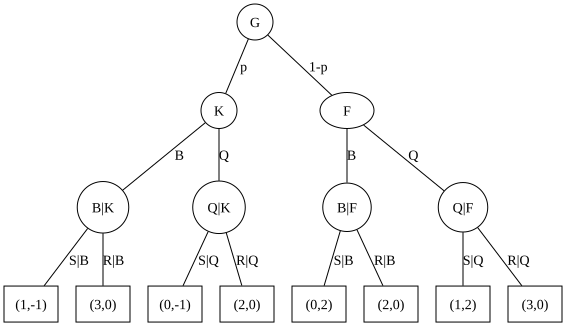

# Das Bier-Quiche-Spiel
<!-- Start table of contents, generated by md_toc_update.py, do not edit -->
## Inhaltsverzeichnis

- [Das Bier-Quiche-Spiel](bier_quiche.md#das-bier-quiche-spiel)
  - [Definition](bier_quiche.md#definition)
  - [Gleichgewichte](bier_quiche.md#gleichgewichte)
    - [Perfekte bayessche Gleichgewichte (PBE)](bier_quiche.md#perfekte-bayessche-gleichgewichte-pbe)
  - [Literatur](bier_quiche.md#literatur)
<!-- End of TOC, generated by md_toc_update.py, do not edit -->

Das [Bier-Quiche-Spiel](https://de.wikipedia.org/wiki/Signalspiel#Das_Bier-Quiche-Spiel) von Cho und Kreps (1987) ist ein [Signalspiel](https://de.wikipedia.org/wiki/Signalspiel) und ein beliebtes Beispiel für [perfekte bayessche Gleichgewichte (PBE)](https://de.wikipedia.org/wiki/Perfekt_bayessches_Gleichgewicht#Das_Bier-Quiche-Spiel). 

## Definition

Spieler 1 (Gast $G$) betritt einen Saloon im wilden Westen. Mit Wahrscheinlichkeit $p$ ist Spieler 1 ein Kerl ($K$), der am liebsten ein Bier ($B$) trinkt, und mit $1-p$ ein Feigling ($F$), der lieber eine Quiche ($Q$) isst. Im Salon sitzt Spieler 2 (Macho $M$), der Streit ($S$) möglichst mit einem Feigling sucht, aber Ruhe ($R$) bevorzugt, falls Spieler 1 ein Kerl ist. Um Streit zu vermeiden, kann ein Feigling bluffen und ein Bier trinken.

Das Bier-Quiche-Spiel ⁠$(N,A,T,p,u)$ ist damit definiert durch:
* Menge der Spieler: $N$ = { $G$ (Gast tritt ein), $M$ (streitsüchtiger Macho) }
* Menge der Aktionen: $A_1$ = { $B$ (Bier), $Q$ (Quiche) }, $A_2$ = { $S$ (Streit), $R$ (Ruhe) }
* Menge der Typen: $T_1$ = { $K$ (Kerl), $F$ (Feigling) }, $T_2$ = { $M$ (Macho) }
* Wahrscheinlichkeiten: $P(T_1=K) = p$, $P(T_1=F) = 1 - p$
* Nutzenfunktionen: $(u_1, u_2)$ nach Spielbaum (Harsanyi-Transformation):  
    

## Gleichgewichte

Der in den Saloon eintretende Gast (Spieler 1) hat 4 mögliche Strategien: Bier $B$ oder Quiche $Q$, jeweils im Falle von Kerl $K$ oder Feigling $F$:
1. $s_{11}$ = $(B|K), (B|F)$ = Bier falls Kerl und Bier falls Feigling
2. $s_{12}$ = $(B|K), (Q|F)$ = Bier falls Kerl und Quiche falls Feigling
3. $s_{13}$ = $(Q|K), (B|F)$ = Quiche falls Kerl und Bier falls Feigling
4. $s_{14}$ = $(Q|K), (Q|F)$ = Quiche falls Kerl und Quiche falls Feigling

Der streitsüchtiger Macho (Spieler 2) hat 4 mögliche Strategien: Streit $S$ oder Ruhe $R$, jeweils im Falle von Beobachtung Bier $B$ oder Beobachtung Quiche $Q$:
1. $s_{21}$ = $(S|B), (S|Q)$ = Streit falls Bier und Streit falls Quiche beobachtet
2. $s_{22}$ = $(S|B), (R|Q)$ = Streit falls Bier und Ruhe falls Quiche beobachtet
3. $s_{23}$ = $(R|B), (S|Q)$ = Ruhe falls Bier und Streit falls Quiche beobachtet
4. $s_{24}$ = $(R|B), (R|Q)$ = Ruhe falls Bier und Ruhe falls Quiche beobachtet

Die Nutzenmatrix hat damit folgende Werte:

|                        | $s_{21}=(S\|B),(S\|Q)$ | $s_{22}=(S\|B),(R\|Q)$ | $s_{23}=(R\|B),(S\|Q)$ | $s_{24}=(R\|B),(R\|Q)$ |
| ---------------------- | ---------------------- | ---------------------- | ---------------------- | ---------------------- |
| $s_{11}=(B\|K),(B\|F)$ | $(1,-1)p + (0,2)(1-p)$ | $(1,-1)p + (0,2)(1-p)$ | $(3,0)p + (2,0)(1-p)$  | $(3,0)p + (2,0)(1-p)$  |
| $s_{12}=(B\|K),(Q\|F)$ | $(1,-1)p + (1,2)(1-p)$ | $(1,-1)p + (3,0)(1-p)$ | $(3,0)p + (1,2)(1-p)$  | $(3,0)p + (3,0)(1-p)$  |
| $s_{13}=(Q\|K),(B\|F)$ | $(0,-1)p + (0,2)(1-p)$ | $(2,0)p  + (0,2)(1-p)$ | $(0,-1)p + (2,0)(1-p)$ | $(2,0)p + (2,0)(1-p)$  |
| $s_{14}=(Q\|K),(Q\|F)$ | $(0,-1)p + (1,2)(1-p)$ | $(2,0)p  + (3,0)(1-p)$ | $(0,-1)p + (1,2)(1-p)$ | $(2,0)p + (3,0)(1-p)$  |

Terme einzeln auflösen ergibt:

|                        | $s_{21}=(S\|B),(S\|Q)$ | $s_{22}=(S\|B),(R\|Q)$ | $s_{23}=(R\|B),(S\|Q)$ | $s_{24}=(R\|B),(R\|Q)$ |
| ---------------------- | ---------------------- | ---------------------- | ---------------------- | ---------------------- |
| $s_{11}=(B\|K),(B\|F)$ |     $(p,   2-3p)$      |     $(p,    2-3p)$     |     $(2+p,  0)$        |     $(2+p, 0)$         |
| $s_{12}=(B\|K),(Q\|F)$ |     $(1,   2-3p)$      |     $(3-2p, -p)$       |     $(1+2p, 2-2p)$     |     $(3,   0)$         |
| $s_{13}=(Q\|K),(B\|F)$ |     $(0,   2-3p)$      |     $(2p,   2-2p)$     |     $(2-2p, -p)$       |     $(2,   0)$         |
| $s_{14}=(Q\|K),(Q\|F)$ |     $(1-p, 2-3p)$      |     $(3-p,  0)$        |     $(1-p,  2-3p)$     |     $(3-p, 0)$         |

Unabhängig von $p$ gibt es anscheinend keine dominierten Strategien, die aus der Matrix gestrichen werden können. Dominierte Strategien gibt es für gegebene Einzelwerte von $p$; z.B wird die Strategie $s_{13}=(Q|K),(B|F)$ vollständig von $s_{12}=(B|K),(Q|F)$ dominiert für $p=0.5$ (für $p=0.5$ sind alle Werte $u_1$ in Zeile $s_{12}$ größer als in Zeile $s_{13}$) und Zeile $s_{13}$ kann in diesem Fall entfernt werden.

Für den Fall $p=0.5$ können sukzessive die dominierten Strategien $s_{13}$, $s_{24}$, $s_{22}$ und $s_{14}$ entfernt werden und es bleibt die Spielmatrix:

|                        | $s_{21}=(S\|B),(S\|Q)$ | $s_{23}=(R\|B),(S\|Q)$ |
| ---------------------- | ---------------------- | ---------------------- |
| $s_{11}=(B\|K),(B\|F)$ |       (0.5, 0.5)       |       (2.5, 0)         |
| $s_{12}=(B\|K),(Q\|F)$ |       (1.0, 0.5)       |       (2.0, 1)         |

Erwartungsnutzen für $p=0.5$:  
$E[u_1(B|F)] = 0.5 \cdot P(S|B) + 2.5 \cdot (1-P(S|B))$  
$E[u_1(Q|F)] = 1.0 \cdot P(S|B) + 2.0 \cdot (1-P(S|B))$  
$E[u_2(S|B)] = 0.5 \cdot P(B|F) + 0.5 \cdot (1-P(B|F))$  
$E[u_2(R|B)] = 0.0 \cdot P(B|F) + 1.0 \cdot (1-P(B|F))$  

Aus den Gleichgewichtsbedingungen $E[u_1(B|F)] = E[u_1(Q|F)]$ und $E[u_2(S|B)] = E[u_2(R|B)]$ ergibt sich $P(S|B) = 0.5$ und $P(B|F) = 0.5$ für $p=0.5$.

### Perfekte bayessche Gleichgewichte (PBE)

Abhängig von $p$ gibt es i.A. unterschiedliche Gleichgewichte (PBEs):
* Pooling-PBEs: Kerl und Feigling wählen das gleiche Signal (immer Bier oder immer Quiche)
* Separating-PBEs mit reinen Strategien: Kerl und Feigling wählen unterschiedliche Signale (Kerl Bier und Feigling Quiche, oder genau umgekehrt)
* Separating-PBEs mit semi-gemischten Strategien: Kerl oder Feigling mischt Strategien (aber nicht beide gleichzeitig)
* Separating-PBEs mit voll-gemischten Strategien: Beide Typen mischen (in Signalspielen selten)

Die Gleichgewichte und deren Anzahl springen diskontinuierlich über $p$, es existiert deshalb keine geschlossene Lösung.

Eine vollständige Suche aller PBE's geht per Fallunterscheidung der Strategien:

1. Nutzenfunktionen (u1,u2) aus Spielbaum:  
    $u_1(B|K) =  (1)(P(S|B)) + (3)(1-P(S|B)) = 3 - 2P(S|B)$  
    $u_1(Q|K) =  (0)(P(S|Q)) + (2)(1-P(S|Q)) = 2 - 2P(S|Q)$  
    $u_1(B|F) =  (0)(P(S|B)) + (2)(1-P(S|B)) = 2 - 2P(S|B)$  
    $u_1(Q|F) =  (1)(P(S|Q)) + (3)(1-P(S|Q)) = 3 - 2P(S|Q)$  
    $u_2(S|B) = (-1)(P(K|B)) + (2)(1-P(K|B)) = 2 - 3P(K|B)$  
    $u_2(R|B) =  (0)(P(K|B)) + (0)(1-P(K|B)) = 0$  
    $u_2(S|Q) = (-1)(P(K|Q)) + (2)(1-P(K|Q)) = 2 - 3P(K|Q)$  
    $u_2(R|Q) =  (0)(P(K|Q)) + (0)(1-P(K|Q)) = 0$  

2. Es gilt immer:  
    Spieler 2 wählt $S|B$, gdw. $u_2(S|B) > u_2(R|B)$ ⇔ Spieler 2 wählt $S|B$, gdw. $P(K|B) < 2/3$ ⇔ $P(S|B) =$ { $1$ falls $P(K|B)<2/3$, $0$ falls $P(K|B)>2/3$, $∈[0,1]$ sonst }  
    Spieler 2 wählt $S|Q$, gdw. $u_2(S|Q) > u_2(R|Q)$ ⇔ Spieler 2 wählt $S|Q$, gdw. $P(K|Q) < 2/3$ ⇔ $P(S|Q) =$ { $1$ falls $P(K|Q)<2/3$, $0$ falls $P(K|Q)>2/3$, $∈[0,1]$ sonst }  
    $μ_B = P(K|B) = p \cdot P(B|K) / (p \cdot P(B|K) + (1-p) \cdot P(B|F))$  
    $μ_Q = P(K|Q) = p \cdot (1-P(B|K)) / (p \cdot (1-P(B|K)) + (1-p) \cdot (1-P(B|F)))$  

3. Pooling auf $B$: Kerl und Feigling wählen immer Bier, $P(B)=1, P(Q)=0$  
    $P(B)=1 ⇒ P(K|B) \cdot P(B) = P(K|B) = p$ ⇒ $P(S|B) =$ { $1$ falls $p<2/3$, $0$ falls $p>2/3$, $∈[0,1]$ sonst }  
    Konsistenzprüfung für $K$:  
    $u_1(B|K) = 3 - 2P(S|B) =$ { $1$ falls $p<2/3$, $3$ falls $p>2/3$, $∈[1,3]$ sonst }  
    $u_1(Q|K) = 2 - 2P(S|Q) ∈ [0,2]$  
    Konsistent falls $u_1(B|K) ≥ u_1(Q|K)$, also falls $p > 2/3$ oder $P(S|Q) ≥ 0.5$  
    Konsistenzprüfung für $F$:  
    $u_1(B|F) = 2 - 2P(S|B) =$ { $0$ falls $p<2/3$, $2$ falls $p>2/3$, $∈[0,2]$ sonst }  
    $u_1(Q|F) = 3 - 2P(S|Q) ∈ [1,3]$  
    Konsistent falls $u_1(B|F) ≥ u_1(Q|F)$, also falls $p > 2/3$ und $P(S|Q) ≥ 1/2$  
    ⇒ PBE mit $p>2/3, P(B|K)=P(B|F)=1, P(S|B)=0, P(S|Q)≥1/2$  

4. Pooling auf $Q$: Kerl und Feigling wählen immer Quiche, $P(B)=0, P(Q)=1$  
    $P(Q)=1 ⇒ P(K|Q) \cdot P(Q) = P(K|Q) = p ⇒ P(S|Q) =$ { $1$ falls $p < 2/3$, $0$ falls $p>2/3$, $∈[0,1]$ sonst }  
    Konsistenzprüfung für $K$:  
    $u_1(B|K) = 3 - 2P(S|B) ∈ [1,3]$  
    $u_1(Q|K) = 2 - 2P(S|Q) =$ { $0$ falls $p<2/3$, $2$ falls $p>2/3$, $∈[0,2]$ sonst }  
    Konsistent falls $u_1(Q|K) ≥ u_1(B|K)$, also falls $p > 2/3$ und $P(S|B) ≥ 1/2$  
    Konsistenzprüfung für $F$:  
    $u_1(B|F) = 2 - 2P(S|B) ∈ [0,2]$  
    $u_1(Q|F) = 3 - 2P(S|Q) =$ { $1$ falls $p<2/3$, $3$ falls $p>2/3$, $∈[1,3]$ sonst }  
    Konsistent falls $u_1(Q|F) ≥ u_1(B|F)$, also falls $p > 2/3$  
    ⇒ PBE mit $p>2/3, P(Q|K)=P(Q|F)=1, P(S|Q)=0, P(S|B)≥1/2$  

5. Separating mit reiner Strategie: Kerl wählt immer Bier, Feigling wählt immer Quiche, $P(B|K)=1, P(B|F)=0, P(Q|K)=0, P(Q|F)=1$  
    $P(K|B) = 1 ⇒ P(S|B) = 0$  
    $P(K|Q) = 0 ⇒ P(S|Q) = 1$  
    Konsistenzprüfung für $K$:  
    $u_1(B|K) = 3 - 2P(S|B) = 3$  
    $u_1(Q|K) = 2 - 2P(S|Q) = 0$  
    Konsistent falls $u_1(B|K) ≥ u_1(Q|K)$, also erfüllt  
    Konsistenzprüfung für $F$:  
    $u_1(B|F) = 2 - 2P(S|B) = 2$  
    $u_1(Q|F) = 3 - 2P(S|Q) = 1$  
    Konsistent falls $u_1(Q|F) ≥ u_1(B|F)$, also nicht erfüllt  
    ⇒ kein PBE  

6. Separating mit reiner Strategie: Kerl wählt immer Quiche, Feigling wählt immer Bier, $P(B|K)=0, P(B|F)=1, P(Q|K)=1, P(Q|F)=0$  
    $P(K|B) = 0 ⇒ P(S|B) = 1$  
    $P(K|Q) = 1 ⇒ P(S|Q) = 0$  
    Konsistenzprüfung für $K$:  
    $u_1(B|K) = 3 - 2P(S|B) = 1$  
    $u_1(Q|K) = 2 - 2P(S|Q) = 2$  
    Konsistent falls $u_1(Q|K) ≥ u_1(B|K)$, also erfüllt  
    Konsistenzprüfung für $F$:  
    $u_1(B|F) = 2 - 2P(S|B) = 0$  
    $u_1(Q|F) = 3 - 2P(S|Q) = 3$  
    Konsistent falls $u_1(B|F) ≥ u_1(Q|F)$, also nicht erfüllt  
    ⇒ kein PBE  

7. Separating mit semi-gemischter Strategie: Kerl wählt immer Bier, Feigling wählt entweder Bier mit $P(B|F)>0$ oder Quiche mit $P(Q|F)=1-P(B|F)>0$, $P(B|K)=1, P(Q|K)=0$  
    $P(K|Q) = 0 , P(S|Q) =$ { $1$ falls $P(K|Q)<2/3$, $0$ falls $P(K|Q)>2/3$, $∈[0,1]$ sonst } ⇒ $P(S|Q) = 1$  
    Gleichgewicht für $F$: $u_1(B|F) = u_1(Q|F) ⇔ 2 - 2P(S|B) = 1 ⇔ P(S|B) = 0.5$  
    Gleichgewicht für $M$: $u_2(S|B) = u_2(R|B) ⇔ 2 - 3P(K|B) = 0 ⇔ P(K|B) = 2/3$  
    $μ_B = P(K|B) = p \cdot P(B|K) / (p \cdot P(B|K) + (1-p) \cdot P(B|F)) = 2/3 ⇔ p / (p + (1-p) \cdot P(B|F)) = 2/3 ⇔ P(B|F) = 0.5 \cdot p/(1-p), p ≤ 2/3$  
    Konsistenzprüfung für $K$:  
    $u_1(B|K) = 3 - 2P(S|B) = 2$  
    $u_1(Q|K) = 2 - 2P(S|Q) = 0$  
    Konsistent falls $u_1(B|K) ≥ u_1(Q|K)$, also erfüllt  
    Konsistenzprüfung für $F$:  
    $u_1(B|F) = 2 - 2P(S|B) = 1$  
    $u_1(Q|F) = 3 - 2P(S|Q) = 1$  
    Konsistent falls $u_1(Q|F) = u_1(B|F)$, also erfüllt  
    ⇒ PBE mit $p ≤ 2/3, P(B|K)=1, P(B|F) = 0.5 \cdot p/(1-p), P(S|B) = 0.5, P(S|Q) = 1$  

8. Separating mit semi-gemischter Strategie: Kerl wählt immer Quiche, Feigling wählt entweder Bier mit $P(B|F)>0$ oder Quiche mit $P(Q|F)=1-P(B|F)>0$, $P(B|K)=0, P(Q|K)=1$  
    $P(K|B) = 0 , P(S|B) =$ { $1$ falls $P(K|B)<2/3$, $0$ falls $P(K|B)>2/3$, $∈[0,1]$ sonst } ⇒ $P(S|B) = 1$  
    $P(K|Q) = 1 , P(S|Q) =$ { $1$ falls $P(K|Q)<2/3$, $0$ falls $P(K|Q)>2/3$, $∈[0,1]$ sonst } ⇒ $P(S|Q) = 0$  
    Konsistenzprüfung für $K$:  
    $u_1(B|K) = 3 - 2P(S|B) = 1$  
    $u_1(Q|K) = 2 - 2P(S|Q) = 2$  
    Konsistent falls $u_1(Q|K) ≥ u_1(B|K)$, also erfüllt  
    Konsistenzprüfung für $F$:  
    $u_1(B|F) = 2 - 2P(S|B) = 0$  
    $u_1(Q|F) = 3 - 2P(S|Q) = 3$  
    Da $u_1(Q|F) > u_1(B|F)$ wechselt $F$ immer zu $Q$, also nicht erfüllt  
    ⇒ kein PBE  

9. Separating mit semi-gemischter Strategie: Feigling wählt immer Bier, Kerl wählt entweder Bier mit $P(B|K)>0$ oder Quiche mit $P(Q|K)=1-P(B|K)>0$, $P(B|F)=1, P(Q|F)=0, P(K|Q)=1$  
    $P(K|Q) = 1 , P(S|Q) =$ { $1$ falls $P(K|Q)<2/3$, $0$ falls $P(K|Q)>2/3$, $∈[0,1]$ sonst } ⇒ $P(S|Q) = 0$  
    Konsistenzprüfung für $F$:  
    $u_1(B|F) = 2 - 2P(S|B)$  
    $u_1(Q|F) = 3 - 2P(S|Q) = 3$  
    Da $u_1(Q|F) > u_1(B|F)$ wechselt $$F$ immer zu $Q$, also nicht erfüllt  
    ⇒ kein PBE  

10. Separating mit semi-gemischter Strategie: Feigling wählt immer Quiche, Kerl wählt entweder Bier mit $P(B|K)>0$ oder Quiche mit $P(Q|K)=1-P(B|K)>0$, $P(B|F)=0, P(Q|F)=1, P(K|B)=1$  
    $P(K|B) = 1 , P(S|B) =$ { $1$ falls $P(K|B)<2/3$, $0$ falls $P(K|B)>2/3$, $∈[0,1]$ sonst } ⇒ $P(S|B) = 0$  
    Konsistenzprüfung für $K$:  
    $u_1(B|K) = 3 - 2P(S|B) = 3$  
    $u_1(Q|K) = 2 - 2P(S|Q)$  
    Da $u_1(B|K) > u_1(Q|K)$ wechselt $K$ immer zu $B$, also nicht erfüllt  
    ⇒ kein PBE  

11. Separating mit voll-gemischter Strategie: Kerl wählt entweder Bier mit $P(B|K)>0$ oder Quiche mit $P(Q|K)=1-P(B|K)>0$, Feigling wählt entweder Bier mit $P(B|F)>0$ oder Quiche mit $P(Q|F)=1-P(B|F)>0$  
    Gleichgewicht für $M$: $u_2(S|B) = u_2(R|B) ⇔ 2 - 3P(K|B) = 0 ⇔ P(K|B) = 2/3$  
    Gleichgewicht für $M$: $u_2(S|Q) = u_2(R|Q) ⇔ 2 - 3P(K|Q) = 0 ⇔ P(K|Q) = 2/3$  
    Bayes:  
    $μ_B = P(K|B) = p \cdot P(B|K) / (p \cdot P(B|K) + (1-p) \cdot P(B|F)) = 2/3 ⇔ P(B|F) = p \cdot P(B|K) / (2 \cdot (1-p))$  
    $μ_Q = P(K|Q) = p \cdot (1-P(B|K)) / (p \cdot (1-P(B|K)) + (1-p) \cdot (1-P(B|F))) = 2/3 ⇔ P(B|F) = 1 - p \cdot (1-P(B|K)) / (2 \cdot (1-p))$  
    ⇒ $P(B|F) = p \cdot P(B|K) / (2 \cdot (1-p)) = 1 - p \cdot (1-P(B|K)) / (2 \cdot (1-p))$  
    ⇒ $p = 2/3$  
    ⇒ $P(B|F) = P(B|K)$  
    Gleichgewicht für $K$: $u_1(B|K) = u_1(Q|K) ⇔ 3 - 2P(S|B) = 2 - 2P(S|Q) ⇔ P(S|B) = 1/2 + P(S|Q) ⇒ P(S|B) ≥ 1/2$ für $P(S|Q)∈[0,1]$  
    Gleichgewicht für $F$: $u_1(B|F) = u_1(Q|F) ⇔ 2 - 2P(S|B) = 3 - 2P(S|Q) ⇔ P(S|B) = -1/2 + P(S|Q) ⇒ P(S|Q) ≥ 1/2$ für $P(S|B)∈[0,1]$  
    ⇒ $P(S|B) = P(S|Q) = 1/2$  
    Konsistenzprüfung für $K$:  
    $u_1(B|K) = 3 - 2P(S|B) = 2$  
    $u_1(Q|K) = 2 - 2P(S|Q) = 1$  
    Da $u_1(B|K) > u_1(Q|K)$ wechselt $K$ immer zu $B$, also nicht erfüllt  
    Konsistenzprüfung für $F$:  
    $u_1(B|F) = 2 - 2P(S|B) = 1$  
    $u_1(Q|F) = 3 - 2P(S|Q) = 2$  
    Da $u_1(Q|F) > u_1(B|F)$ wechselt $F$ immer zu $Q$, also nicht erfüllt  
    ⇒ kein PBE  

Das Ergebnis entspricht der Intuition: PBE's existieren nur bei Pooling auf $B$ oder $Q$ (Punkt 3 und 4: Macho kann Kerl von Feigling nicht durch Signal unterscheiden), oder wenn ein Kerl immer Bier trinkt und ein Feigling mit einer gewissen Wahrscheinlichkeit blufft (Punkt 7 mit Bluffwahrscheinlichkeit $P(B|F) = 0.5 \cdot p / (1-p)$ und $p ≤ 2/3$).

## Literatur

* Erwin Amann: "Spieltheorie für dummies", Wiley, 2. Auflage 2026
